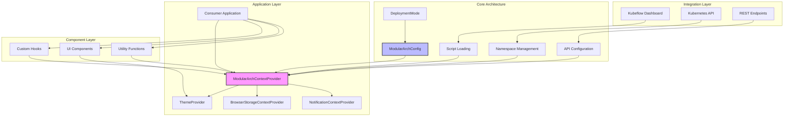

# Shared Library Guide

The **mod-arch-shared** library (`opendatahub-io/kubeflow-ui-essentials`) is the cornerstone of our modular architecture initiative. This TypeScript-based shared component library provides the foundation for building consistent, reusable micro-frontend applications across the AI platform ecosystem.

## Overview

The `mod-arch-shared` library serves as a foundational layer that enables:

- **Unified Context Management**: Centralized state management through React Context API
- **Multi-Deployment Support**: Configurable deployment modes for different architectural patterns
- **Kubernetes Integration**: Built-in support for namespace management and K8s API interactions
- **Cross-Platform Theming**: Support for both PatternFly and Material-UI design systems
- **Reusable Components**: Common UI components optimized for micro-frontend architectures

## Architecture Overview

The library follows a modular micro-frontend architecture designed to support three distinct deployment modes while maintaining a consistent API surface.

### Core Architectural Components



## Installation and Setup

### Prerequisites

Install the library and required peer dependencies:

```bash
npm install mod-arch-shared @mui/material @mui/icons-material @mui/types sass sass-loader
```

### Build System Configuration

The library contains SCSS files that must be processed by your build system. For webpack:

```javascript
{
  test: /\.s[ac]ss$/i,
  use: [
    'style-loader',    // Creates style nodes from JS strings
    'css-loader',      // Translates CSS into CommonJS
    'sass-loader',     // Compiles Sass to CSS
  ],
}
```

### Provider Setup

Configure the required context providers at your application root:

```typescript
import React from 'react';
import { createRoot } from 'react-dom/client';
import { BrowserRouter as Router } from 'react-router-dom';
import { 
  ModularArchContextProvider, 
  ThemeProvider,
  BrowserStorageContextProvider,
  NotificationContextProvider,
  DeploymentMode,
  Theme,
  ModularArchConfig
} from 'mod-arch-shared';

const modularArchConfig: ModularArchConfig = {
  deploymentMode: DeploymentMode.Standalone,
  URL_PREFIX: '/api',
  BFF_API_VERSION: 'v1',
  // mandatoryNamespace: 'my-namespace', // Optional: force single namespace
};

const container = document.getElementById('root');
const root = createRoot(container!);

root.render(
  <React.StrictMode>
    <Router>
      <ModularArchContextProvider config={modularArchConfig}>
        <ThemeProvider theme={Theme.Patternfly}>
          <BrowserStorageContextProvider>
            <NotificationContextProvider>
              <App />
            </NotificationContextProvider>
          </BrowserStorageContextProvider>
        </ThemeProvider>
      </ModularArchContextProvider>
    </Router>
  </React.StrictMode>,
);
```

## Configuration System

### Deployment Modes

The library supports three deployment modes, each with different integration patterns:

| Mode | Use Case | Description |
|------|----------|-------------|
| `DeploymentMode.Standalone` | Independent applications | Standard API integration without external dependencies |
| `DeploymentMode.Federated` | Module federation | Standard API integration with federation support |
| `DeploymentMode.Kubeflow` | Kubeflow integration | External script loading and dashboard integration |

### Configuration Interface

```typescript
interface ModularArchConfig {
  deploymentMode: DeploymentMode;
  URL_PREFIX: string;           // Base URL for API endpoints
  BFF_API_VERSION: string;      // API version for backend communication
  mandatoryNamespace?: string;  // Optional: forces single namespace operation
}
```

## Context and State Management

The library implements a centralized state management system through the `ModularArchContext`:

### Core Context State

```typescript
interface ModularArchContextType {
  config: ModularArchConfig;
  namespacesLoaded: boolean;
  namespacesLoadError: Error | undefined;
  namespaces: Namespace[];
  preferredNamespace: Namespace | undefined;
  updatePreferredNamespace: (namespace: Namespace) => void;
  initializationError: Error | undefined;
  scriptLoaded: boolean;
}
```

### Using Context Hooks

```typescript
import { useModularArchContext, useNamespaceSelector } from 'mod-arch-shared';

const MyComponent: React.FC = () => {
  const { namespaces, preferredNamespace } = useModularArchContext();
  const { selectedNamespace, setSelectedNamespace } = useNamespaceSelector();
  
  return (
    <div>
      <p>Available namespaces: {namespaces.length}</p>
      <p>Selected: {selectedNamespace?.name}</p>
    </div>
  );
};
```

## Component Library

The library provides a comprehensive set of reusable UI components:

### Navigation Components

#### NavBar Component

The primary application masthead with integrated namespace selection:

```typescript
import { NavBar } from 'mod-arch-shared';

const App: React.FC = () => {
  return (
    <div>
      <NavBar />
      {/* Your application content */}
    </div>
  );
};
```

#### Key Navigation Features

- **Namespace Selector**: Dropdown for switching between available namespaces
- **User Menu**: User authentication and profile management
- **Theme Integration**: Supports both PatternFly and Material-UI themes
- **Responsive Design**: Mobile-friendly navigation patterns

### Dashboard Components

| Component | Purpose |
|-----------|---------|
| `DashboardDescriptionListGroup` | Structured data display |
| `DashboardEmptyTableView` | Empty state for data tables |
| `DashboardHelpTooltip` | Contextual help tooltips |
| `DashboardModalFooter` | Standardized modal actions |
| `DashboardSearchField` | Search input with consistent styling |

### Form Components

| Component | Purpose |
|-----------|---------|
| `FormFieldset` | Grouped form fields |
| `SimpleSelect` | Basic dropdown selection |
| `TypeaheadSelect` | Searchable dropdown |
| `EditableLabelsDescriptionListGroup` | Editable key-value pairs |
| `EditableTextDescriptionListGroup` | Inline text editing |

### Utility Components

| Component | Purpose |
|-----------|---------|
| `ToastNotification` | Individual notification |
| `ToastNotifications` | Notification container |
| `TruncatedText` | Text overflow handling |
| `MarkdownView` | Markdown content rendering |
| `InlineTruncatedClipboardCopy` | Copy-to-clipboard functionality |

## API Integration

### Kubernetes API Functions

The library provides typed functions for Kubernetes API integration:

```typescript
import { getNamespaces, getUser } from 'mod-arch-shared';

const MyComponent: React.FC = () => {
  const { config } = useModularArchContext();
  
  useEffect(() => {
    const fetchData = async () => {
      try {
        const namespaces = await getNamespaces('', config);
        const user = await getUser('', config);
        console.log('Namespaces:', namespaces);
        console.log('User:', user);
      } catch (error) {
        console.error('API Error:', error);
      }
    };
    
    fetchData();
  }, [config]);
  
  return <div>Loading...</div>;
};
```

### API State Management

Use the `useAPIState` hook for managing API call state:

```typescript
import { useAPIState } from 'mod-arch-shared';

const MyComponent: React.FC = () => {
  const [apiState, setAPIState] = useAPIState();
  
  const fetchData = async () => {
    setAPIState({ loading: true });
    try {
      const result = await someAPICall();
      setAPIState({ data: result, loading: false });
    } catch (error) {
      setAPIState({ error, loading: false });
    }
  };
  
  if (apiState.loading) return <div>Loading...</div>;
  if (apiState.error) return <div>Error: {apiState.error.message}</div>;
  
  return <div>Data: {JSON.stringify(apiState.data)}</div>;
};
```

## Utilities and Helpers

### Kubeflow Integration

For applications deployed in Kubeflow mode:

```typescript
import { kubeflowScriptLoader, kubeflowNamespaceLoader } from 'mod-arch-shared';

// Script loading for Kubeflow integration
kubeflowScriptLoader(
  DeploymentMode.Kubeflow,
  () => console.log('Script loaded successfully'),
  (error) => console.error('Script loading failed:', error)
);

// Namespace integration with Kubeflow dashboard
const initSuccess = kubeflowNamespaceLoader(
  DeploymentMode.Kubeflow,
  true, // scriptLoaded
  'mandatory-namespace', // optional
  (namespace) => console.log('Namespace selected:', namespace),
  (error) => console.error('Namespace integration failed:', error)
);
```

### General Utilities

```typescript
import { asEnumMember, isEnumMember, genRandomChars } from 'mod-arch-shared';

// Safe enum handling
const mode = asEnumMember(DeploymentMode, userInput);
if (mode) {
  console.log('Valid deployment mode:', mode);
}

// Type-safe enum checking
if (isEnumMember(DeploymentMode, someValue)) {
  console.log('Valid enum member');
}

// Random string generation
const randomId = genRandomChars(8);
```

### Custom Hooks

| Hook | Purpose |
|------|---------|
| `useDebounceCallback` | Debounced function execution |
| `useDeepCompareMemoize` | Deep comparison memoization |
| `useEventListener` | Event listener management |
| `useFetchState` | Fetch operation state management |
| `useGenericObjectState` | Generic object state management |

## Theme System

### PatternFly Theme (Default)

```typescript
import { ThemeProvider, Theme } from 'mod-arch-shared';

<ThemeProvider theme={Theme.Patternfly}>
  <App />
</ThemeProvider>
```

### Material-UI Theme

```typescript
import { ThemeProvider, Theme } from 'mod-arch-shared';

<ThemeProvider theme={Theme.MUI}>
  <App />
</ThemeProvider>
```

### Custom Theme Integration

The theme system integrates with your application's existing theme:

```typescript
import { useThemeContext } from 'mod-arch-shared';

const MyThemedComponent: React.FC = () => {
  const { theme } = useThemeContext();
  
  const styles = {
    color: theme === Theme.Patternfly ? '#151515' : '#000000',
    backgroundColor: theme === Theme.Patternfly ? '#ffffff' : '#fafafa'
  };
  
  return <div style={styles}>Themed content</div>;
};
```

## Development and Testing

### Build Requirements

The library requires specific build configurations:

```json
{
  "scripts": {
    "build": "tsc && tsc-alias && npm run copy-assets",
    "copy-assets": "mkdir -p dist/style dist/images && cp -r style/* dist/style/ && find components \\( -name '*.scss' -o -name '*.css' \\) -exec rsync -R {} dist/ \\;",
    "test": "run-s test:lint test:unit test:type-check"
  }
}
```

### Testing Strategy

The library employs comprehensive testing:

- **Unit Tests**: Jest with React Testing Library
- **Linting**: ESLint with TypeScript support
- **Type Checking**: TypeScript compiler validation

```bash
# Run all tests
npm test

# Individual test types
npm run test:unit
npm run test:lint
npm run test:type-check
```

## Best Practices

### Context Usage

1. **Always wrap your app** with required providers
2. **Use hooks instead of direct context access** for better type safety
3. **Handle loading and error states** from context

### Component Integration

1. **Import components explicitly** from the library
2. **Follow PatternFly patterns** for consistency
3. **Use theme-aware styling** when customizing components

### API Best Practices

1. **Use the provided API functions** instead of custom fetch calls
2. **Handle errors consistently** using the error utilities
3. **Leverage the state management hooks** for loading states

### Performance

1. **Use memo and callback hooks** appropriately
2. **Leverage the debounce utilities** for expensive operations
3. **Follow the deployment mode patterns** for optimal loading

---

**Next Steps**: Explore the [API Integration Guide](./13-api-integration.md) for detailed API patterns, or review the [Component Library Reference](./14-component-library.md) for comprehensive component usage examples.
