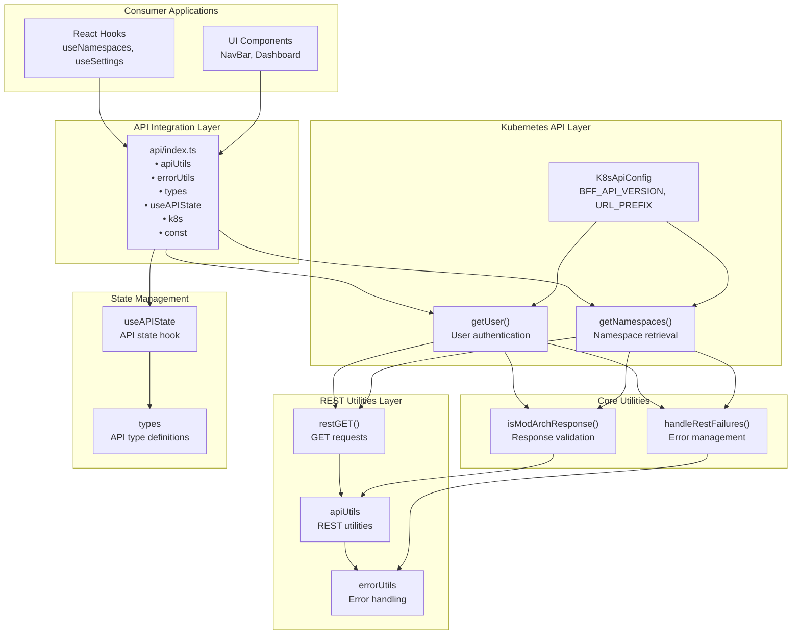

# API Integration Guide

This guide provides comprehensive information about integrating with APIs in modular architecture applications. It covers the shared library's API utilities, REST integration patterns, Kubernetes API integration, and best practices for building robust API interactions.

## API Architecture Overview

The mod-arch-shared library provides a layered API integration system that separates concerns between generic REST utilities and domain-specific Kubernetes integration.



## API Configuration

### Basic Configuration Setup

Configure API settings through the ModularArchConfig:

```typescript
import { ModularArchConfig, DeploymentMode } from 'mod-arch-shared';

const apiConfig: ModularArchConfig = {
  deploymentMode: DeploymentMode.Standalone,
  URL_PREFIX: '/api',              // Base URL for all API calls
  BFF_API_VERSION: 'v1',          // API version
  mandatoryNamespace: undefined    // Optional: lock to specific namespace
};
```

### Environment-Specific Configuration

```typescript
// Development configuration
const devConfig: ModularArchConfig = {
  deploymentMode: DeploymentMode.Standalone,
  URL_PREFIX: 'http://localhost:8080/api',
  BFF_API_VERSION: 'v1',
};

// Production configuration  
const prodConfig: ModularArchConfig = {
  deploymentMode: DeploymentMode.Federated,
  URL_PREFIX: '/api',
  BFF_API_VERSION: 'v1',
};

// Kubeflow integration configuration
const kubeflowConfig: ModularArchConfig = {
  deploymentMode: DeploymentMode.Kubeflow,
  URL_PREFIX: '/api',
  BFF_API_VERSION: 'v1',
  mandatoryNamespace: 'kubeflow-user'
};
```

## REST API Utilities

### Basic REST Operations

The library provides standardized REST utilities for HTTP operations:

```typescript
import { restGET, handleRestFailures, isModArchResponse } from 'mod-arch-shared';

// Basic GET request
const fetchData = async (endpoint: string) => {
  try {
    const response = await restGET(endpoint);
    
    // Validate response format
    if (isModArchResponse(response)) {
      return response.data;
    } else {
      throw new Error('Invalid response format');
    }
  } catch (error) {
    // Standardized error handling
    handleRestFailures(error);
    throw error;
  }
};
```

### Advanced REST Patterns

```typescript
import { restGET, APIOptions } from 'mod-arch-shared';

// GET request with options
const fetchWithOptions = async (endpoint: string, options: APIOptions = {}) => {
  const response = await restGET(endpoint, {
    headers: {
      'Content-Type': 'application/json',
      'Authorization': `Bearer ${token}`,
      ...options.headers
    },
    timeout: 30000,
    ...options
  });
  
  return response;
};

// Error handling with retry logic
const fetchWithRetry = async (endpoint: string, maxRetries: number = 3) => {
  for (let attempt = 1; attempt <= maxRetries; attempt++) {
    try {
      return await restGET(endpoint);
    } catch (error) {
      if (attempt === maxRetries) {
        handleRestFailures(error);
        throw error;
      }
      
      // Wait before retry
      await new Promise(resolve => setTimeout(resolve, 1000 * attempt));
    }
  }
};
```

## Kubernetes API Integration

### Built-in Kubernetes Functions

The library provides typed functions for common Kubernetes operations:

```typescript
import { getNamespaces, getUser, useModularArchContext } from 'mod-arch-shared';

const KubernetesIntegration: React.FC = () => {
  const { config } = useModularArchContext();
  const [namespaces, setNamespaces] = useState<Namespace[]>([]);
  const [user, setUser] = useState<UserSettings | null>(null);
  const [loading, setLoading] = useState(true);
  
  useEffect(() => {
    const fetchKubernetesData = async () => {
      try {
        setLoading(true);
        
        // Fetch namespaces
        const namespacesData = await getNamespaces('', config);
        setNamespaces(namespacesData);
        
        // Fetch user information
        const userData = await getUser('', config);
        setUser(userData);
        
      } catch (error) {
        console.error('Failed to fetch Kubernetes data:', error);
      } finally {
        setLoading(false);
      }
    };
    
    fetchKubernetesData();
  }, [config]);
  
  if (loading) return <div>Loading Kubernetes data...</div>;
  
  return (
    <div>
      <h3>User: {user?.name}</h3>
      <h4>Available Namespaces:</h4>
      <ul>
        {namespaces.map(ns => (
          <li key={ns.name}>{ns.name}</li>
        ))}
      </ul>
    </div>
  );
};
```

### Custom Kubernetes API Calls

Build custom Kubernetes API functions using the library's utilities:

```typescript
import { restGET, K8sApiConfig } from 'mod-arch-shared';

// Custom function for fetching pods
const getPods = async (namespace: string, config: K8sApiConfig) => {
  const endpoint = `${config.URL_PREFIX}/${config.BFF_API_VERSION}/namespaces/${namespace}/pods`;
  
  try {
    const response = await restGET(endpoint);
    return response.data as Pod[];
  } catch (error) {
    handleRestFailures(error);
    throw new Error(`Failed to fetch pods for namespace ${namespace}`);
  }
};

// Custom function for fetching services
const getServices = async (namespace: string, config: K8sApiConfig) => {
  const endpoint = `${config.URL_PREFIX}/${config.BFF_API_VERSION}/namespaces/${namespace}/services`;
  
  try {
    const response = await restGET(endpoint);
    return response.data as Service[];
  } catch (error) {
    handleRestFailures(error);
    throw new Error(`Failed to fetch services for namespace ${namespace}`);
  }
};

// Usage in component
const KubernetesResources: React.FC = () => {
  const { config, preferredNamespace } = useModularArchContext();
  const [pods, setPods] = useState<Pod[]>([]);
  const [services, setServices] = useState<Service[]>([]);
  
  useEffect(() => {
    if (preferredNamespace) {
      const fetchResources = async () => {
        try {
          const [podsData, servicesData] = await Promise.all([
            getPods(preferredNamespace.name, config),
            getServices(preferredNamespace.name, config)
          ]);
          
          setPods(podsData);
          setServices(servicesData);
        } catch (error) {
          console.error('Failed to fetch resources:', error);
        }
      };
      
      fetchResources();
    }
  }, [preferredNamespace, config]);
  
  return (
    <div>
      <h3>Namespace: {preferredNamespace?.name}</h3>
      <div>
        <h4>Pods ({pods.length})</h4>
        <h4>Services ({services.length})</h4>
      </div>
    </div>
  );
};
```

## API State Management

### Using useAPIState Hook

The `useAPIState` hook provides standardized state management for API operations:

```typescript
import { useAPIState, APIState } from 'mod-arch-shared';

interface MyData {
  id: string;
  name: string;
  status: string;
}

const DataFetcher: React.FC = () => {
  const [apiState, setAPIState] = useAPIState<MyData[]>();
  
  const fetchData = async () => {
    setAPIState({ loading: true, error: undefined });
    
    try {
      const response = await restGET('/api/v1/my-data');
      setAPIState({ 
        data: response.data, 
        loading: false, 
        error: undefined 
      });
    } catch (error) {
      setAPIState({ 
        data: undefined, 
        loading: false, 
        error: error as Error 
      });
    }
  };
  
  useEffect(() => {
    fetchData();
  }, []);
  
  // Render based on state
  if (apiState.loading) {
    return <div>Loading...</div>;
  }
  
  if (apiState.error) {
    return (
      <div>
        <p>Error: {apiState.error.message}</p>
        <button onClick={fetchData}>Retry</button>
      </div>
    );
  }
  
  if (!apiState.data || apiState.data.length === 0) {
    return <div>No data available</div>;
  }
  
  return (
    <div>
      <h3>Data ({apiState.data.length} items)</h3>
      <ul>
        {apiState.data.map(item => (
          <li key={item.id}>
            {item.name} - {item.status}
          </li>
        ))}
      </ul>
      <button onClick={fetchData}>Refresh</button>
    </div>
  );
};
```

### Custom API State Hooks

Create reusable hooks for specific API operations:

```typescript
import { useState, useEffect } from 'react';
import { useModularArchContext, useAPIState } from 'mod-arch-shared';

// Custom hook for namespace data
export const useNamespaceData = (namespaceName?: string) => {
  const { config } = useModularArchContext();
  const [apiState, setAPIState] = useAPIState<NamespaceDetails>();
  
  useEffect(() => {
    if (!namespaceName) return;
    
    const fetchNamespaceData = async () => {
      setAPIState({ loading: true });
      
      try {
        const endpoint = `${config.URL_PREFIX}/${config.BFF_API_VERSION}/namespaces/${namespaceName}/details`;
        const response = await restGET(endpoint);
        
        setAPIState({ 
          data: response.data, 
          loading: false 
        });
      } catch (error) {
        setAPIState({ 
          error: error as Error, 
          loading: false 
        });
      }
    };
    
    fetchNamespaceData();
  }, [namespaceName, config]);
  
  return apiState;
};

// Custom hook for resource monitoring
export const useResourceMonitoring = (namespace: string, resourceType: string) => {
  const { config } = useModularArchContext();
  const [apiState, setAPIState] = useAPIState<ResourceMetrics>();
  
  useEffect(() => {
    const fetchMetrics = async () => {
      try {
        const endpoint = `${config.URL_PREFIX}/${config.BFF_API_VERSION}/namespaces/${namespace}/${resourceType}/metrics`;
        const response = await restGET(endpoint);
        
        setAPIState({ 
          data: response.data, 
          loading: false 
        });
      } catch (error) {
        setAPIState({ 
          error: error as Error, 
          loading: false 
        });
      }
    };
    
    // Initial fetch
    fetchMetrics();
    
    // Set up polling
    const interval = setInterval(fetchMetrics, 30000); // Poll every 30 seconds
    
    return () => clearInterval(interval);
  }, [namespace, resourceType, config]);
  
  return apiState;
};
```

## Error Handling Patterns

### Standardized Error Handling

```typescript
import { handleRestFailures, isModArchResponse } from 'mod-arch-shared';

// Error handling utility
const handleAPIError = (error: unknown, context: string) => {
  console.error(`API Error in ${context}:`, error);
  
  if (error instanceof Error) {
    // Handle different error types
    if (error.message.includes('401')) {
      // Handle authentication errors
      window.location.href = '/login';
    } else if (error.message.includes('403')) {
      // Handle authorization errors
      showNotification('Access denied', 'error');
    } else if (error.message.includes('404')) {
      // Handle not found errors
      showNotification('Resource not found', 'warning');
    } else {
      // Handle other errors
      showNotification('An unexpected error occurred', 'error');
    }
  }
  
  // Use library's error handling
  handleRestFailures(error);
};

// API call wrapper with error handling
const safeAPICall = async <T>(
  apiCall: () => Promise<T>,
  context: string,
  fallbackValue?: T
): Promise<T | undefined> => {
  try {
    const result = await apiCall();
    return result;
  } catch (error) {
    handleAPIError(error, context);
    return fallbackValue;
  }
};

// Usage example
const MyComponent: React.FC = () => {
  const [data, setData] = useState<MyData[]>([]);
  
  useEffect(() => {
    const fetchData = async () => {
      const result = await safeAPICall(
        () => restGET('/api/v1/my-data'),
        'fetchData',
        { data: [] } // fallback value
      );
      
      if (result && isModArchResponse(result)) {
        setData(result.data);
      }
    };
    
    fetchData();
  }, []);
  
  return <div>{/* Component content */}</div>;
};
```

### Retry and Circuit Breaker Patterns

```typescript
// Retry utility with exponential backoff
const retryWithBackoff = async <T>(
  apiCall: () => Promise<T>,
  maxRetries: number = 3,
  baseDelay: number = 1000
): Promise<T> => {
  for (let attempt = 1; attempt <= maxRetries; attempt++) {
    try {
      return await apiCall();
    } catch (error) {
      if (attempt === maxRetries) {
        throw error;
      }
      
      // Exponential backoff: 1s, 2s, 4s
      const delay = baseDelay * Math.pow(2, attempt - 1);
      await new Promise(resolve => setTimeout(resolve, delay));
    }
  }
  
  throw new Error('Max retries exceeded');
};

// Circuit breaker pattern
class CircuitBreaker {
  private failures = 0;
  private lastFailureTime = 0;
  private state: 'CLOSED' | 'OPEN' | 'HALF_OPEN' = 'CLOSED';
  
  constructor(
    private threshold: number = 5,
    private timeout: number = 60000
  ) {}
  
  async execute<T>(apiCall: () => Promise<T>): Promise<T> {
    if (this.state === 'OPEN') {
      if (Date.now() - this.lastFailureTime > this.timeout) {
        this.state = 'HALF_OPEN';
      } else {
        throw new Error('Circuit breaker is OPEN');
      }
    }
    
    try {
      const result = await apiCall();
      this.onSuccess();
      return result;
    } catch (error) {
      this.onFailure();
      throw error;
    }
  }
  
  private onSuccess() {
    this.failures = 0;
    this.state = 'CLOSED';
  }
  
  private onFailure() {
    this.failures++;
    this.lastFailureTime = Date.now();
    
    if (this.failures >= this.threshold) {
      this.state = 'OPEN';
    }
  }
}

// Usage
const circuitBreaker = new CircuitBreaker(3, 30000);

const reliableAPICall = async (endpoint: string) => {
  return circuitBreaker.execute(() =>
    retryWithBackoff(() => restGET(endpoint))
  );
};
```

## Performance Optimization

### Request Caching

```typescript
import { useMemo, useRef } from 'react';

// Simple cache implementation
class APICache {
  private cache = new Map<string, { data: any; timestamp: number }>();
  private ttl = 5 * 60 * 1000; // 5 minutes
  
  get(key: string) {
    const item = this.cache.get(key);
    if (!item) return null;
    
    if (Date.now() - item.timestamp > this.ttl) {
      this.cache.delete(key);
      return null;
    }
    
    return item.data;
  }
  
  set(key: string, data: any) {
    this.cache.set(key, {
      data,
      timestamp: Date.now()
    });
  }
  
  clear() {
    this.cache.clear();
  }
}

// Cached API hook
export const useCachedAPI = <T>(endpoint: string) => {
  const cache = useRef(new APICache()).current;
  const [apiState, setAPIState] = useAPIState<T>();
  
  const fetchData = useMemo(() => async () => {
    // Check cache first
    const cached = cache.get(endpoint);
    if (cached) {
      setAPIState({ data: cached, loading: false });
      return;
    }
    
    setAPIState({ loading: true });
    
    try {
      const response = await restGET(endpoint);
      const data = response.data;
      
      // Cache the result
      cache.set(endpoint, data);
      
      setAPIState({ data, loading: false });
    } catch (error) {
      setAPIState({ error: error as Error, loading: false });
    }
  }, [endpoint, cache, setAPIState]);
  
  useEffect(() => {
    fetchData();
  }, [fetchData]);
  
  return { ...apiState, refetch: fetchData };
};
```

### Request Deduplication

```typescript
// Request deduplication utility
class RequestDeduplicator {
  private pendingRequests = new Map<string, Promise<any>>();
  
  async execute<T>(key: string, apiCall: () => Promise<T>): Promise<T> {
    // If request is already in progress, return the existing promise
    if (this.pendingRequests.has(key)) {
      return this.pendingRequests.get(key)!;
    }
    
    // Start new request
    const promise = apiCall().finally(() => {
      // Clean up when request completes
      this.pendingRequests.delete(key);
    });
    
    this.pendingRequests.set(key, promise);
    return promise;
  }
}

const deduplicator = new RequestDeduplicator();

// Deduplicated API hook
export const useDedupedAPI = <T>(endpoint: string) => {
  const [apiState, setAPIState] = useAPIState<T>();
  
  const fetchData = useCallback(async () => {
    setAPIState({ loading: true });
    
    try {
      const response = await deduplicator.execute(
        endpoint,
        () => restGET(endpoint)
      );
      
      setAPIState({ data: response.data, loading: false });
    } catch (error) {
      setAPIState({ error: error as Error, loading: false });
    }
  }, [endpoint, setAPIState]);
  
  useEffect(() => {
    fetchData();
  }, [fetchData]);
  
  return { ...apiState, refetch: fetchData };
};
```

## Testing API Integration

### Mocking API Calls

```typescript
import { jest } from '@jest/globals';

// Mock the API utilities
jest.mock('mod-arch-shared', () => ({
  ...jest.requireActual('mod-arch-shared'),
  restGET: jest.fn(),
  getNamespaces: jest.fn(),
  getUser: jest.fn(),
}));

import { restGET, getNamespaces } from 'mod-arch-shared';

const mockRestGET = restGET as jest.MockedFunction<typeof restGET>;
const mockGetNamespaces = getNamespaces as jest.MockedFunction<typeof getNamespaces>;

describe('API Integration', () => {
  beforeEach(() => {
    jest.clearAllMocks();
  });
  
  test('should fetch namespaces successfully', async () => {
    const mockNamespaces = [
      { name: 'default', status: 'Active' },
      { name: 'kube-system', status: 'Active' }
    ];
    
    mockGetNamespaces.mockResolvedValue(mockNamespaces);
    
    const result = await getNamespaces('', { 
      URL_PREFIX: '/api', 
      BFF_API_VERSION: 'v1' 
    });
    
    expect(result).toEqual(mockNamespaces);
    expect(mockGetNamespaces).toHaveBeenCalledWith('', {
      URL_PREFIX: '/api',
      BFF_API_VERSION: 'v1'
    });
  });
  
  test('should handle API errors', async () => {
    const mockError = new Error('Network error');
    mockRestGET.mockRejectedValue(mockError);
    
    await expect(
      restGET('/api/v1/test')
    ).rejects.toThrow('Network error');
  });
});
```

## Best Practices

### Configuration Best Practices

1. **Centralize configuration** in environment-specific files
2. **Use type-safe configuration** with TypeScript interfaces
3. **Validate configuration** at application startup
4. **Support multiple environments** (dev, staging, prod)

### Error Handling

1. **Use consistent error handling** across all API calls
2. **Provide meaningful error messages** to users
3. **Log errors** with sufficient context for debugging
4. **Implement retry logic** for transient failures

### Performance

1. **Cache frequently accessed data** to reduce API calls
2. **Implement request deduplication** to avoid duplicate calls
3. **Use pagination** for large datasets
4. **Optimize API call timing** with proper loading states

### Security

1. **Always validate responses** using type guards
2. **Handle authentication errors** gracefully
3. **Sanitize user inputs** before sending to APIs
4. **Use HTTPS** for all API communications

### Testing

1. **Mock API calls** in unit tests
2. **Test error scenarios** as well as success paths
3. **Use integration tests** for critical API flows
4. **Validate API contracts** with schema testing

---

**Next Steps**: Explore the [Component Library Reference](./14-component-library.md) for UI component integration, or review the [Advanced Development Patterns](./15-advanced-patterns.md) for sophisticated architectural patterns.
