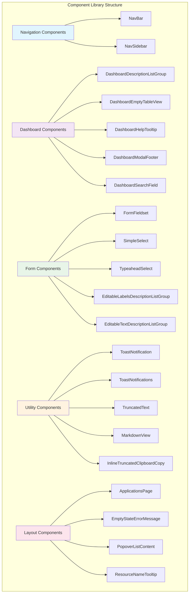

# Component Library Reference

This comprehensive guide covers all UI components available in the mod-arch-shared library. The component library provides reusable, theme-aware components optimized for micro-frontend architectures, with built-in support for PatternFly and Material-UI design systems.

## Component Categories

The component library is organized into several categories:



## Navigation Components

### NavBar Component

The primary application masthead with integrated namespace selection and user management.

#### Basic Usage

```typescript
import { NavBar } from 'mod-arch-shared';

const App: React.FC = () => {
  return (
    <div>
      <NavBar />
      <main>
        {/* Your application content */}
      </main>
    </div>
  );
};
```

#### Props and Configuration

```typescript
interface NavBarProps {
  // No additional props - uses context for configuration
}
```

#### Features

- **Namespace Selector**: Dropdown showing available namespaces with search capability
- **User Menu**: Authentication status and user actions
- **Theme Integration**: Supports both PatternFly and Material-UI themes
- **Responsive Design**: Mobile-friendly navigation patterns
- **Context Integration**: Automatically integrates with ModularArchContext

#### Customization Example

```typescript
import { NavBar, useModularArchContext, useThemeContext } from 'mod-arch-shared';

const CustomNavBar: React.FC = () => {
  const { preferredNamespace, namespaces } = useModularArchContext();
  const { theme } = useThemeContext();
  
  return (
    <div>
      <NavBar />
      {/* Additional custom navigation elements */}
      <div className={`custom-nav-extension ${theme}`}>
        <span>Current Namespace: {preferredNamespace?.name}</span>
        <span>Total Namespaces: {namespaces.length}</span>
      </div>
    </div>
  );
};
```

### NavSidebar Component

Application sidebar navigation for secondary navigation patterns.

```typescript
import { NavSidebar } from 'mod-arch-shared';

interface NavSidebarProps {
  items: NavItem[];
  collapsed?: boolean;
  onToggle?: () => void;
}

const AppWithSidebar: React.FC = () => {
  const [collapsed, setCollapsed] = useState(false);
  
  const navItems = [
    { label: 'Dashboard', path: '/', icon: 'dashboard' },
    { label: 'Models', path: '/models', icon: 'model' },
    { label: 'Experiments', path: '/experiments', icon: 'experiment' }
  ];
  
  return (
    <div className="app-layout">
      <NavBar />
      <div className="app-content">
        <NavSidebar 
          items={navItems}
          collapsed={collapsed}
          onToggle={() => setCollapsed(!collapsed)}
        />
        <main className="main-content">
          {/* Page content */}
        </main>
      </div>
    </div>
  );
};
```

## Dashboard Components

### DashboardDescriptionListGroup

Structured data display for key-value pairs with consistent styling.

```typescript
import { DashboardDescriptionListGroup } from 'mod-arch-shared';

interface DashboardDescriptionListGroupProps {
  label: string;
  value: React.ReactNode;
  isEmpty?: boolean;
  helperText?: string;
}

const ModelDetails: React.FC<{ model: Model }> = ({ model }) => {
  return (
    <DescriptionList>
      <DashboardDescriptionListGroup
        label="Model Name"
        value={model.name}
      />
      <DashboardDescriptionListGroup
        label="Version"
        value={model.version}
      />
      <DashboardDescriptionListGroup
        label="Created"
        value={new Date(model.created).toLocaleDateString()}
        helperText="Date when the model was first registered"
      />
      <DashboardDescriptionListGroup
        label="Description"
        value={model.description || 'No description provided'}
        isEmpty={!model.description}
      />
    </DescriptionList>
  );
};
```

### DashboardEmptyTableView

Empty state component for data tables when no data is available.

```typescript
import { DashboardEmptyTableView } from 'mod-arch-shared';

interface DashboardEmptyTableViewProps {
  title: string;
  description: string;
  icon?: React.ReactNode;
  primaryAction?: {
    label: string;
    onClick: () => void;
  };
  secondaryAction?: {
    label: string;
    onClick: () => void;
  };
}

const ModelsTable: React.FC = () => {
  const { models, loading } = useModels();
  
  if (loading) return <div>Loading...</div>;
  
  if (models.length === 0) {
    return (
      <DashboardEmptyTableView
        title="No models found"
        description="Get started by creating your first model or importing an existing one."
        icon={<ModelIcon />}
        primaryAction={{
          label: "Create Model",
          onClick: () => navigate('/models/create')
        }}
        secondaryAction={{
          label: "Import Model",
          onClick: () => navigate('/models/import')
        }}
      />
    );
  }
  
  return (
    <Table>
      {/* Table content */}
    </Table>
  );
};
```

### DashboardHelpTooltip

Contextual help tooltips with consistent styling and behavior.

```typescript
import { DashboardHelpTooltip } from 'mod-arch-shared';

interface DashboardHelpTooltipProps {
  content: React.ReactNode;
  position?: 'top' | 'bottom' | 'left' | 'right';
}

const FormFieldWithHelp: React.FC = () => {
  return (
    <FormGroup
      label={
        <span>
          Model Framework
          <DashboardHelpTooltip
            content="The machine learning framework used to train this model (e.g., TensorFlow, PyTorch, Scikit-learn)"
            position="top"
          />
        </span>
      }
    >
      <TextInput
        value={framework}
        onChange={setFramework}
        placeholder="Enter framework name"
      />
    </FormGroup>
  );
};
```

### DashboardModalFooter

Standardized modal footer with consistent action button layouts.

```typescript
import { DashboardModalFooter } from 'mod-arch-shared';

interface DashboardModalFooterProps {
  primaryAction: {
    label: string;
    onClick: () => void;
    isDisabled?: boolean;
    isLoading?: boolean;
  };
  secondaryAction?: {
    label: string;
    onClick: () => void;
  };
  cancelAction: {
    label?: string;
    onClick: () => void;
  };
}

const CreateModelModal: React.FC<{ isOpen: boolean; onClose: () => void }> = ({ isOpen, onClose }) => {
  const [isSubmitting, setIsSubmitting] = useState(false);
  
  const handleSubmit = async () => {
    setIsSubmitting(true);
    try {
      await createModel(formData);
      onClose();
    } catch (error) {
      console.error('Failed to create model:', error);
    } finally {
      setIsSubmitting(false);
    }
  };
  
  return (
    <Modal isOpen={isOpen} onClose={onClose} title="Create Model">
      <ModalHeader>
        <Text>Create a new model registration</Text>
      </ModalHeader>
      <ModalBody>
        {/* Form content */}
      </ModalBody>
      <DashboardModalFooter
        primaryAction={{
          label: "Create Model",
          onClick: handleSubmit,
          isDisabled: !isFormValid,
          isLoading: isSubmitting
        }}
        secondaryAction={{
          label: "Save as Draft",
          onClick: handleSaveDraft
        }}
        cancelAction={{
          label: "Cancel",
          onClick: onClose
        }}
      />
    </Modal>
  );
};
```

### DashboardSearchField

Search input component with built-in debouncing and filtering capabilities.

```typescript
import { DashboardSearchField } from 'mod-arch-shared';

interface DashboardSearchFieldProps {
  placeholder?: string;
  value: string;
  onChange: (value: string) => void;
  onClear?: () => void;
  debounceMs?: number;
}

const ModelsPage: React.FC = () => {
  const [searchTerm, setSearchTerm] = useState('');
  const [filteredModels, setFilteredModels] = useState<Model[]>([]);
  
  const { models } = useModels();
  
  useEffect(() => {
    if (!searchTerm) {
      setFilteredModels(models);
    } else {
      const filtered = models.filter(model =>
        model.name.toLowerCase().includes(searchTerm.toLowerCase()) ||
        model.description?.toLowerCase().includes(searchTerm.toLowerCase())
      );
      setFilteredModels(filtered);
    }
  }, [models, searchTerm]);
  
  return (
    <div>
      <PageHeader title="Models">
        <DashboardSearchField
          placeholder="Search models..."
          value={searchTerm}
          onChange={setSearchTerm}
          onClear={() => setSearchTerm('')}
          debounceMs={300}
        />
      </PageHeader>
      
      <ModelsTable models={filteredModels} />
    </div>
  );
};
```

## Form Components

### FormFieldset

Grouped form fields with consistent styling and layout.

```typescript
import { FormFieldset } from 'mod-arch-shared';

interface FormFieldsetProps {
  title: string;
  description?: string;
  children: React.ReactNode;
}

const ModelConfigurationForm: React.FC = () => {
  return (
    <Form>
      <FormFieldset
        title="Basic Information"
        description="Essential details about your model"
      >
        <FormGroup label="Model Name" isRequired>
          <TextInput value={name} onChange={setName} />
        </FormGroup>
        <FormGroup label="Description">
          <TextArea value={description} onChange={setDescription} />
        </FormGroup>
      </FormFieldset>
      
      <FormFieldset
        title="Technical Specifications"
        description="Technical details and configuration"
      >
        <FormGroup label="Framework">
          <SimpleSelect
            options={frameworkOptions}
            value={framework}
            onChange={setFramework}
          />
        </FormGroup>
        <FormGroup label="Version">
          <TextInput value={version} onChange={setVersion} />
        </FormGroup>
      </FormFieldset>
    </Form>
  );
};
```

### SimpleSelect

Basic dropdown selection component with search and filtering capabilities.

```typescript
import { SimpleSelect } from 'mod-arch-shared';

interface SimpleSelectProps {
  options: SelectOption[];
  value?: string;
  onChange: (value: string) => void;
  placeholder?: string;
  isDisabled?: boolean;
  hasSearch?: boolean;
}

interface SelectOption {
  value: string;
  label: string;
  description?: string;
}

const FrameworkSelector: React.FC = () => {
  const [selectedFramework, setSelectedFramework] = useState('');
  
  const frameworkOptions = [
    { value: 'tensorflow', label: 'TensorFlow', description: 'Open source ML platform' },
    { value: 'pytorch', label: 'PyTorch', description: 'Dynamic neural network framework' },
    { value: 'sklearn', label: 'Scikit-learn', description: 'Simple ML library for Python' },
    { value: 'xgboost', label: 'XGBoost', description: 'Gradient boosting framework' }
  ];
  
  return (
    <FormGroup label="ML Framework">
      <SimpleSelect
        options={frameworkOptions}
        value={selectedFramework}
        onChange={setSelectedFramework}
        placeholder="Select a framework"
        hasSearch={true}
      />
    </FormGroup>
  );
};
```

### TypeaheadSelect

Advanced dropdown with typeahead search and async loading support.

```typescript
import { TypeaheadSelect } from 'mod-arch-shared';

interface TypeaheadSelectProps {
  options: SelectOption[];
  value?: string;
  onChange: (value: string) => void;
  onSearch?: (searchTerm: string) => Promise<SelectOption[]>;
  placeholder?: string;
  isLoading?: boolean;
  allowCustomValues?: boolean;
}

const ModelSelector: React.FC = () => {
  const [selectedModel, setSelectedModel] = useState('');
  const [isLoading, setIsLoading] = useState(false);
  
  const searchModels = async (searchTerm: string) => {
    setIsLoading(true);
    try {
      const response = await fetch(`/api/v1/models/search?q=${searchTerm}`);
      const models = await response.json();
      return models.map(model => ({
        value: model.id,
        label: model.name,
        description: model.version
      }));
    } catch (error) {
      console.error('Failed to search models:', error);
      return [];
    } finally {
      setIsLoading(false);
    }
  };
  
  return (
    <FormGroup label="Base Model">
      <TypeaheadSelect
        options={[]}
        value={selectedModel}
        onChange={setSelectedModel}
        onSearch={searchModels}
        placeholder="Search for a model..."
        isLoading={isLoading}
        allowCustomValues={false}
      />
    </FormGroup>
  );
};
```

### EditableLabelsDescriptionListGroup

Editable key-value pairs for labels and metadata.

```typescript
import { EditableLabelsDescriptionListGroup } from 'mod-arch-shared';

interface EditableLabelsDescriptionListGroupProps {
  labels: Record<string, string>;
  onChange: (labels: Record<string, string>) => void;
  title?: string;
  addButtonText?: string;
}

const ModelLabels: React.FC<{ model: Model }> = ({ model }) => {
  const [labels, setLabels] = useState(model.labels || {});
  
  const handleLabelsChange = (newLabels: Record<string, string>) => {
    setLabels(newLabels);
    // Auto-save or trigger save action
    updateModelLabels(model.id, newLabels);
  };
  
  return (
    <EditableLabelsDescriptionListGroup
      labels={labels}
      onChange={handleLabelsChange}
      title="Model Labels"
      addButtonText="Add Label"
    />
  );
};
```

### EditableTextDescriptionListGroup

Inline editable text fields for description lists.

```typescript
import { EditableTextDescriptionListGroup } from 'mod-arch-shared';

interface EditableTextDescriptionListGroupProps {
  label: string;
  value: string;
  onChange: (value: string) => void;
  placeholder?: string;
  helperText?: string;
  isRequired?: boolean;
}

const ModelDescription: React.FC<{ model: Model }> = ({ model }) => {
  const [description, setDescription] = useState(model.description || '');
  
  const handleDescriptionChange = (newDescription: string) => {
    setDescription(newDescription);
    // Debounced save
    debouncedUpdateModel(model.id, { description: newDescription });
  };
  
  return (
    <DescriptionList>
      <EditableTextDescriptionListGroup
        label="Description"
        value={description}
        onChange={handleDescriptionChange}
        placeholder="Add a description..."
        helperText="Describe the purpose and characteristics of this model"
      />
    </DescriptionList>
  );
};
```

## Utility Components

### ToastNotification & ToastNotifications

Notification system for user feedback and alerts.

```typescript
import { ToastNotification, ToastNotifications, useNotifications } from 'mod-arch-shared';

// Individual notification
interface ToastNotificationProps {
  title: string;
  message?: string;
  variant: 'info' | 'success' | 'warning' | 'danger';
  onClose: () => void;
  timeout?: number;
}

// Notification container
const App: React.FC = () => {
  return (
    <div>
      {/* Your app content */}
      <ToastNotifications />
    </div>
  );
};

// Using notifications in components
const ModelActions: React.FC = () => {
  const { addNotification } = useNotifications();
  
  const handleModelCreated = async () => {
    try {
      await createModel(formData);
      addNotification({
        title: 'Model Created',
        message: 'Your model has been successfully registered',
        variant: 'success',
        timeout: 5000
      });
    } catch (error) {
      addNotification({
        title: 'Creation Failed',
        message: error.message,
        variant: 'danger'
      });
    }
  };
  
  return (
    <Button onClick={handleModelCreated}>
      Create Model
    </Button>
  );
};
```

### TruncatedText

Text component with overflow handling and tooltips.

```typescript
import { TruncatedText } from 'mod-arch-shared';

interface TruncatedTextProps {
  text: string;
  maxLength?: number;
  showTooltip?: boolean;
  tooltipPosition?: 'top' | 'bottom' | 'left' | 'right';
}

const ModelCard: React.FC<{ model: Model }> = ({ model }) => {
  return (
    <Card>
      <CardHeader>
        <TruncatedText 
          text={model.name}
          maxLength={30}
          showTooltip={true}
        />
      </CardHeader>
      <CardBody>
        <TruncatedText
          text={model.description}
          maxLength={100}
          showTooltip={true}
          tooltipPosition="bottom"
        />
      </CardBody>
    </Card>
  );
};
```

### MarkdownView

Markdown content renderer with syntax highlighting.

```typescript
import { MarkdownView } from 'mod-arch-shared';

interface MarkdownViewProps {
  content: string;
  className?: string;
  enableSyntaxHighlighting?: boolean;
}

const ModelDocumentation: React.FC<{ model: Model }> = ({ model }) => {
  const [documentation, setDocumentation] = useState('');
  
  useEffect(() => {
    // Fetch markdown documentation
    fetchModelDocumentation(model.id).then(setDocumentation);
  }, [model.id]);
  
  return (
    <div className="model-documentation">
      <h3>Documentation</h3>
      <MarkdownView
        content={documentation}
        enableSyntaxHighlighting={true}
      />
    </div>
  );
};
```

### InlineTruncatedClipboardCopy

Copy-to-clipboard functionality with text truncation.

```typescript
import { InlineTruncatedClipboardCopy } from 'mod-arch-shared';

interface InlineTruncatedClipboardCopyProps {
  text: string;
  maxLength?: number;
  successMessage?: string;
}

const ModelEndpoint: React.FC<{ endpoint: string }> = ({ endpoint }) => {
  return (
    <DescriptionListGroup>
      <DescriptionListTerm>Endpoint URL</DescriptionListTerm>
      <DescriptionListDescription>
        <InlineTruncatedClipboardCopy
          text={endpoint}
          maxLength={50}
          successMessage="Endpoint copied to clipboard"
        />
      </DescriptionListDescription>
    </DescriptionListGroup>
  );
};
```

## Layout Components

### ApplicationsPage

Standard page layout for application views.

```typescript
import { ApplicationsPage } from 'mod-arch-shared';

interface ApplicationsPageProps {
  title: string;
  description?: string;
  breadcrumbs?: BreadcrumbItem[];
  actions?: React.ReactNode;
  children: React.ReactNode;
}

const ModelsPage: React.FC = () => {
  const breadcrumbs = [
    { label: 'Home', path: '/' },
    { label: 'Models', path: '/models' }
  ];
  
  const actions = (
    <div>
      <Button variant="secondary" onClick={handleImport}>
        Import Model
      </Button>
      <Button variant="primary" onClick={handleCreate}>
        Create Model
      </Button>
    </div>
  );
  
  return (
    <ApplicationsPage
      title="Model Registry"
      description="Manage your machine learning models"
      breadcrumbs={breadcrumbs}
      actions={actions}
    >
      <ModelsTable />
    </ApplicationsPage>
  );
};
```

### EmptyStateErrorMessage

Error state component for when something goes wrong.

```typescript
import { EmptyStateErrorMessage } from 'mod-arch-shared';

interface EmptyStateErrorMessageProps {
  title: string;
  message: string;
  action?: {
    label: string;
    onClick: () => void;
  };
}

const ModelsPage: React.FC = () => {
  const { models, error, loading } = useModels();
  
  if (loading) return <div>Loading...</div>;
  
  if (error) {
    return (
      <EmptyStateErrorMessage
        title="Failed to load models"
        message="There was an error loading your models. Please try again or contact support if the problem persists."
        action={{
          label: "Retry",
          onClick: () => window.location.reload()
        }}
      />
    );
  }
  
  return <ModelsTable models={models} />;
};
```

## Theme Integration

All components automatically integrate with the theme system:

```typescript
import { ThemeProvider, Theme, useThemeContext } from 'mod-arch-shared';

// Theme provider setup
<ThemeProvider theme={Theme.Patternfly}>
  <App />
</ThemeProvider>

// Using theme in custom components
const CustomComponent: React.FC = () => {
  const { theme } = useThemeContext();
  
  const className = theme === Theme.Patternfly 
    ? 'pf-component-style' 
    : 'mui-component-style';
  
  return <div className={className}>Themed content</div>;
};
```

## Accessibility Features

All components include built-in accessibility features:

- **Keyboard Navigation**: Full keyboard support for all interactive elements
- **Screen Reader Support**: Proper ARIA labels and descriptions
- **Focus Management**: Logical focus order and visible focus indicators
- **Color Contrast**: Meets WCAG 2.1 AA standards
- **Responsive Design**: Works across different screen sizes and devices

## Best Practices

### Component Usage

1. **Import explicitly** - Import only the components you need
2. **Use TypeScript** - Leverage type safety for props and APIs
3. **Follow design patterns** - Use components as intended by design system
4. **Test accessibility** - Ensure your usage maintains accessibility standards

### Performance

1. **Lazy loading** - Use React.lazy for large components
2. **Memoization** - Use React.memo for expensive components
3. **Prop optimization** - Avoid creating new objects in render
4. **Bundle optimization** - Tree-shake unused components

### Customization

1. **CSS classes** - Use CSS classes for styling overrides
2. **Theme variables** - Leverage theme system for consistent styling
3. **Composition** - Compose components rather than modifying them
4. **Extension** - Create wrapper components for custom behavior

---

**Next Steps**: Explore [Advanced Development Patterns](./15-advanced-patterns.md) for sophisticated component composition and state management patterns, or review the [Shared Library Guide](./12-shared-library-guide.md) for foundational concepts.
