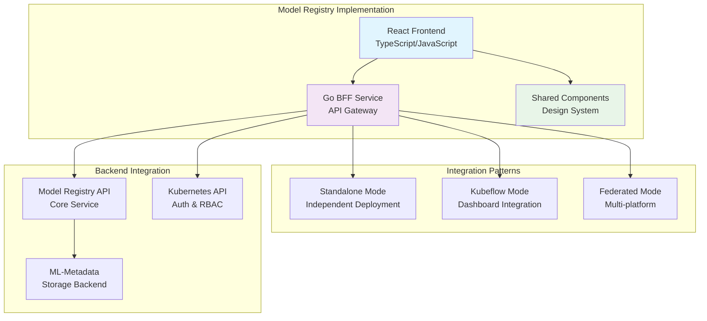

# Model Registry Case Study: Real-World Modular Implementation

The **Model Registry UI** serves as a comprehensive case study for implementing modular architecture patterns in practice. This document examines how the Model Registry UI implements the core patterns, technologies, and best practices outlined in our modular architecture initiative.

## Overview

The Model Registry UI demonstrates a complete modular micro-frontend implementation with:

- **Standalone Deployment**: Independent application with full functionality
- **Kubeflow Integration**: Seamless integration with the Kubeflow ecosystem
- **Multi-Theme Support**: PatternFly and Material-UI compatibility
- **Comprehensive BFF**: Full Backend-for-Frontend implementation
- **Authentication Integration**: Kubernetes RBAC and token-based auth

## Architecture Implementation

### Core Pattern Application

The Model Registry UI implements all three core modular architecture patterns:



### Multi-Deployment Architecture

The Model Registry demonstrates sophisticated deployment flexibility:

#### Deployment Mode Configuration

```typescript
// Environment-based deployment mode selection
interface DeploymentConfig {
  mode: 'standalone' | 'kubeflow' | 'federated';
  theme: 'patternfly-theme' | 'mui-theme';
  authMethod: 'internal' | 'user_token';
  apiEndpoints: string[];
  staticAssets: string;
}

// Example configurations for different modes
const standaloneConfig: DeploymentConfig = {
  mode: 'standalone',
  theme: 'patternfly-theme',
  authMethod: 'user_token',
  apiEndpoints: ['/api/v1/*', '/namespace'],
  staticAssets: '/app/dist'
};

const kubeflowConfig: DeploymentConfig = {
  mode: 'kubeflow',
  theme: 'patternfly-theme',
  authMethod: 'internal',
  apiEndpoints: ['/api/v1/*'], // Limited endpoints
  staticAssets: '/app/dist'
};
```

## Frontend Implementation Patterns

### Component Architecture

The Model Registry frontend demonstrates modern React patterns aligned with shared library principles:

```typescript
// Model Registry App Structure
import React from 'react';
import { BrowserRouter as Router } from 'react-router-dom';
import { QueryClient, QueryClientProvider } from 'react-query';
import { PatternFlyThemeProvider } from '@patternfly/react-core';

// Shared library integration (conceptual)
import {
  AppContextProvider,
  ThemeProvider,
  UserProvider,
  NotificationProvider
} from '@mod-arch/shared';

const ModelRegistryApp: React.FC = () => {
  const queryClient = new QueryClient();
  
  return (
    <QueryClientProvider client={queryClient}>
      <AppContextProvider config={modelRegistryConfig}>
        <ThemeProvider theme="patternfly">
          <UserProvider>
            <NotificationProvider>
              <Router>
                <PatternFlyThemeProvider>
                  <ModelRegistryRoutes />
                </PatternFlyThemeProvider>
              </Router>
            </NotificationProvider>
          </UserProvider>
        </ThemeProvider>
      </AppContextProvider>
    </QueryClientProvider>
  );
};
```

### API Integration Layer

The Model Registry implements a sophisticated API client that demonstrates best practices:

```typescript
// API client with type safety and error handling
import { useQuery, useMutation, useQueryClient } from 'react-query';

interface ModelRegistryService {
  id: string;
  name: string;
  description?: string;
  state: 'LIVE' | 'ARCHIVED';
  customProperties?: Record<string, any>;
  createTimeSinceEpoch?: string;
  lastUpdateTimeSinceEpoch?: string;
}

// Custom hook for Model Registry operations
export const useModelRegistryServices = () => {
  return useQuery<ModelRegistryService[]>({
    queryKey: ['modelRegistryServices'],
    queryFn: async () => {
      const response = await fetch('/api/v1/model_registry');
      if (!response.ok) {
        throw new Error('Failed to fetch model registry services');
      }
      return response.json();
    },
    staleTime: 5 * 60 * 1000, // 5 minutes
    cacheTime: 10 * 60 * 1000, // 10 minutes
  });
};

// Mutation for creating model registry services
export const useCreateModelRegistryService = () => {
  const queryClient = useQueryClient();
  
  return useMutation({
    mutationFn: async (data: Partial<ModelRegistryService>) => {
      const response = await fetch('/api/v1/model_registry', {
        method: 'POST',
        headers: { 'Content-Type': 'application/json' },
        body: JSON.stringify(data),
      });
      
      if (!response.ok) {
        throw new Error('Failed to create model registry service');
      }
      
      return response.json();
    },
    onSuccess: () => {
      // Invalidate and refetch
      queryClient.invalidateQueries(['modelRegistryServices']);
    },
  });
};
```

### Theme Integration

The Model Registry demonstrates sophisticated theme switching capabilities:

```typescript
// Theme-aware component implementation
import React from 'react';
import {
  Page,
  PageSection,
  Title,
  Card,
  CardBody
} from '@patternfly/react-core';

interface ModelRegistryPageProps {
  theme: 'patternfly-theme' | 'mui-theme';
}

const ModelRegistryPage: React.FC<ModelRegistryPageProps> = ({ theme }) => {
  // Theme-specific styling
  const themeStyles = {
    patternfly: {
      backgroundColor: 'var(--pf-global--BackgroundColor--100)',
      color: 'var(--pf-global--Color--100)'
    },
    mui: {
      backgroundColor: '#fafafa',
      color: '#212121'
    }
  };

  const currentTheme = theme === 'patternfly-theme' ? 'patternfly' : 'mui';

  return (
    <Page style={themeStyles[currentTheme]}>
      <PageSection>
        <Title headingLevel="h1" size="lg">
          Model Registry
        </Title>
        <Card>
          <CardBody>
            {/* Model Registry content */}
          </CardBody>
        </Card>
      </PageSection>
    </Page>
  );
};
```

## Backend-for-Frontend Implementation

### Comprehensive BFF Architecture

The Model Registry BFF demonstrates a production-ready BFF implementation:

```go
// Main BFF server structure
package main

import (
    "context"
    "log"
    "net/http"
    "os"
    "os/signal"
    "syscall"
    "time"
    
    "github.com/gorilla/mux"
    "github.com/kubeflow/model-registry/clients/ui/bff/internal/config"
    "github.com/kubeflow/model-registry/clients/ui/bff/internal/middleware"
    "github.com/kubeflow/model-registry/clients/ui/bff/internal/handlers"
)

func main() {
    // Load configuration from environment
    cfg := config.LoadFromEnv()
    
    // Create router with middleware chain
    router := mux.NewRouter()
    
    // Apply middleware stack
    router.Use(middleware.Recovery())
    router.Use(middleware.Telemetry())
    router.Use(middleware.CORS(cfg.AllowedOrigins))
    
    // API routes with authentication
    apiRouter := router.PathPrefix("/api/v1").Subrouter()
    apiRouter.Use(middleware.IdentityInjection(cfg.AuthMethod))
    apiRouter.Use(middleware.NamespaceAttachment())
    apiRouter.Use(middleware.Authorization())
    apiRouter.Use(middleware.RESTClientAttachment())
    
    // Register handlers
    handlers.RegisterAPIRoutes(apiRouter)
    
    // Static file serving for SPA
    router.PathPrefix("/").Handler(
        handlers.NewSPAHandler(cfg.StaticAssetsDir),
    )
    
    // Start server with graceful shutdown
    server := &http.Server{
        Addr:    ":" + cfg.Port,
        Handler: router,
        ReadTimeout:  15 * time.Second,
        WriteTimeout: 15 * time.Second,
        IdleTimeout:  60 * time.Second,
    }
    
    go func() {
        log.Printf("BFF server starting on port %s", cfg.Port)
        if err := server.ListenAndServe(); err != nil && err != http.ErrServerClosed {
            log.Fatalf("Server failed to start: %v", err)
        }
    }()
    
    // Wait for interrupt signal
    c := make(chan os.Signal, 1)
    signal.Notify(c, os.Interrupt, syscall.SIGTERM)
    <-c
    
    // Graceful shutdown
    ctx, cancel := context.WithTimeout(context.Background(), 15*time.Second)
    defer cancel()
    
    if err := server.Shutdown(ctx); err != nil {
        log.Fatalf("Server shutdown failed: %v", err)
    }
    
    log.Println("Server stopped gracefully")
}
```

### Authentication Middleware Implementation

```go
// Identity injection middleware for different auth methods
package middleware

import (
    "context"
    "net/http"
    "strings"
)

type AuthMethod string

const (
    AuthMethodInternal  AuthMethod = "internal"
    AuthMethodUserToken AuthMethod = "user_token"
)

type UserIdentity struct {
    UserID string
    Groups []string
    Token  string
}

func IdentityInjection(authMethod AuthMethod) func(http.Handler) http.Handler {
    return func(next http.Handler) http.Handler {
        return http.HandlerFunc(func(w http.ResponseWriter, r *http.Request) {
            var identity *UserIdentity
            
            switch authMethod {
            case AuthMethodInternal:
                identity = extractInternalIdentity(r)
            case AuthMethodUserToken:
                identity = extractUserTokenIdentity(r)
            default:
                http.Error(w, "Invalid auth method", http.StatusInternalServerError)
                return
            }
            
            if identity == nil {
                http.Error(w, "Unauthorized", http.StatusUnauthorized)
                return
            }
            
            // Add identity to request context
            ctx := context.WithValue(r.Context(), "user_identity", identity)
            next.ServeHTTP(w, r.WithContext(ctx))
        })
    }
}

func extractInternalIdentity(r *http.Request) *UserIdentity {
    userID := r.Header.Get("kubeflow-userid")
    if userID == "" {
        return nil
    }
    
    groups := strings.Split(r.Header.Get("kubeflow-groups"), ",")
    
    return &UserIdentity{
        UserID: userID,
        Groups: groups,
    }
}

func extractUserTokenIdentity(r *http.Request) *UserIdentity {
    authHeader := r.Header.Get("Authorization")
    if !strings.HasPrefix(authHeader, "Bearer ") {
        return nil
    }
    
    token := strings.TrimPrefix(authHeader, "Bearer ")
    if token == "" {
        return nil
    }
    
    return &UserIdentity{
        Token: token,
    }
}
```

### Authorization with Kubernetes RBAC

```go
// Authorization middleware using Kubernetes SAR/SSAR
package middleware

import (
    "context"
    "net/http"
    
    authv1 "k8s.io/api/authorization/v1"
    metav1 "k8s.io/apimachinery/pkg/apis/meta/v1"
    "k8s.io/client-go/kubernetes"
)

func Authorization() func(http.Handler) http.Handler {
    return func(next http.Handler) http.Handler {
        return http.HandlerFunc(func(w http.ResponseWriter, r *http.Request) {
            identity := r.Context().Value("user_identity").(*UserIdentity)
            namespace := r.Header.Get("X-Namespace")
            
            // Check permissions based on the endpoint
            if !checkPermissions(r.Context(), identity, namespace, r.URL.Path) {
                http.Error(w, "Forbidden", http.StatusForbidden)
                return
            }
            
            next.ServeHTTP(w, r)
        })
    }
}

func checkPermissions(ctx context.Context, identity *UserIdentity, namespace, path string) bool {
    // Create Kubernetes client
    clientset, err := kubernetes.NewForConfig(getK8sConfig())
    if err != nil {
        return false
    }
    
    // Determine required permissions based on path
    resource, verb := getResourceAndVerb(path)
    
    // Create SAR request
    sar := &authv1.SubjectAccessReview{
        Spec: authv1.SubjectAccessReviewSpec{
            User:   identity.UserID,
            Groups: identity.Groups,
            ResourceAttributes: &authv1.ResourceAttributes{
                Namespace: namespace,
                Verb:      verb,
                Resource:  resource,
            },
        },
    }
    
    // Check permissions
    result, err := clientset.AuthorizationV1().
        SubjectAccessReviews().
        Create(ctx, sar, metav1.CreateOptions{})
    
    if err != nil {
        return false
    }
    
    return result.Status.Allowed
}

func getResourceAndVerb(path string) (resource, verb string) {
    switch {
    case strings.Contains(path, "/model_registry"):
        return "services", "get"
    case strings.Contains(path, "/namespace"):
        return "namespaces", "list"
    default:
        return "services", "get"
    }
}
```

## Testing Strategies

### Frontend Testing

The Model Registry demonstrates comprehensive frontend testing:

```typescript
// Component testing with React Testing Library
import React from 'react';
import { render, screen, waitFor } from '@testing-library/react';
import userEvent from '@testing-library/user-event';
import { QueryClient, QueryClientProvider } from 'react-query';

import { ModelRegistryServicesList } from '../ModelRegistryServicesList';

// Mock API responses
const mockServices = [
  {
    id: '1',
    name: 'Model Registry A',
    description: 'Primary model registry',
    state: 'LIVE' as const,
    createTimeSinceEpoch: '1609459200000'
  },
  {
    id: '2',
    name: 'Model Registry B',
    description: 'Secondary model registry',
    state: 'ARCHIVED' as const,
    createTimeSinceEpoch: '1609459200000'
  }
];

// Test utilities
const renderWithQueryClient = (component: React.ReactElement) => {
  const queryClient = new QueryClient({
    defaultOptions: {
      queries: { retry: false },
      mutations: { retry: false },
    },
  });
  
  return render(
    <QueryClientProvider client={queryClient}>
      {component}
    </QueryClientProvider>
  );
};

describe('ModelRegistryServicesList', () => {
  beforeEach(() => {
    // Mock fetch API
    global.fetch = jest.fn();
  });

  afterEach(() => {
    jest.restoreAllMocks();
  });

  it('should display model registry services', async () => {
    (global.fetch as jest.Mock).mockResolvedValueOnce({
      ok: true,
      json: async () => mockServices,
    });

    renderWithQueryClient(<ModelRegistryServicesList />);

    // Wait for loading to complete
    await waitFor(() => {
      expect(screen.getByText('Model Registry A')).toBeInTheDocument();
      expect(screen.getByText('Model Registry B')).toBeInTheDocument();
    });

    // Check service details
    expect(screen.getByText('Primary model registry')).toBeInTheDocument();
    expect(screen.getByText('LIVE')).toBeInTheDocument();
    expect(screen.getByText('ARCHIVED')).toBeInTheDocument();
  });

  it('should handle service creation', async () => {
    const user = userEvent.setup();
    
    (global.fetch as jest.Mock)
      .mockResolvedValueOnce({
        ok: true,
        json: async () => mockServices,
      })
      .mockResolvedValueOnce({
        ok: true,
        json: async () => ({
          id: '3',
          name: 'New Registry',
          state: 'LIVE'
        }),
      });

    renderWithQueryClient(<ModelRegistryServicesList />);

    // Wait for initial load
    await waitFor(() => {
      expect(screen.getByText('Model Registry A')).toBeInTheDocument();
    });

    // Click create button
    const createButton = screen.getByRole('button', { name: /create/i });
    await user.click(createButton);

    // Fill form (assuming modal opens)
    const nameInput = screen.getByLabelText(/name/i);
    await user.type(nameInput, 'New Registry');

    const submitButton = screen.getByRole('button', { name: /submit/i });
    await user.click(submitButton);

    // Verify API call
    expect(global.fetch).toHaveBeenCalledWith('/api/v1/model_registry', {
      method: 'POST',
      headers: { 'Content-Type': 'application/json' },
      body: JSON.stringify({ name: 'New Registry' }),
    });
  });

  it('should handle API errors gracefully', async () => {
    (global.fetch as jest.Mock).mockRejectedValueOnce(
      new Error('Network error')
    );

    renderWithQueryClient(<ModelRegistryServicesList />);

    await waitFor(() => {
      expect(screen.getByText(/error/i)).toBeInTheDocument();
    });
  });
});
```

### BFF Testing

```go
// BFF integration testing
package handlers_test

import (
    "bytes"
    "encoding/json"
    "net/http"
    "net/http/httptest"
    "testing"
    
    "github.com/gorilla/mux"
    "github.com/stretchr/testify/assert"
    "github.com/stretchr/testify/require"
    
    "github.com/kubeflow/model-registry/clients/ui/bff/internal/handlers"
    "github.com/kubeflow/model-registry/clients/ui/bff/internal/middleware"
)

func TestModelRegistryAPI(t *testing.T) {
    tests := []struct {
        name           string
        method         string
        path           string
        headers        map[string]string
        body           interface{}
        expectedStatus int
        expectedBody   interface{}
    }{
        {
            name:   "List model registries with valid auth",
            method: "GET",
            path:   "/api/v1/model_registry",
            headers: map[string]string{
                "kubeflow-userid": "test-user",
                "X-Namespace":     "default",
            },
            expectedStatus: http.StatusOK,
        },
        {
            name:           "List model registries without auth",
            method:         "GET",
            path:           "/api/v1/model_registry",
            expectedStatus: http.StatusUnauthorized,
        },
        {
            name:   "Create model registry",
            method: "POST",
            path:   "/api/v1/model_registry",
            headers: map[string]string{
                "kubeflow-userid": "test-user",
                "X-Namespace":     "default",
                "Content-Type":    "application/json",
            },
            body: map[string]string{
                "name":        "Test Registry",
                "description": "Test model registry",
            },
            expectedStatus: http.StatusCreated,
        },
    }

    for _, tt := range tests {
        t.Run(tt.name, func(t *testing.T) {
            // Create router with middleware
            router := mux.NewRouter()
            
            // Apply test middleware stack
            apiRouter := router.PathPrefix("/api/v1").Subrouter()
            apiRouter.Use(middleware.IdentityInjection(middleware.AuthMethodInternal))
            apiRouter.Use(mockKubernetesMiddleware()) // Mock K8s for testing
            
            // Register handlers
            handlers.RegisterAPIRoutes(apiRouter)
            
            // Prepare request
            var bodyReader *bytes.Reader
            if tt.body != nil {
                bodyBytes, err := json.Marshal(tt.body)
                require.NoError(t, err)
                bodyReader = bytes.NewReader(bodyBytes)
            } else {
                bodyReader = bytes.NewReader([]byte{})
            }
            
            req := httptest.NewRequest(tt.method, tt.path, bodyReader)
            
            // Add headers
            for key, value := range tt.headers {
                req.Header.Set(key, value)
            }
            
            // Execute request
            w := httptest.NewRecorder()
            router.ServeHTTP(w, req)
            
            // Assert response
            assert.Equal(t, tt.expectedStatus, w.Code)
            
            if tt.expectedBody != nil {
                var responseBody interface{}
                err := json.Unmarshal(w.Body.Bytes(), &responseBody)
                require.NoError(t, err)
                assert.Equal(t, tt.expectedBody, responseBody)
            }
        })
    }
}

// Mock Kubernetes middleware for testing
func mockKubernetesMiddleware() func(http.Handler) http.Handler {
    return func(next http.Handler) http.Handler {
        return http.HandlerFunc(func(w http.ResponseWriter, r *http.Request) {
            // Simulate successful authorization for test user
            next.ServeHTTP(w, r)
        })
    }
}
```

## Deployment Configuration

### Multi-Mode Deployment

The Model Registry demonstrates sophisticated deployment configuration:

```yaml
# Kubernetes deployment for standalone mode
apiVersion: apps/v1
kind: Deployment
metadata:
  name: model-registry-ui
  namespace: kubeflow
spec:
  replicas: 2
  selector:
    matchLabels:
      app: model-registry-ui
  template:
    metadata:
      labels:
        app: model-registry-ui
    spec:
      serviceAccountName: model-registry-ui
      containers:
      - name: bff
        image: kubeflow/model-registry-ui:latest
        ports:
        - containerPort: 8080
        env:
        - name: DEPLOYMENT_MODE
          value: "standalone"
        - name: STYLE_THEME
          value: "patternfly-theme"
        - name: AUTH_METHOD
          value: "user_token"
        - name: PORT
          value: "8080"
        - name: LOG_LEVEL
          value: "info"
        volumeMounts:
        - name: static-assets
          mountPath: /app/dist
        livenessProbe:
          httpGet:
            path: /healthcheck
            port: 8080
          initialDelaySeconds: 30
          periodSeconds: 10
        readinessProbe:
          httpGet:
            path: /healthcheck
            port: 8080
          initialDelaySeconds: 5
          periodSeconds: 5
      volumes:
      - name: static-assets
        emptyDir: {}
---
apiVersion: v1
kind: Service
metadata:
  name: model-registry-ui-service
  namespace: kubeflow
spec:
  selector:
    app: model-registry-ui
  ports:
  - port: 80
    targetPort: 8080
  type: ClusterIP
---
apiVersion: networking.k8s.io/v1
kind: Ingress
metadata:
  name: model-registry-ui-ingress
  namespace: kubeflow
  annotations:
    nginx.ingress.kubernetes.io/rewrite-target: /$1
spec:
  rules:
  - host: model-registry.example.com
    http:
      paths:
      - path: /(.*)
        pathType: Prefix
        backend:
          service:
            name: model-registry-ui-service
            port:
              number: 80
```

### Kubeflow Integration Deployment

```yaml
# Kubeflow integration configuration
apiVersion: v1
kind: ConfigMap
metadata:
  name: model-registry-ui-config
  namespace: kubeflow
data:
  config.yaml: |
    deploymentMode: "kubeflow"
    authMethod: "internal"
    theme: "patternfly-theme"
    endpoints:
      - "/api/v1/*"
    kubeflowIntegration:
      dashboardNamespace: "kubeflow"
      centralDashboardPath: "/model-registry"
---
apiVersion: apps/v1
kind: Deployment
metadata:
  name: model-registry-ui-kubeflow
  namespace: kubeflow
spec:
  replicas: 1
  selector:
    matchLabels:
      app: model-registry-ui-kubeflow
  template:
    metadata:
      labels:
        app: model-registry-ui-kubeflow
    spec:
      serviceAccountName: model-registry-ui
      containers:
      - name: bff
        image: kubeflow/model-registry-ui:kubeflow
        ports:
        - containerPort: 8080
        env:
        - name: DEPLOYMENT_MODE
          value: "kubeflow"
        - name: AUTH_METHOD
          value: "internal"
        volumeMounts:
        - name: config
          mountPath: /etc/config
      volumes:
      - name: config
        configMap:
          name: model-registry-ui-config
```

## Performance Optimizations

### Frontend Performance

```typescript
// Code splitting and lazy loading implementation
import React, { Suspense } from 'react';
import { Routes, Route } from 'react-router-dom';
import { LoadingSpinner } from '@shared/components';

// Lazy load components for better performance
const ModelRegistryList = React.lazy(() => 
  import('./components/ModelRegistryList')
);
const ModelRegistryDetail = React.lazy(() => 
  import('./components/ModelRegistryDetail')
);
const ModelRegistryCreate = React.lazy(() => 
  import('./components/ModelRegistryCreate')
);

const ModelRegistryRoutes: React.FC = () => {
  return (
    <Suspense fallback={<LoadingSpinner />}>
      <Routes>
        <Route 
          path="/model-registry" 
          element={<ModelRegistryList />} 
        />
        <Route 
          path="/model-registry/:id" 
          element={<ModelRegistryDetail />} 
        />
        <Route 
          path="/model-registry/create" 
          element={<ModelRegistryCreate />} 
        />
      </Routes>
    </Suspense>
  );
};

// Optimized data fetching with caching
export const useOptimizedModelRegistryData = () => {
  return useQuery({
    queryKey: ['modelRegistryServices'],
    queryFn: fetchModelRegistryServices,
    staleTime: 5 * 60 * 1000, // 5 minutes
    cacheTime: 10 * 60 * 1000, // 10 minutes
    refetchOnWindowFocus: false,
    refetchOnMount: false,
  });
};
```

### BFF Performance

```go
// Connection pooling and request optimization
package client

import (
    "net/http"
    "time"
)

// Optimized HTTP client with connection pooling
func NewOptimizedHTTPClient() *http.Client {
    transport := &http.Transport{
        MaxIdleConns:        100,
        MaxIdleConnsPerHost: 10,
        IdleConnTimeout:     90 * time.Second,
        DisableKeepAlives:   false,
    }
    
    return &http.Client{
        Transport: transport,
        Timeout:   30 * time.Second,
    }
}

// Response caching middleware
func CacheMiddleware(duration time.Duration) func(http.Handler) http.Handler {
    cache := make(map[string]cacheEntry)
    
    return func(next http.Handler) http.Handler {
        return http.HandlerFunc(func(w http.ResponseWriter, r *http.Request) {
            if r.Method != http.MethodGet {
                next.ServeHTTP(w, r)
                return
            }
            
            key := r.URL.Path + r.URL.RawQuery
            
            if entry, exists := cache[key]; exists && time.Since(entry.timestamp) < duration {
                w.Header().Set("X-Cache", "HIT")
                w.WriteHeader(entry.statusCode)
                w.Write(entry.data)
                return
            }
            
            // Capture response
            recorder := &responseRecorder{ResponseWriter: w}
            next.ServeHTTP(recorder, r)
            
            // Cache successful responses
            if recorder.statusCode < 400 {
                cache[key] = cacheEntry{
                    data:       recorder.data,
                    statusCode: recorder.statusCode,
                    timestamp:  time.Now(),
                }
            }
        })
    }
}
```

## Lessons Learned

### Implementation Insights

1. **Deployment Flexibility**: Multiple deployment modes provide significant value but require careful configuration management
2. **Authentication Complexity**: Supporting both internal and user token authentication adds complexity but enables broader integration
3. **Theme System**: Multi-theme support requires careful component abstraction but enables diverse UI requirements
4. **BFF Value**: The BFF pattern significantly simplifies frontend development while providing security and performance benefits

### Best Practices Demonstrated

1. **Configuration-Driven**: Environment-based configuration enables flexible deployment
2. **Middleware Chain**: Comprehensive middleware stack provides consistent cross-cutting concerns
3. **Type Safety**: Strong typing across frontend and backend improves development experience
4. **Testing Strategy**: Comprehensive testing at all levels ensures reliability
5. **Performance Focus**: Optimization strategies at build and runtime improve user experience

The Model Registry UI serves as a comprehensive example of modular architecture implementation, demonstrating how theoretical patterns translate into practical, production-ready solutions.

---

**Next Steps**: Use this case study as a reference when implementing your own modular applications, adapting the patterns to your specific requirements while maintaining the core architectural principles.
