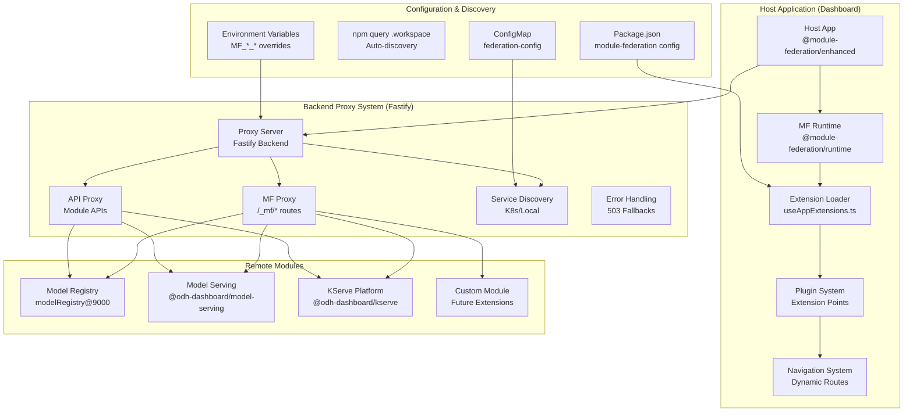

# Module Federation Integration

This guide covers the comprehensive implementation of Webpack Module Federation in our modular architecture, enabling dynamic loading and integration of micro-frontends into the main dashboard application.

## Overview

Module Federation provides the technical foundation for our modular architecture by enabling:

- **Dynamic Module Loading**: Micro-frontends are loaded at runtime rather than build time
- **Independent Deployment**: Each module can be deployed and updated independently
- **Shared Dependencies**: Common libraries are shared between host and remote modules
- **Plugin Architecture**: Extensible system for adding new capabilities
- **Runtime Integration**: Modules are discovered and integrated dynamically

## Architecture Components

### High-Level System Architecture

```text
┌─────────────────┐    ┌─────────────────┐    ┌─────────────────┐
│   Host App      │    │   Backend       │    │   Remote Apps   │
│   (Dashboard)   │◄──►│   (Proxy)       │◄──►│   (Modules)     │
└─────────────────┘    └─────────────────┘    └─────────────────┘
```

### Detailed Component Architecture



### Key Components

1. **Host Application**: Main dashboard that orchestrates micro-frontends
2. **Extension System**: Dynamic plugin architecture for UI integration
3. **Backend Proxy**: Intelligent routing and API proxying system
4. **Remote Modules**: Independent micro-frontend applications
5. **Configuration System**: Flexible configuration for development and production

## Module Federation Configuration

### Host Application Setup

The main dashboard acts as the Module Federation host with dynamic remote discovery:

```javascript
// frontend/config/moduleFederation.js
const { ModuleFederationPlugin } = require('@module-federation/enhanced/webpack');

const getModuleFederationConfig = () => {
  if (process.env.MODULE_FEDERATION_CONFIG) {
    // Production: Use environment variable from ConfigMap
    return JSON.parse(process.env.MODULE_FEDERATION_CONFIG);
  } else {
    // Development: Auto-discover from workspace packages
    return readModuleFederationConfigFromPackages();
  }
};

const mfConfig = getModuleFederationConfig();

module.exports = {
  moduleFederationConfig: mfConfig,
  moduleFederationPlugins: mfConfig.length > 0 ? [
    new ModuleFederationPlugin({
      name: 'host',
      filename: 'remoteEntry.js',
      remotes: process.env.NODE_ENV === 'development'
        ? // Development: Direct connection to local services
          mfConfig.reduce((acc, config) => {
            const host = process.env[`MF_${config.name.toUpperCase()}_LOCAL_HOST`] ?? config.local.host ?? 'localhost';
            const port = process.env[`MF_${config.name.toUpperCase()}_LOCAL_PORT`] ?? config.local.port;
            acc[`@mf/${config.name}`] = `${config.name}@http://${host}:${port}${config.remoteEntry}`;
            return acc;
          }, {})
        : // Production: Proxy through backend
          mfConfig.reduce((acc, config) => {
            acc[`@mf/${config.name}`] = `${config.name}@/_mf/${config.name}${config.remoteEntry}`;
            return acc;
          }, {}),
      shared: {
        // Critical shared dependencies
        react: { singleton: true, requiredVersion: deps.react },
        'react-dom': { singleton: true, requiredVersion: deps['react-dom'] },
        'react-router': { singleton: true, requiredVersion: deps['react-router'] },
        'react-router-dom': { singleton: true, requiredVersion: deps['react-router-dom'] },
        
        // UI framework dependencies
        '@patternfly/react-core': { requiredVersion: deps['@patternfly/react-core'] },
        '@openshift/dynamic-plugin-sdk': { 
          singleton: true, 
          requiredVersion: deps['@openshift/dynamic-plugin-sdk'] 
        },
        
        // Auto-include workspace packages as shared dependencies
        ...workspacePackages
          .filter((pkg) => !!pkg.exports)
          .reduce((acc, pkg) => {
            acc[pkg.name] = {
              singleton: true,
              requiredVersion: pkg.version,
            };
            return acc;
          }, {}),
      },
      dts: process.env.NODE_ENV === 'development', // Type generation in dev only
    }),
  ] : [],
};
```

### Remote Module Configuration

Each remote module defines its own Module Federation configuration:

```javascript
// packages/model-registry/upstream/frontend/config/moduleFederation.js
const { ModuleFederationPlugin } = require('@module-federation/enhanced/webpack');

const moduleFederationConfig = {
  name: 'modelRegistry',
  filename: 'remoteEntry.js',
  shared: {
    // Match host shared dependencies exactly
    react: { singleton: true, requiredVersion: deps.react },
    'react-dom': { singleton: true, requiredVersion: deps['react-dom'] },
    'react-router': { singleton: true, requiredVersion: deps['react-router'] },
    'react-router-dom': { singleton: true, requiredVersion: deps['react-router-dom'] },
    '@patternfly/react-core': { singleton: true, requiredVersion: deps['@patternfly/react-core'] },
    '@openshift/dynamic-plugin-sdk': { singleton: true, requiredVersion: '*' },
    
    // Dashboard-specific shared packages
    '@odh-dashboard/plugin-core': { singleton: true, requiredVersion: '0.0.0' },
    'mod-arch-shared': { singleton: true, requiredVersion: '*' },
  },
  exposes: {
    './extensions': './src/extensions', // Extension point definitions
    './components': './src/components', // Optional: Expose reusable components
  },
  runtime: false, // Important for optimization.runtimeChunk="single"
  dts: false, // Disable in production
};

module.exports = {
  moduleFederationPlugins: [new ModuleFederationPlugin(moduleFederationConfig)],
};
```

### Module Package Configuration

Each module declares its configuration in `package.json`:

```json
{
  "name": "@odh-dashboard/model-registry",
  "private": true,
  "exports": {
    "./extensions": "./src/extensions.ts",
    "./components": "./src/components/index.ts"
  },
  "module-federation": {
    "name": "modelRegistry",
    "remoteEntry": "/remoteEntry.js",
    "authorize": true,
    "tls": false,
    "proxy": [
      {
        "path": "/model-registry/api",
        "pathRewrite": "/api"
      },
      {
        "path": "/model-registry/health",
        "pathRewrite": "/health"
      }
    ],
    "local": {
      "host": "localhost",
      "port": 9000
    },
    "service": {
      "name": "model-registry-ui-service",
      "port": 8080
    }
  }
}
```

## Extension System

### Extension Point Types

The system defines standardized extension points for different types of integrations:

```typescript
// Extension point definitions
export type Extension = 
  | AreaExtension
  | HrefNavItemExtension
  | RouteExtension
  | ProjectDetailsTab
  | OverviewSectionExtension
  | ModelServingPlatformExtension;

// Navigation extension
export interface HrefNavItemExtension extends Extension {
  type: 'app.navigation/href';
  properties: {
    id: string;
    title: string;
    href: string;
    section?: string;
    path?: string;
  };
  flags?: {
    required?: string[];
    disallowed?: string[];
  };
}

// Route extension
export interface RouteExtension extends Extension {
  type: 'app.route';
  properties: {
    path: string;
    component: () => Promise<{ default: React.ComponentType }>;
  };
  flags?: {
    required?: string[];
  };
}

// Project details tab extension
export interface ProjectDetailsTab extends Extension {
  type: 'app.project-details/tab';
  properties: {
    id: string;
    title: string;
    component: () => Promise<{ default: React.ComponentType }>;
  };
  flags?: {
    required?: string[];
  };
}

// Area definition for feature flags
export interface AreaExtension extends Extension {
  type: 'app.area';
  properties: {
    id: string;
    reliantAreas?: SupportedArea[];
    devFlags?: string[];
  };
}

// Model serving platform extension
export interface ModelServingPlatformExtension<T = unknown> extends Extension {
  type: 'model-serving/platform';
  properties: {
    id: string;
    displayName: string;
    icon: () => Promise<{ default: React.ComponentType }>;
    isEnabled: (project: ProjectKind) => boolean;
    isDisabled?: (project: ProjectKind) => boolean;
    disabledReason?: string;
  };
}
```

### Extension Registration

Modules register extensions by exporting them from their exposed entry points:

```typescript
// packages/model-registry/src/extensions.ts
import type {
  HrefNavItemExtension,
  RouteExtension,
  AreaExtension,
} from '@odh-dashboard/plugin-core/extension-points';
import { SupportedArea } from '@odh-dashboard/internal/concepts/areas/types';

const MODEL_REGISTRY_PLUGIN = 'plugin-model-registry';

const extensions: (
  | AreaExtension
  | HrefNavItemExtension
  | RouteExtension
)[] = [
  // Area definition for feature flag management
  {
    type: 'app.area',
    properties: {
      id: MODEL_REGISTRY_PLUGIN,
      reliantAreas: [SupportedArea.MODEL_REGISTRY],
      devFlags: ['Model Registry Plugin'],
    },
  },
  
  // Navigation item
  {
    type: 'app.navigation/href',
    flags: {
      required: [MODEL_REGISTRY_PLUGIN],
    },
    properties: {
      id: 'modelRegistry',
      title: 'Model registry',
      href: '/model-registry',
      section: 'models',
      path: '/model-registry/:registryName?/*',
    },
  },
  
  // Route definition
  {
    type: 'app.route',
    properties: {
      path: '/model-registry/:registryName?/*',
      component: () => import('./ModelRegistryWrapper'),
    },
    flags: {
      required: [MODEL_REGISTRY_PLUGIN],
    },
  },
];

export default extensions;
```

### Specialized Platform Extensions

For complex domains like model serving, specialized extension points provide more sophisticated integration:

```typescript
// packages/kserve/src/extensions.ts
import type {
  ModelServingPlatformExtension,
  ModelServingDeploymentsTableExtension,
  ModelServingDeleteModal,
} from '@odh-dashboard/model-serving/extension-points';

export const KSERVE_ID = 'kserve';

const extensions: (
  | ModelServingPlatformExtension<KServeDeployment>
  | ModelServingDeploymentsTableExtension<KServeDeployment>
  | ModelServingDeleteModal<KServeDeployment>
)[] = [
  {
    type: 'model-serving/platform',
    properties: {
      id: KSERVE_ID,
      displayName: 'Single-model serving platform',
      icon: () => import('./src/icon'),
      isEnabled: (project) => project.metadata.labels?.['modelmesh-enabled'] !== 'true',
      isDisabled: (project) => !!project.metadata.labels?.['modelmesh-enabled'],
      disabledReason: 'Single-model serving is disabled for this project',
    },
  },
  {
    type: 'model-serving/deployments-table',
    properties: {
      platform: KSERVE_ID,
      component: () => import('./src/deployments/KServeDeploymentsTable'),
    },
  },
  {
    type: 'model-serving/delete-modal',
    properties: {
      platform: KSERVE_ID,
      component: () => import('./src/deployments/KServeDeleteModal'),
    },
  },
];

export default extensions;
```

## Backend Proxy System

### Main Proxy Implementation

The backend implements a comprehensive proxy system for module federation and API routing:

```typescript
// backend/src/routes/module-federation.ts
import { registerProxy } from '../utils/proxy';
import { KubeFastifyInstance } from '../types';
import { DEV_MODE } from '../utils/constants';

export default async (fastify: KubeFastifyInstance): Promise<void> => {
  const mfConfig = getModuleFederationConfig(fastify);
  
  if (mfConfig && mfConfig.length > 0) {
    fastify.log.info(
      `Module federation configured for: ${mfConfig.map((mf) => mf.name).join(', ')}`,
    );
    
    mfConfig.forEach(({ name, proxy, local, service, tls: mfTls, authorize }) => {
      // Environment variable overrides for flexible deployment
      const getEnvVar = (prop: string): string | undefined =>
        process.env[`MF_${name.toUpperCase()}_${prop.toUpperCase()}`];

      const serviceName = getEnvVar('SERVICE_NAME') ?? service.name;
      const serviceNamespace = getEnvVar('SERVICE_NAMESPACE') ?? service.namespace ?? process.env.OC_PROJECT;
      const servicePort = getEnvVar('SERVICE_PORT') ?? service.port;
      const host = getEnvVar('LOCAL_HOST') ?? local?.host ?? 'localhost';
      const port = getEnvVar('LOCAL_PORT') ?? local?.port;
      const tls = getEnvVar('TLS') ? getEnvVar('TLS') === 'true' : !!mfTls;

      // Register main module federation proxy (/_mf/{module}/*)
      registerProxy(fastify, {
        prefix: `/_mf/${name}`,
        rewritePrefix: '',
        tls,
        authorize,
        service: { name: serviceName, namespace: serviceNamespace, port: servicePort },
        local: { host, port },
        onError: (reply, error) => {
          if (error.error.code === 'FST_REPLY_FROM_INTERNAL_SERVER_ERROR' && error.error.statusCode === 500) {
            fastify.log.error(`Module federation service '${name}' is unavailable`);
            reply.code(503).send({
              error: 'Service Unavailable',
              message: `Module federation service '${name}' is currently unavailable`,
              statusCode: 503,
            });
          } else {
            reply.send(error);
          }
        },
      });

      // Register API proxies for module-specific APIs
      proxy?.forEach((proxyConfig) => {
        registerProxy(fastify, {
          prefix: proxyConfig.path,           // e.g., '/model-registry/api'
          rewritePrefix: proxyConfig.pathRewrite ?? proxyConfig.path,
          tls,
          authorize,
          service: { name: serviceName, namespace: serviceNamespace, port: servicePort },
          local: { host, port },
        });
      });
    });
  }
};
```

### Proxy Utility with Advanced Features

```typescript
// backend/src/utils/proxy.ts
import httpProxy from '@fastify/http-proxy';
import { DEV_MODE } from './constants';

export const registerProxy = async (
  fastify: KubeFastifyInstance,
  {
    prefix,
    rewritePrefix,
    service,
    local,
    authorize,
    tls,
    onError,
  }: {
    prefix: string;
    rewritePrefix: string;
    authorize?: boolean;
    tls?: boolean;
    service: { name: string; namespace: string; port: number | string };
    local?: { host?: string; port?: number | string };
    onError?: FastifyReplyFromHooks['onError'];
  },
): Promise<void> => {
  const scheme = tls ? 'https' : 'http';
  const upstream = DEV_MODE
    ? `${scheme}://${local?.host || 'localhost'}:${local?.port ?? service.port}`
    : `${scheme}://${service.name}.${service.namespace}.svc.cluster.local:${service.port}`;
    
  fastify.log.info(`Proxy setup for: ${prefix} -> ${upstream}`);
  
  return fastify.register(httpProxy, {
    prefix,
    rewritePrefix,
    upstream,
    replyOptions: {
      getUpstream: () => upstream,
      onError,
    },
    preHandler: async (request, reply) => {
      // Rate limiting check
      if (checkRequestLimitExceeded(request, fastify, reply)) {
        return;
      }
      
      // Authentication setup
      if (authorize) {
        await setAuthorizationHeader(request, fastify);
      }
      
      // Detailed logging for debugging
      fastify.log.info(`Proxy ${request.method} request ${request.url} to ${upstream}`);
    },
  });
};
```

## Runtime Loading and Integration

### Dynamic Extension Loading

Extensions are loaded dynamically at runtime using the Module Federation runtime:

```typescript
// frontend/src/plugins/useAppExtensions.ts
import { init, loadRemote } from '@module-federation/runtime';
import type { Extension } from '@openshift/dynamic-plugin-sdk';

const initRemotes = (remotes: MFConfig[]) => {
  init({
    name: 'app',
    remotes: remotes.map(({ name, remoteEntry }) => ({
      name,
      entry: process.env.NODE_ENV === 'development' 
        ? `http://localhost:${getLocalPort(name)}${remoteEntry}`
        : `/_mf/${name}${remoteEntry}`,
    })),
  });
};

const loadModuleExtensions = async (moduleName: string): Promise<Record<string, Extension[]>> => {
  try {
    const result = await loadRemote<{ default: Extension[] }>(`${moduleName}/extensions`);
    return { [moduleName]: result ? result.default : [] };
  } catch (error) {
    console.warn(`Failed to load extensions from module '${moduleName}':`, error);
    return { [moduleName]: [] }; // Graceful degradation
  }
};

export const useAppExtensions = (): [Record<string, Extension[]>, boolean] => {
  const [appExtensions, setAppExtensions] = React.useState<Record<string, Extension[]>>({});
  const [loaded, setLoaded] = React.useState(!MF_CONFIG);

  React.useEffect(() => {
    if (MF_CONFIG) {
      const remotes: MFConfig[] = JSON.parse(MF_CONFIG);
      try {
        if (remotes.length > 0) {
          initRemotes(remotes);
          // Load all module extensions in parallel with error handling
          Promise.allSettled(remotes.map((r) => loadModuleExtensions(r.name)))
            .then((results) => {
              const extensions = results
                .filter((result): result is PromiseFulfilledResult<Record<string, Extension[]>> => 
                  result.status === 'fulfilled')
                .reduce((acc, result) => ({ ...acc, ...result.value }), {});
              
              setAppExtensions((prev) => ({ ...prev, ...extensions }));
            })
            .finally(() => setLoaded(true));
        }
      } catch (error) {
        console.error('Error parsing module federation config:', error);
        setLoaded(true);
      }
    }
  }, []);

  return [{ ...pluginExtensions, ...appExtensions }, loaded];
};
```

### Extension Resolution and Usage

Extensions are resolved and used throughout the application using hooks and utilities:

```typescript
// frontend/packages/plugin-core/src/useExtensions.ts
import React from 'react';
import { Extension, ExtensionPredicate } from '@openshift/dynamic-plugin-sdk';
import { useAppExtensions } from '../plugins/useAppExtensions';

export const useExtensions = <T extends Extension>(
  extensionPredicate: ExtensionPredicate<T>,
): T[] => {
  const [extensions, loaded] = useAppExtensions();
  
  return React.useMemo(() => {
    if (!loaded) return [];
    
    const allExtensions = Object.values(extensions).flat() as Extension[];
    return allExtensions.filter(extensionPredicate) as T[];
  }, [extensions, loaded, extensionPredicate]);
};

// Platform-specific extension utilities
export const usePlatformExtension = <T extends PlatformExtension>(
  extensionPredicate: ExtensionPredicate<T>,
  platform: ModelServingPlatform,
): T | null => {
  const extensions = useExtensions<T>(extensionPredicate);

  return React.useMemo(
    () => extensions.find((ext) => ext.properties.platform === platform.properties.id) ?? null,
    [extensions, platform],
  );
};

// Usage in navigation component
const NavigationComponent: React.FC = () => {
  const hrefExtensions = useExtensions<HrefNavItemExtension>(
    (ext) => ext.type === 'app.navigation/href'
  );
  
  return (
    <Nav>
      {hrefExtensions.map((ext) => (
        <NavItem key={ext.properties.id}>
          <NavLink to={ext.properties.href}>
            {ext.properties.title}
          </NavLink>
        </NavItem>
      ))}
    </Nav>
  );
};
```

## Development Workflow

### Local Development Setup

1. **Start the main dashboard** (host application):

   ```bash
   cd odh-dashboard
   npm run dev
   ```

2. **Start remote modules** (in separate terminals):

   ```bash
   # Model Registry module
   cd frontend/packages/model-registry/upstream/frontend
   npm run dev
   
   # Model Serving module
   cd frontend/packages/model-serving
   npm run dev
   ```

3. **Automatic Discovery**: The system automatically detects running modules and configures proxying

### Environment Configuration

Configure development environment with override variables:

```bash
# Override service configuration for specific modules
export MF_MODELREGISTRY_LOCAL_HOST=127.0.0.1
export MF_MODELREGISTRY_LOCAL_PORT=9001
export MF_MODELREGISTRY_SERVICE_NAME=custom-mr-service

# Enable type updates during development
export MF_UPDATE_TYPES=true

# Global configuration override (optional)
export MODULE_FEDERATION_CONFIG='[{"name":"modelRegistry",...}]'
```

### Creating a New Module - Complete Example

Follow this comprehensive example to create a new module from scratch:

#### 1. Create Package Structure

```bash
# Create the module package directory
mkdir -p frontend/packages/my-analytics-module/src/components
cd frontend/packages/my-analytics-module

# Initialize package.json
npm init -y

# Create essential files
touch src/extensions.ts
touch src/MyAnalyticsRoutes.tsx
touch webpack.config.js
touch tsconfig.json
```

#### 2. Configure Package.json with Full Module Federation Config

```json
{
  "name": "@odh-dashboard/my-analytics-module",
  "version": "1.0.0",
  "private": true,
  "type": "module",
  "exports": {
    "./extensions": "./src/extensions.ts"
  },
  "module-federation": {
    "name": "analyticsModule",
    "remoteEntry": "/remoteEntry.js",
    "authorize": true,
    "tls": false,
    "proxy": [
      {
        "path": "/analytics/api",
        "pathRewrite": "/api"
      },
      {
        "path": "/analytics/metrics",
        "pathRewrite": "/metrics"
      }
    ],
    "local": {
      "host": "localhost",
      "port": 9003
    },
    "service": {
      "name": "analytics-service",
      "namespace": "opendatahub",
      "port": 8080
    }
  },
  "scripts": {
    "dev": "webpack serve --mode development",
    "build": "webpack --mode production",
    "type-check": "tsc --noEmit"
  },
  "dependencies": {
    "react": "^18.0.0",
    "react-dom": "^18.0.0",
    "react-router-dom": "^6.0.0",
    "@patternfly/react-core": "^5.0.0",
    "@openshift/dynamic-plugin-sdk": "^4.0.0",
    "mod-arch-shared": "*"
  },
  "devDependencies": {
    "@module-federation/enhanced": "^0.2.0",
    "@types/react": "^18.0.0",
    "@types/react-dom": "^18.0.0",
    "typescript": "^5.0.0",
    "webpack": "^5.0.0",
    "webpack-cli": "^5.0.0",
    "webpack-dev-server": "^4.0.0"
  }
}
```

#### 3. Create Comprehensive Extensions

```typescript
// src/extensions.ts
import type { 
  Extension, 
  HrefNavItemExtension, 
  RouteExtension,
  ProjectDetailsTab,
  OverviewSectionExtension 
} from '@openshift/dynamic-plugin-sdk';

const ANALYTICS_MODULE_ID = 'analytics-module';

const extensions: Extension[] = [
  // Navigation item in the main menu
  {
    type: 'app.navigation/href',
    properties: {
      id: 'analytics',
      title: 'Analytics Dashboard',
      href: '/analytics',
      section: 'models', // Group with other model-related items
      path: '/analytics/*',
    },
  } as HrefNavItemExtension,
  
  // Main route for the analytics module
  {
    type: 'app.route',
    properties: {
      path: '/analytics/*',
      component: () => import('./MyAnalyticsRoutes'),
    },
  } as RouteExtension,
  
  // Project details tab integration
  {
    type: 'app.project-details/tab',
    properties: {
      id: 'analytics-tab',
      title: 'Analytics',
      component: () => import('./components/ProjectAnalyticsTab'),
    },
  } as ProjectDetailsTab,
  
  // Overview section in project details
  {
    type: 'app.project-details/overview-section',
    properties: {
      id: 'analytics-overview',
      title: 'Analytics Summary',
      component: () => import('./components/AnalyticsOverviewSection'),
    },
  } as OverviewSectionExtension,
];

export default extensions;
```

#### 4. Create Module Routes with Proper Context

```typescript
// src/MyAnalyticsRoutes.tsx
import React from 'react';
import { Routes, Route, Navigate } from 'react-router-dom';
import {
  ModularArchContextProvider,
  NotificationContextProvider,
  BrowserStorageContextProvider,
  ModularArchConfig,
} from 'mod-arch-shared';
import { AnalyticsDashboard } from './components/AnalyticsDashboard';
import { MetricsView } from './components/MetricsView';
import { ReportsView } from './components/ReportsView';

const modularArchConfig: ModularArchConfig = {
  platformMode: process.env.PLATFORM_MODE || 'integrated',
  deploymentMode: process.env.DEPLOYMENT_MODE || 'standalone',
  URL_PREFIX: process.env.URL_PREFIX || '/analytics',
  BFF_API_VERSION: process.env.BFF_API_VERSION || 'v1',
  enableNotifications: true,
  enableErrorBoundary: true,
};

const MyAnalyticsRoutes: React.FC = () => {
  return (
    <ModularArchContextProvider config={modularArchConfig}>
      <BrowserStorageContextProvider>
        <NotificationContextProvider>
          <Routes>
            <Route path="/" element={<Navigate to="/analytics/dashboard" replace />} />
            <Route path="/dashboard" element={<AnalyticsDashboard />} />
            <Route path="/metrics" element={<MetricsView />} />
            <Route path="/reports" element={<ReportsView />} />
            <Route path="*" element={<Navigate to="/analytics/dashboard" replace />} />
          </Routes>
        </NotificationContextProvider>
      </BrowserStorageContextProvider>
    </ModularArchContextProvider>
  );
};

export default MyAnalyticsRoutes;
```

#### 5. Configure Webpack with Module Federation

```javascript
// webpack.config.js
const { ModuleFederationPlugin } = require('@module-federation/enhanced/webpack');
const path = require('path');

// Load shared dependencies versions from main dashboard
const deps = require('../../package.json').dependencies;

const moduleFederationConfig = {
  name: 'analyticsModule',
  filename: 'remoteEntry.js',
  shared: {
    // Core React dependencies - must match host exactly
    react: { 
      singleton: true, 
      requiredVersion: deps.react,
      eager: false 
    },
    'react-dom': { 
      singleton: true, 
      requiredVersion: deps['react-dom'],
      eager: false 
    },
    'react-router': { 
      singleton: true, 
      requiredVersion: deps['react-router'],
      eager: false 
    },
    'react-router-dom': { 
      singleton: true, 
      requiredVersion: deps['react-router-dom'],
      eager: false 
    },
    
    // PatternFly and styling
    '@patternfly/react-core': { 
      singleton: true, 
      requiredVersion: deps['@patternfly/react-core'],
      eager: false 
    },
    
    // Dashboard shared libraries
    '@openshift/dynamic-plugin-sdk': { 
      singleton: true, 
      requiredVersion: '*',
      eager: false 
    },
    '@odh-dashboard/plugin-core': { 
      singleton: true, 
      requiredVersion: '0.0.0',
      eager: false 
    },
    'mod-arch-shared': { 
      singleton: true, 
      requiredVersion: '*',
      eager: false 
    },
  },
  exposes: {
    './extensions': './src/extensions',
    './components': './src/components', // Optional: expose reusable components
  },
  runtime: false, // Important for optimization.runtimeChunk="single"
  dts: process.env.NODE_ENV === 'development', // Generate types in development
};

module.exports = (env, argv) => ({
  mode: argv.mode || 'development',
  entry: './src/index.ts',
  target: 'web',
  devtool: argv.mode === 'development' ? 'eval-source-map' : 'source-map',
  
  resolve: {
    extensions: ['.ts', '.tsx', '.js', '.jsx'],
    alias: {
      '~': path.resolve(__dirname, 'src'),
    },
  },
  
  module: {
    rules: [
      {
        test: /\.tsx?$/,
        use: 'ts-loader',
        exclude: /node_modules/,
      },
      {
        test: /\.css$/,
        use: ['style-loader', 'css-loader'],
      },
    ],
  },
  
  plugins: [
    new ModuleFederationPlugin(moduleFederationConfig),
  ],
  
  devServer: {
    port: 9003,
    historyApiFallback: true,
    hot: true,
    headers: {
      'Access-Control-Allow-Origin': '*',
      'Access-Control-Allow-Methods': 'GET, POST, PUT, DELETE, PATCH, OPTIONS',
      'Access-Control-Allow-Headers': 'X-Requested-With, content-type, Authorization',
    },
  },
  
  optimization: {
    runtimeChunk: false, // Important for module federation
    splitChunks: false,   // Let module federation handle chunk splitting
  },
});
```

### Local Development Workflow

#### Starting Development Environment

1. **Start the main dashboard (host)**:

   ```bash
   # In the root dashboard directory
   npm run dev
   
   # Look for output like:
   # "Federated modules: modelRegistry, analyticsModule"
   # "webpack 5.x.x compiled successfully"
   ```

2. **Start remote module(s)** (in separate terminals):

   ```bash
   # For Model Registry
   cd frontend/packages/model-registry/upstream/frontend
   npm run dev  # Runs on localhost:9000
   
   # For your new Analytics module
   cd frontend/packages/my-analytics-module  
   npm run dev  # Runs on localhost:9003
   ```

3. **Verify Module Loading**:

   - Check browser console for module federation logs
   - Verify navigation items appear in the dashboard
   - Test that routes work correctly
   - Check that API proxies are functioning

#### Development Tips

1. **Auto-Discovery**: The system automatically discovers and configures modules based on `package.json` settings

2. **Hot Reload**: Both host and remote modules support hot reloading during development

3. **Network Debugging**: Use browser dev tools to inspect:
   - `remoteEntry.js` files being loaded
   - Module federation runtime logs
   - API proxy requests

4. **Environment Variables**: Override configurations as needed:

   ```bash
   # Override service configuration
   MF_ANALYTICSMODULE_LOCAL_PORT=9004
   MF_ANALYTICSMODULE_LOCAL_HOST=127.0.0.1
   
   # Run with custom configuration
   npm run dev
   ```

#### Testing Module Integration

```bash
# Test remote entry accessibility
curl -I http://localhost:9003/remoteEntry.js

# Test API proxy (when dashboard is running)
curl http://localhost:4000/analytics/api/health

# Check module federation configuration
npm query .workspace --json | jq '.[] | select(."module-federation")'
```

## Production Deployment

### Kubernetes Configuration

Modules are deployed as separate Kubernetes services with configuration via ConfigMap:

```yaml
# manifests/core-bases/base/federation-configmap.yaml
apiVersion: v1
kind: ConfigMap
metadata:
  name: federation-config
  namespace: opendatahub
data:
  module-federation-config.json: |
    [
      {
        "name": "modelRegistry",
        "remoteEntry": "/remoteEntry.js",
        "authorize": true,
        "proxy": [
          {
            "path": "/model-registry/api",
            "pathRewrite": "/api"
          }
        ],
        "service": {
          "name": "model-registry-ui-service",
          "namespace": "opendatahub",
          "port": 8080
        }
      },
      {
        "name": "modelServing",
        "remoteEntry": "/remoteEntry.js",
        "authorize": true,
        "proxy": [
          {
            "path": "/model-serving/api",
            "pathRewrite": "/api"
          }
        ],
        "service": {
          "name": "model-serving-ui-service",
          "namespace": "opendatahub",
          "port": 8080
        }
      }
    ]
```

### Service Deployment

Each module runs as an independent Kubernetes service:

```yaml
# manifests/model-registry/deployment.yaml
apiVersion: apps/v1
kind: Deployment
metadata:
  name: model-registry-ui
  namespace: opendatahub
spec:
  replicas: 2
  selector:
    matchLabels:
      app: model-registry-ui
  template:
    metadata:
      labels:
        app: model-registry-ui
    spec:
      containers:
      - name: model-registry-ui
        image: model-registry-ui:latest
        ports:
        - containerPort: 8080
        env:
        - name: DEPLOYMENT_MODE
          value: "kubeflow"
        - name: AUTH_METHOD
          value: "internal"
        livenessProbe:
          httpGet:
            path: /health
            port: 8080
        readinessProbe:
          httpGet:
            path: /ready
            port: 8080
---
apiVersion: v1
kind: Service
metadata:
  name: model-registry-ui-service
  namespace: opendatahub
spec:
  selector:
    app: model-registry-ui
  ports:
  - port: 8080
    targetPort: 8080
  type: ClusterIP
```

### Dashboard Integration

The main dashboard deployment references the module federation configuration:

```yaml
# manifests/dashboard/deployment.yaml
apiVersion: apps/v1
kind: Deployment
metadata:
  name: odh-dashboard
  namespace: opendatahub
spec:
  template:
    spec:
      containers:
      - name: odh-dashboard
        image: odh-dashboard:latest
        env:
        - name: MODULE_FEDERATION_CONFIG
          valueFrom:
            configMapKeyRef:
              name: federation-config
              key: module-federation-config.json
        - name: OC_PROJECT
          value: opendatahub
        volumeMounts:
        - name: federation-config
          mountPath: /etc/config
          readOnly: true
      volumes:
      - name: federation-config
        configMap:
          name: federation-config
```

## Error Handling and Resilience

### Graceful Degradation

The system is designed to handle module failures gracefully:

```typescript
// In extension loading
const loadExtensionsWithFallback = async (moduleName: string) => {
  try {
    const extensions = await loadRemote(`${moduleName}/extensions`);
    return extensions.default || [];
  } catch (error) {
    console.warn(`Module ${moduleName} failed to load, continuing without it:`, error);
    
    // Optional: Show user notification
    showNotification({
      type: 'warning',
      title: 'Module Unavailable',
      message: `The ${moduleName} module is temporarily unavailable. Some features may be limited.`,
    });
    
    return []; // Return empty array to continue operation
  }
};
```

#### Error Boundaries for Remote Components

```typescript
// ErrorBoundary for remote components
class RemoteModuleErrorBoundary extends React.Component {
  constructor(props) {
    super(props);
    this.state = { hasError: false, error: null };
  }

  static getDerivedStateFromError(error) {
    return { hasError: true, error };
  }

  componentDidCatch(error, errorInfo) {
    console.error('Remote module error:', error, errorInfo);
    
    // Optional: Report to monitoring service
    reportError('remote-module-error', {
      moduleName: this.props.moduleName,
      error: error.message,
      stack: error.stack,
    });
  }

  render() {
    if (this.state.hasError) {
      return (
        <Alert variant="warning" title="Module Loading Error">
          The {this.props.moduleName} module encountered an error and could not load.
          <br />
          <Button onClick={() => window.location.reload()}>Refresh Page</Button>
        </Alert>
      );
    }

    return this.props.children;
  }
}

## Best Practices

### Module Development

1. **Keep modules focused**: Each module should have a single responsibility
2. **Use shared dependencies**: Leverage the shared dependency system for common libraries  
3. **Follow extension patterns**: Use the established extension point system
4. **Handle loading states**: Provide appropriate loading and error states

### Configuration Management

1. **Environment-specific configs**: Use different configurations for dev/prod
2. **Service discovery**: Rely on Kubernetes service names in production
3. **Local development**: Use localhost configurations for development
4. **Security**: Enable authorization for sensitive modules

### Performance Considerations

1. **Lazy loading**: Modules are loaded only when needed
2. **Shared chunks**: Common dependencies are shared between modules
3. **Bundle splitting**: Each module maintains its own bundle
4. **Caching**: Leverage browser caching for remote entries

## Integration with Existing Documentation

This module federation system is a core component of our broader [Modular Architecture Initiative](./README.md). For comprehensive understanding:

- **Strategic Context**: See [Executive Summary](./01-executive-summary.md) for business goals
- **Architecture Patterns**: Review [Core Patterns](./04-core-patterns.md) for design principles
- **Implementation Guide**: Follow [Getting Started](./10-getting-started.md) for practical steps
- **Real-world Examples**: Study [Model Registry Case Study](./16-model-registry-case-study.md)
- **Shared Libraries**: Reference [Shared Library Guide](./12-shared-library-guide.md)

---

**Next Steps**: Explore the [Quick Reference Guide](../federated-module-docs/QUICK_REFERENCE.md) for development templates and common configuration patterns.
