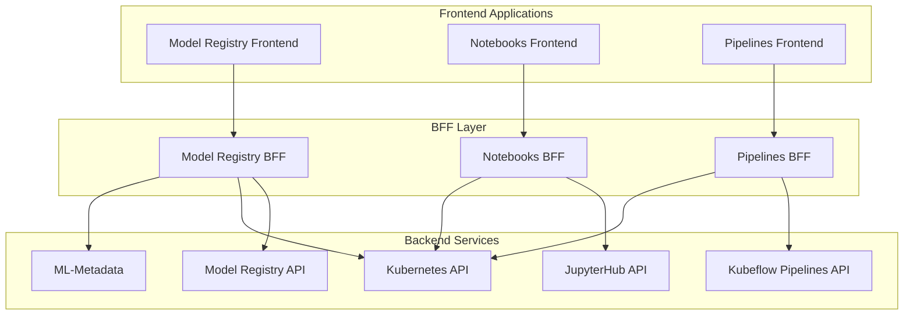

# Architecture

This document provides a comprehensive overview of the modular architecture components, including frontend patterns, Backend-for-Frontend (BFF) implementation, and OpenAPI specification standards.

## Frontend Architecture

Our frontend architecture is built on modern React patterns with a focus on modularity, reusability, and developer experience.

### Core Frontend Patterns

#### Component Architecture

```mermaid
graph TB
    subgraph "Frontend Architecture"
        subgraph "Application Layer"
            App[App Component]
            Router[React Router]
            Context[Context Providers]
        end
        
        subgraph "Feature Modules"
            ModelRegistry[Model Registry Module]
            Notebooks[Notebooks Module]
            Pipelines[Pipelines Module]
        end
        
        subgraph "Shared Libraries"
            Components[Shared Components]
            Hooks[Custom Hooks]
            Utilities[Utility Functions]
            Types[TypeScript Types]
        end
        
        subgraph "External Dependencies"
            React[React 18+]
            PatternFly[PatternFly Components]
            MaterialUI[Material-UI (Kubeflow)]
        end
    end
    
    App --> Router
    App --> Context
    Router --> ModelRegistry
    Router --> Notebooks
    Router --> Pipelines
    
    ModelRegistry --> Components
    Notebooks --> Components
    Pipelines --> Components
    
    Components --> React
    Components --> PatternFly
    Components --> MaterialUI
    
    ModelRegistry --> Hooks
    Notebooks --> Hooks
    Pipelines --> Hooks
    
    Hooks --> Utilities
    Hooks --> Types
```

#### React Architecture Standards

```typescript
// Standard module structure
interface ModuleStructure {
  app: {
    // Main application entry point
    App: React.ComponentType;
    Routes: React.ComponentType;
  };
  
  components: {
    // Feature-specific components
    pages: React.ComponentType[];
    forms: React.ComponentType[];
    tables: React.ComponentType[];
  };
  
  hooks: {
    // Custom hooks for data fetching and state management
    useModels: () => ModelsHook;
    useModelDetails: (id: string) => ModelDetailsHook;
  };
  
  types: {
    // TypeScript interfaces generated from OpenAPI
    Model: ModelInterface;
    ModelsResponse: ModelsResponseInterface;
  };
}
```

### State Management Patterns

#### Context-Based State Management

```typescript
// Example: Model Registry Context
interface ModelRegistryContextType {
  selectedNamespace: string;
  setSelectedNamespace: (namespace: string) => void;
  models: Model[];
  loading: boolean;
  error: Error | null;
}

const ModelRegistryContext = React.createContext<ModelRegistryContextType | null>(null);

export const ModelRegistryProvider: React.FC<{ children: React.ReactNode }> = ({ children }) => {
  const [selectedNamespace, setSelectedNamespace] = React.useState('default');
  const [models, setModels] = React.useState<Model[]>([]);
  const [loading, setLoading] = React.useState(false);
  const [error, setError] = React.useState<Error | null>(null);

  const contextValue = React.useMemo(() => ({
    selectedNamespace,
    setSelectedNamespace,
    models,
    loading,
    error,
  }), [selectedNamespace, models, loading, error]);

  return (
    <ModelRegistryContext.Provider value={contextValue}>
      {children}
    </ModelRegistryContext.Provider>
  );
};
```

#### Data Fetching with React Query

```typescript
// Custom hook for data fetching
import { useQuery, useMutation, useQueryClient } from '@tanstack/react-query';

export const useModels = (namespace: string) => {
  return useQuery({
    queryKey: ['models', namespace],
    queryFn: () => modelsApi.getModels(namespace),
    staleTime: 5 * 60 * 1000, // 5 minutes
    cacheTime: 10 * 60 * 1000, // 10 minutes
  });
};

export const useCreateModel = () => {
  const queryClient = useQueryClient();
  
  return useMutation({
    mutationFn: modelsApi.createModel,
    onSuccess: (newModel) => {
      // Invalidate and refetch models
      queryClient.invalidateQueries({ queryKey: ['models'] });
      
      // Optimistically update the cache
      queryClient.setQueryData(['models', newModel.namespace], (old: Model[]) => [
        ...(old || []),
        newModel,
      ]);
    },
  });
};
```

### Theme and Styling

#### Multi-Theme Support

```typescript
// Theme configuration for different deployment modes
export enum ThemeMode {
  PatternFly = 'patternfly-theme',
  MaterialUI = 'mui-theme',
}

interface ThemeConfig {
  mode: ThemeMode;
  components: {
    Button: ComponentTheme;
    Card: ComponentTheme;
    Table: ComponentTheme;
  };
}

// PatternFly theme for Federated mode
const patternflyTheme: ThemeConfig = {
  mode: ThemeMode.PatternFly,
  components: {
    Button: { component: Button, variant: 'primary' },
    Card: { component: Card },
    Table: { component: Table },
  },
};

// Material-UI theme for Kubeflow mode
const muiTheme: ThemeConfig = {
  mode: ThemeMode.MaterialUI,
  components: {
    Button: { component: MuiButton, variant: 'contained' },
    Card: { component: MuiCard },
    Table: { component: MuiTable },
  },
};
```

## Backend-for-Frontend (BFF) Architecture

The BFF pattern provides each frontend with its own tailored backend service, optimized for specific frontend requirements.

### BFF Core Responsibilities



### BFF Implementation Patterns

#### Service Structure

```go
// BFF service interface
type BFFService interface {
    // Authentication & Authorization
    AuthenticateUser(ctx context.Context, token string) (*User, error)
    AuthorizeAccess(ctx context.Context, user *User, resource string) error
    
    // Data Aggregation
    GetModels(ctx context.Context, namespace string, filters ModelFilters) (*ModelsResponse, error)
    GetModelDetails(ctx context.Context, namespace, modelID string) (*ModelDetails, error)
    
    // Business Logic
    CreateModel(ctx context.Context, model CreateModelRequest) (*Model, error)
    UpdateModel(ctx context.Context, model UpdateModelRequest) (*Model, error)
    DeleteModel(ctx context.Context, namespace, modelID string) error
}

// BFF implementation
type ModelRegistryBFF struct {
    kubeClient     kubernetes.Interface
    modelRegistryClient modelregistry.Client
    authHandler    auth.Handler
    logger         logrus.FieldLogger
}

func (b *ModelRegistryBFF) GetModels(ctx context.Context, namespace string, filters ModelFilters) (*ModelsResponse, error) {
    // 1. Authentication
    user, err := b.authHandler.GetUserFromContext(ctx)
    if err != nil {
        return nil, fmt.Errorf("authentication failed: %w", err)
    }
    
    // 2. Authorization
    if err := b.authHandler.AuthorizeNamespaceAccess(ctx, user, namespace); err != nil {
        return nil, fmt.Errorf("authorization failed: %w", err)
    }
    
    // 3. Data Aggregation
    models, err := b.modelRegistryClient.ListModels(ctx, namespace)
    if err != nil {
        return nil, fmt.Errorf("failed to fetch models: %w", err)
    }
    
    // 4. Apply Filters
    filteredModels := b.applyFilters(models, filters)
    
    // 5. Data Transformation
    response := b.transformModelsResponse(filteredModels)
    
    // 6. Add Metadata
    response.Metadata = ResponseMetadata{
        Total:     len(response.Models),
        Namespace: namespace,
        Timestamp: time.Now(),
    }
    
    return response, nil
}
```

#### Authentication Integration

```go
// Kubeflow mode authentication
type KubeflowAuthHandler struct {
    tokenReviewer auth.TokenReviewer
}

func (h *KubeflowAuthHandler) GetUserFromContext(ctx context.Context) (*User, error) {
    token := h.extractToken(ctx)
    if token == "" {
        return nil, errors.New("no authentication token provided")
    }
    
    // Validate token with Kubernetes
    tokenReview, err := h.tokenReviewer.Review(ctx, token)
    if err != nil {
        return nil, fmt.Errorf("token validation failed: %w", err)
    }
    
    return &User{
        Username: tokenReview.Status.User.Username,
        Groups:   tokenReview.Status.User.Groups,
        UID:      tokenReview.Status.User.UID,
    }, nil
}

// Federated mode authentication
type FederatedAuthHandler struct {
    oauthClient oauth.Client
}

func (h *FederatedAuthHandler) GetUserFromContext(ctx context.Context) (*User, error) {
    token := h.extractToken(ctx)
    if token == "" {
        return nil, errors.New("no authentication token provided")
    }
    
    // Validate with OpenShift OAuth
    userInfo, err := h.oauthClient.GetUserInfo(ctx, token)
    if err != nil {
        return nil, fmt.Errorf("OAuth validation failed: %w", err)
    }
    
    return &User{
        Username: userInfo.Username,
        Groups:   userInfo.Groups,
        UID:      userInfo.UID,
    }, nil
}
```

#### Data Transformation Patterns

```go
// Transform backend models to frontend-optimized format
func (b *ModelRegistryBFF) transformModelsResponse(models []modelregistry.Model) *ModelsResponse {
    responseModels := make([]Model, len(models))
    
    for i, model := range models {
        responseModels[i] = Model{
            ID:          model.ID,
            Name:        model.Name,
            Version:     model.Version,
            Description: model.Description,
            
            // Computed fields for frontend
            DisplayName: fmt.Sprintf("%s v%s", model.Name, model.Version),
            Status:      b.computeModelStatus(model),
            LastUpdated: model.UpdatedAt.Format(time.RFC3339),
            
            // Aggregated data
            Artifacts:   b.getModelArtifacts(model.ID),
            Metadata:    b.getModelMetadata(model.ID),
            
            // Frontend-specific fields
            Actions: b.getAvailableActions(model),
            Links:   b.generateModelLinks(model),
        }
    }
    
    return &ModelsResponse{
        Models: responseModels,
        Pagination: PaginationInfo{
            Total: len(responseModels),
            Page:  1,
            Size:  len(responseModels),
        },
    }
}
```

## OpenAPI Specification Standards

OpenAPI specifications define the contract between frontend and BFF, ensuring type safety and clear API documentation.

### Specification Structure

```yaml
# openapi.yaml - Model Registry BFF API
openapi: 3.0.3
info:
  title: Model Registry BFF API
  version: 1.0.0
  description: Backend-for-Frontend API for Model Registry functionality

servers:
  - url: http://localhost:8080/api/v1
    description: Development server
  - url: https://model-registry.example.com/api/v1
    description: Production server

paths:
  /models:
    get:
      summary: List models in namespace
      operationId: listModels
      parameters:
        - name: namespace
          in: query
          required: true
          schema:
            type: string
        - name: filter
          in: query
          schema:
            type: string
        - name: sort
          in: query
          schema:
            type: string
            enum: [name, created_at, updated_at]
      responses:
        '200':
          description: Successful response
          content:
            application/json:
              schema:
                $ref: '#/components/schemas/ModelsResponse'
        '401':
          $ref: '#/components/responses/Unauthorized'
        '403':
          $ref: '#/components/responses/Forbidden'
        '500':
          $ref: '#/components/responses/InternalError'

  /models/{modelId}:
    get:
      summary: Get model details
      operationId: getModel
      parameters:
        - name: modelId
          in: path
          required: true
          schema:
            type: string
        - name: namespace
          in: query
          required: true
          schema:
            type: string
      responses:
        '200':
          description: Model details
          content:
            application/json:
              schema:
                $ref: '#/components/schemas/ModelDetails'
        '404':
          $ref: '#/components/responses/NotFound'

components:
  schemas:
    Model:
      type: object
      required:
        - id
        - name
        - version
        - namespace
      properties:
        id:
          type: string
          example: "model-123"
        name:
          type: string
          example: "fraud-detection-model"
        version:
          type: string
          example: "1.0.0"
        namespace:
          type: string
          example: "data-science"
        description:
          type: string
          example: "Machine learning model for fraud detection"
        displayName:
          type: string
          example: "fraud-detection-model v1.0.0"
        status:
          type: string
          enum: [active, inactive, archived]
          example: "active"
        lastUpdated:
          type: string
          format: date-time
          example: "2024-01-15T10:30:00Z"
        artifacts:
          type: array
          items:
            $ref: '#/components/schemas/ModelArtifact'
        metadata:
          type: object
          additionalProperties: true
        actions:
          type: array
          items:
            $ref: '#/components/schemas/ModelAction'
        links:
          type: object
          additionalProperties:
            type: string

    ModelsResponse:
      type: object
      required:
        - models
        - pagination
      properties:
        models:
          type: array
          items:
            $ref: '#/components/schemas/Model'
        pagination:
          $ref: '#/components/schemas/PaginationInfo'
        metadata:
          $ref: '#/components/schemas/ResponseMetadata'

  responses:
    Unauthorized:
      description: Authentication required
      content:
        application/json:
          schema:
            $ref: '#/components/schemas/ErrorResponse'
    
    Forbidden:
      description: Access denied
      content:
        application/json:
          schema:
            $ref: '#/components/schemas/ErrorResponse'
```

### Type Generation

```typescript
// Generated TypeScript types from OpenAPI specification
// types/api.generated.ts

export interface Model {
  id: string;
  name: string;
  version: string;
  namespace: string;
  description?: string;
  displayName?: string;
  status: 'active' | 'inactive' | 'archived';
  lastUpdated?: string;
  artifacts?: ModelArtifact[];
  metadata?: Record<string, any>;
  actions?: ModelAction[];
  links?: Record<string, string>;
}

export interface ModelsResponse {
  models: Model[];
  pagination: PaginationInfo;
  metadata?: ResponseMetadata;
}

export interface ModelsApiClient {
  listModels(params: {
    namespace: string;
    filter?: string;
    sort?: 'name' | 'created_at' | 'updated_at';
  }): Promise<ModelsResponse>;
  
  getModel(params: {
    modelId: string;
    namespace: string;
  }): Promise<ModelDetails>;
  
  createModel(params: {
    namespace: string;
    model: CreateModelRequest;
  }): Promise<Model>;
  
  updateModel(params: {
    modelId: string;
    namespace: string;
    model: UpdateModelRequest;
  }): Promise<Model>;
  
  deleteModel(params: {
    modelId: string;
    namespace: string;
  }): Promise<void>;
}
```

### API Client Generation

```typescript
// Generated API client
// api/client.generated.ts

import { Configuration, ModelsApi } from './generated';

export class ApiClient {
  private modelsApi: ModelsApi;

  constructor(basePath?: string, accessToken?: string) {
    const config = new Configuration({
      basePath: basePath || process.env.REACT_APP_BFF_URL,
      accessToken: accessToken,
    });
    
    this.modelsApi = new ModelsApi(config);
  }

  async listModels(namespace: string, filters?: ModelFilters): Promise<ModelsResponse> {
    try {
      const response = await this.modelsApi.listModels({
        namespace,
        filter: filters?.search,
        sort: filters?.sortBy,
      });
      
      return response.data;
    } catch (error) {
      throw this.handleApiError(error);
    }
  }

  private handleApiError(error: any): ApiError {
    if (error.response) {
      return new ApiError(
        error.response.status,
        error.response.data?.message || 'API request failed',
        error.response.data
      );
    }
    
    return new ApiError(0, 'Network error', { originalError: error });
  }
}

export class ApiError extends Error {
  constructor(
    public status: number,
    public message: string,
    public data?: any
  ) {
    super(message);
    this.name = 'ApiError';
  }
}
```

### Validation and Error Handling

```go
// BFF request validation using generated Go types
func (b *ModelRegistryBFF) validateCreateModelRequest(req *CreateModelRequest) error {
    if req == nil {
        return fmt.Errorf("request body is required")
    }
    
    if req.Name == "" {
        return fmt.Errorf("model name is required")
    }
    
    if req.Version == "" {
        return fmt.Errorf("model version is required")
    }
    
    if req.Namespace == "" {
        return fmt.Errorf("namespace is required")
    }
    
    // Additional business validation
    if !isValidModelName(req.Name) {
        return fmt.Errorf("invalid model name format")
    }
    
    if !isValidVersion(req.Version) {
        return fmt.Errorf("invalid version format")
    }
    
    return nil
}

// Error response formatting
func (b *ModelRegistryBFF) handleError(w http.ResponseWriter, err error, statusCode int) {
    errorResponse := ErrorResponse{
        Error: ErrorDetails{
            Code:    statusCode,
            Message: err.Error(),
            Type:    "ValidationError",
        },
        Timestamp: time.Now(),
        Path:      b.getRequestPath(),
    }
    
    w.Header().Set("Content-Type", "application/json")
    w.WriteHeader(statusCode)
    json.NewEncoder(w).Encode(errorResponse)
}
```

This architecture ensures strong contracts between frontend and backend components while maintaining flexibility for different deployment modes and integration patterns.
