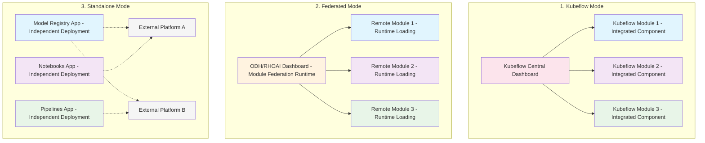
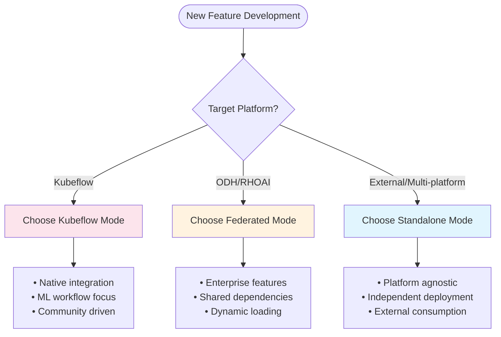

# Deployment Modes

The modular architecture supports three distinct deployment modes, each optimized for different environments and use cases. Each mode provides specific capabilities and integration patterns tailored to the target platform's requirements.

## Overview of Deployment Modes



## 1. Kubeflow Mode

**Purpose**: For Kubeflow deployments in Kubeflow Central Dashboard using Kubernetes clusters

### Characteristics

- **Platform Integration**: Components are integrated directly into the Kubeflow Central Dashboard
- **Native Architecture**: Follows Kubeflow's native component architecture and patterns
- **Kubeflow Services**: Leverages Kubeflow's existing infrastructure and services
- **Seamless UX**: Designed for seamless integration with Kubeflow workflows and ecosystem
- **Theme Consistency**: Uses Material-UI (MUI) Theme to ensure consistent theming across all components

### Environment Setup

```bash
# Configure kubectl context for Kubeflow cluster
kubectl config use-context kubeflow-cluster

# Deploy module to cluster
kubectl apply -f manifests/kubeflow/

# Port forward for local development
kubectl port-forward svc/model-registry-bff 8080:80

# Configure frontend to use cluster BFF
export REACT_APP_BFF_URL=http://localhost:8080
export REACT_APP_THEME=mui-theme
npm start
```

### Authentication & Authorization

- **Header-based Authentication**: Uses simple header-based authentication (`kubeflow-user`)
- **RBAC**: Utilizes Kubernetes Role-Based Access Control
- **Service Mesh**: Works within Istio service mesh for secure communication
- **Token Management**: Handles Kubeflow authentication tokens automatically

### Best Use Cases

- Native Kubeflow platform deployments
- ML workflow integration requirements
- Kubernetes-native environments
- Community-driven development

## 2. Federated Mode

**Purpose**: For ODH/RHOAI deployments using OpenShift Clusters with dynamic module loading

### Characteristics

- **Module Federation**: Uses Webpack Module Federation for runtime composition within ODH/RHOAI Dashboard
- **Dynamic Loading**: Enables dynamic loading of micro-frontends at runtime
- **Shared Dependencies**: Optimizes bundle sizes through shared dependencies between modules
- **OpenShift Integration**: Optimized for ODH (Open Data Hub) and RHOAI (Red Hat OpenShift AI) platforms
- **Enterprise Features**: Supports enterprise-grade security, monitoring, and compliance

### Module Federation Configuration

```javascript
// webpack.config.js for federated module
const ModuleFederationPlugin = require('@module-federation/webpack');

module.exports = {
  plugins: [
    new ModuleFederationPlugin({
      name: 'modelRegistryModule',
      filename: 'remoteEntry.js',
      exposes: {
        './ModelRegistryApp': './src/app/ModelRegistryApp',
        './ModelRegistryRoutes': './src/app/ModelRegistryRoutes',
      },
      shared: {
        react: { singleton: true },
        'react-dom': { singleton: true },
        '@patternfly/react-core': { singleton: true },
      },
    }),
  ],
};
```

### Authentication & Authorization

- **OpenShift OAuth**: Integrates with OpenShift's OAuth provider
- **RBAC**: Uses OpenShift User token access
- **Service Accounts**: No need for service accounts since the authentication is leveraged to the user token
- **Multi-tenancy**: Supports namespace-based multi-tenancy

### Best Use Cases

- ODH/RHOAI dashboard integration
- OpenShift-based deployments
- Enterprise environments requiring shared dependencies
- Complex host-remote relationships for integrated dashboard experience

## 3. Standalone Mode

[TBD]: Standalone mode it's still a work in progress so there's some specification that need to be defined yet.

**Purpose**: For standalone deployments that might not even use Kubernetes cluster and can work in other environments

### Characteristics

- **Independent Deployment**: Each feature is developed as a completely independent application
- **Environment Agnostic**: Can run without Kubernetes dependencies
- **External Platform Integration**: Can be consumed by external platforms and host applications
- **Complete Autonomy**: Own repository, deployment pipeline, and release cycle
- **Platform Flexibility**: Works in various environments including non-containerized setups

### Authentication & Authorization

- **Mock Authentication**: Supports mocked authentication for development
- **Flexible Auth**: Can integrate with various external authentication systems
- **Token-based**: Supports JWT and other token-based authentication methods [TBD]

### Best Use Cases

- Features requiring independent deployment outside platforms
- External platform integration
- Development and testing environments
- Non-Kubernetes environments
- Community contributions and external adoption

## Deployment Mode Comparison

| Feature | Kubeflow Mode | Federated Mode | Standalone Mode |
|---------|---------------|----------------|-----------------|
| **Target Platform** | Kubeflow Central Dashboard | ODH/RHOAI Dashboard | Independent/External |
| **Integration** | iframe rendering | Module Federation | External Integration |
| **Theme** | Material-UI | PatternFly | TBD |
| **Authentication** | `internal` (kubeflow-userid) | `user_token` (x-forwarded-access-token) | `user_token` (default) |
| **Auth Method** | Header impersonation | Bearer token from proxy | Bearer token / Mock |
| **Infrastructure** | Kubernetes Required | OpenShift Required | Optional |
| **Deployment** | Kubernetes Manifests | Kubernetes Manifests | TBD |
| **Development** | `dev-start-kubeflow` | `dev-start-federated` | `dev-start` (mock mode) |
| **Dependencies** | Kubeflow Services | ODH/RHOAI Services | Self-contained |

## Authentication Modes

The BFF supports two authentication methods:

| Auth Method | Description | Use Case |
|-------------|-------------|----------|
| **`user_token`** (default) | Extracts bearer token from `x-forwarded-access-token` header (ODH) or `Authorization` header | ODH/RHOAI deployments, Standalone mode, Mock development |
| **`internal`** | Impersonates user via `kubeflow-userid` header using cluster credentials | Kubeflow Central Dashboard only |

> **Note:** `user_token` is the default and recommended authentication method for most use cases, including local development in mock mode.

## Choosing the Right Mode

### Decision Matrix



### Guidelines

1. **Choose Kubeflow Mode when:**
   - Building features primarily for Kubeflow platform
   - Need tight integration with ML workflows
   - Contributing to open-source Kubeflow community

2. **Choose Federated Mode when:**
   - Building enterprise features for ODH/RHOAI
   - Need shared dependencies and runtime composition
   - Targeting OpenShift environments

3. **Choose Standalone Mode when:**
   - Building platform-agnostic features
   - Need maximum deployment flexibility
   - Planning external platform integration
