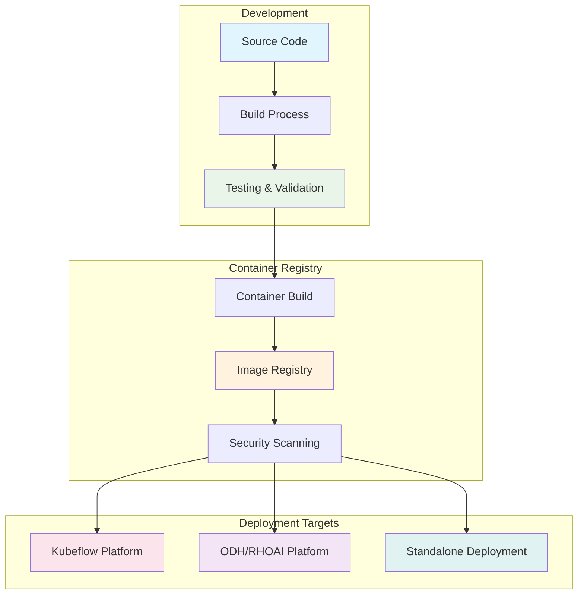

# Deployment

This document covers deployment strategies and configurations for modular architecture across different platforms and environments.

## Overview

The modular architecture supports three primary deployment targets, each with specific configuration requirements and deployment workflows:

- **Kubeflow**: Native integration with Kubeflow Central Dashboard
- **ODH/RHOAI**: Enterprise deployment through OpenShift with Module Federation
- **Standalone**: Independent deployment for various environments



## Kubeflow Deployment

### Istio Configuration

Kubeflow deployments require Istio service mesh configuration for proper routing and security.

#### Service Mesh Integration

```yaml
# istio-gateway.yaml - Gateway configuration for model registry
apiVersion: networking.istio.io/v1beta1
kind: Gateway
metadata:
  name: model-registry-gateway
  namespace: kubeflow
spec:
  selector:
    istio: ingressgateway
  servers:
  - port:
      number: 80
      name: http
      protocol: HTTP
    hosts:
    - model-registry.kubeflow.local
  - port:
      number: 443
      name: https
      protocol: HTTPS
    tls:
      mode: SIMPLE
      credentialName: kubeflow-tls
    hosts:
    - model-registry.kubeflow.local

---
# istio-virtual-service.yaml - Virtual service for routing
apiVersion: networking.istio.io/v1beta1
kind: VirtualService
metadata:
  name: model-registry-vs
  namespace: kubeflow
spec:
  hosts:
  - model-registry.kubeflow.local
  gateways:
  - model-registry-gateway
  http:
  - match:
    - uri:
        prefix: "/model-registry"
    rewrite:
      uri: "/"
    route:
    - destination:
        host: model-registry-service.kubeflow.svc.cluster.local
        port:
          number: 8080
  - match:
    - uri:
        prefix: "/api/v1/model-registry"
    rewrite:
      uri: "/api/v1"
    route:
    - destination:
        host: model-registry-bff.kubeflow.svc.cluster.local
        port:
          number: 3000

---
# istio-authorization-policy.yaml - Authorization policies
apiVersion: security.istio.io/v1beta1
kind: AuthorizationPolicy
metadata:
  name: model-registry-authz
  namespace: kubeflow
spec:
  selector:
    matchLabels:
      app: model-registry
  rules:
  - from:
    - source:
        principals: ["cluster.local/ns/kubeflow/sa/model-registry"]
  - to:
    - operation:
        methods: ["GET", "POST", "PUT", "DELETE"]
    - operation:
        paths: ["/api/v1/*"]
  when:
  - key: request.auth.claims[email]
    values: ["*@company.com"]
```

#### Service Configuration

```yaml
# model-registry-service.yaml
apiVersion: v1
kind: Service
metadata:
  name: model-registry-service
  namespace: kubeflow
  labels:
    app: model-registry
    version: v1.0.0
spec:
  selector:
    app: model-registry
  ports:
  - name: http
    port: 8080
    targetPort: 8080
    protocol: TCP
  - name: grpc
    port: 9090
    targetPort: 9090
    protocol: TCP

---
apiVersion: v1
kind: Service
metadata:
  name: model-registry-bff
  namespace: kubeflow
  labels:
    app: model-registry-bff
    version: v1.0.0
spec:
  selector:
    app: model-registry-bff
  ports:
  - name: http
    port: 3000
    targetPort: 3000
    protocol: TCP
```

### Modular Architecture Configuration for Kubeflow Support

Configuration for integrating with the Kubeflow ecosystem:

```yaml
# kubeflow-integration-configmap.yaml
apiVersion: v1
kind: ConfigMap
metadata:
  name: model-registry-config
  namespace: kubeflow
data:
  config.yaml: |
    deployment:
      mode: "kubeflow"
      theme: "mui-theme"
      platform:
        name: "kubeflow"
        version: "1.7.0"
    
    authentication:
      method: "kubeflow-auth"
      tokenHeader: "kubeflow-userid"
      rbac:
        enabled: true
        clusterRole: "model-registry-user"
    
    integration:
      centralDashboard:
        enabled: true
        menuItem:
          text: "Model Registry"
          link: "/model-registry"
          icon: "model"
        iframeIntegration: false
      
      kubeflowPipelines:
        enabled: true
        endpoint: "http://ml-pipeline.kubeflow.svc.cluster.local:8888"
      
      katib:
        enabled: true
        endpoint: "http://katib-controller.kubeflow.svc.cluster.local:8080"
    
    features:
      modelVersioning: true
      advancedMetrics: true
      pipelineIntegration: true
      experimentTracking: true
    
    storage:
      backend: "ml-metadata"
      connection:
        host: "metadata-grpc-service.kubeflow.svc.cluster.local"
        port: 8080
```

#### Central Dashboard Integration

```javascript
// kubeflow-dashboard-integration.js
// Configuration for Kubeflow Central Dashboard menu integration

window.kubeflowDashboardConfig = {
  menuLinks: [
    {
      type: 'item',
      link: '/model-registry',
      text: 'Model Registry',
      icon: 'icons:assignment',
      href: '/model-registry',
    },
  ],
  externalLinks: [],
  documentationLinks: [
    {
      text: 'Model Registry Documentation',
      desc: 'Learn how to manage and track your ML models',
      link: 'https://kubeflow.org/docs/components/model-registry/',
    },
  ],
};

// Register with central dashboard
if (window.centraldashboard) {
  window.centraldashboard.CentralDashboard.addMenuLinks(
    window.kubeflowDashboardConfig.menuLinks
  );
}
```

### Onboard Manifests to Kubeflow Repository

Process for contributing module manifests to upstream Kubeflow:

#### Repository Structure

```
kubeflow/manifests/
├── apps/
│   └── model-registry/
│       ├── upstream/
│       │   ├── base/
│       │   │   ├── deployment.yaml
│       │   │   ├── service.yaml
│       │   │   ├── configmap.yaml
│       │   │   └── kustomization.yaml
│       │   └── overlays/
│       │       ├── kubeflow/
│       │       └── standalone/
│       └── README.md
```

#### Base Manifests

```yaml
# apps/model-registry/upstream/base/deployment.yaml
apiVersion: apps/v1
kind: Deployment
metadata:
  name: model-registry
  labels:
    app: model-registry
spec:
  replicas: 1
  selector:
    matchLabels:
      app: model-registry
  template:
    metadata:
      labels:
        app: model-registry
      annotations:
        sidecar.istio.io/inject: "true"
    spec:
      serviceAccountName: model-registry
      containers:
      - name: frontend
        image: model-registry-frontend:latest
        ports:
        - containerPort: 8080
        env:
        - name: REACT_APP_MODE
          value: "kubeflow"
        - name: REACT_APP_THEME
          value: "mui-theme"
        - name: REACT_APP_BFF_URL
          value: "http://localhost:3000"
        resources:
          requests:
            memory: "256Mi"
            cpu: "250m"
          limits:
            memory: "512Mi"
            cpu: "500m"
      - name: bff
        image: model-registry-bff:latest
        ports:
        - containerPort: 3000
        env:
        - name: MODE
          value: "kubeflow"
        - name: METADATA_STORE_HOST
          value: "metadata-grpc-service.kubeflow.svc.cluster.local"
        - name: METADATA_STORE_PORT
          value: "8080"
        resources:
          requests:
            memory: "128Mi"
            cpu: "100m"
          limits:
            memory: "256Mi"
            cpu: "200m"
```

#### Kustomization Configuration

```yaml
# apps/model-registry/upstream/base/kustomization.yaml
apiVersion: kustomize.config.k8s.io/v1beta1
kind: Kustomization

namespace: kubeflow

resources:
- deployment.yaml
- service.yaml
- configmap.yaml
- serviceaccount.yaml
- rbac.yaml

images:
- name: model-registry-frontend
  newTag: v1.0.0
- name: model-registry-bff
  newTag: v1.0.0

commonLabels:
  app.kubernetes.io/name: model-registry
  app.kubernetes.io/version: v1.0.0
  app.kubernetes.io/component: model-registry
  app.kubernetes.io/part-of: kubeflow
```

## ODH/RHOAI Deployment

### Konflux Onboarding for Images

Konflux is the build and release system for Red Hat products. Onboarding process:

#### Konflux Configuration

```yaml
# .konflux/docker/Dockerfile.frontend
FROM registry.redhat.io/ubi9/nodejs-18:latest

WORKDIR /app

# Copy package files
COPY package*.json ./
RUN npm ci --only=production

# Copy source code
COPY src/ ./src/
COPY public/ ./public/
COPY tsconfig.json ./
COPY webpack.config.js ./

# Build the application
RUN npm run build:federated

# Production stage
FROM registry.redhat.io/ubi9/nginx-122:latest

COPY --from=0 /app/dist /opt/app-root/src
COPY nginx.conf /etc/nginx/nginx.conf

EXPOSE 8080

CMD ["nginx", "-g", "daemon off;"]
```

#### Konflux Pipeline Configuration

```yaml
# .konflux/release/release-pipeline.yaml
apiVersion: tekton.dev/v1beta1
kind: Pipeline
metadata:
  name: model-registry-release
spec:
  params:
  - name: git-url
    type: string
  - name: revision
    type: string
    default: main
  - name: output-image
    type: string
  
  tasks:
  - name: clone-repository
    taskRef:
      name: git-clone
    params:
    - name: url
      value: $(params.git-url)
    - name: revision
      value: $(params.revision)
  
  - name: build-frontend
    taskRef:
      name: buildah
    runAfter:
    - clone-repository
    params:
    - name: IMAGE
      value: $(params.output-image)-frontend
    - name: DOCKERFILE
      value: .konflux/docker/Dockerfile.frontend
    - name: CONTEXT
      value: frontend/
  
  - name: build-bff
    taskRef:
      name: buildah
    runAfter:
    - clone-repository
    params:
    - name: IMAGE
      value: $(params.output-image)-bff
    - name: DOCKERFILE
      value: .konflux/docker/Dockerfile.bff
    - name: CONTEXT
      value: backend/
  
  - name: security-scan
    taskRef:
      name: clair-scan
    runAfter:
    - build-frontend
    - build-bff
    params:
    - name: image-url
      value: $(params.output-image)-frontend
  
  - name: publish
    taskRef:
      name: push-to-registry
    runAfter:
    - security-scan
    params:
    - name: image-url
      value: $(params.output-image)
```

### Onboard Feature to Operator Deployment

Integration with ODH/RHOAI operators:

#### Custom Resource Definition

```yaml
# odh-model-registry-crd.yaml
apiVersion: apiextensions.k8s.io/v1
kind: CustomResourceDefinition
metadata:
  name: modelregistries.modelregistry.opendatahub.io
spec:
  group: modelregistry.opendatahub.io
  versions:
  - name: v1alpha1
    served: true
    storage: true
    schema:
      openAPIV3Schema:
        type: object
        properties:
          spec:
            type: object
            properties:
              enableModelRegistry:
                type: boolean
                description: "Enable Model Registry component"
              modelRegistry:
                type: object
                properties:
                  replicas:
                    type: integer
                    minimum: 1
                    default: 1
                  resources:
                    type: object
                    properties:
                      requests:
                        type: object
                      limits:
                        type: object
                  storage:
                    type: object
                    properties:
                      storageClass:
                        type: string
                      size:
                        type: string
                        default: "10Gi"
          status:
            type: object
            properties:
              conditions:
                type: array
                items:
                  type: object
                  properties:
                    type:
                      type: string
                    status:
                      type: string
                    reason:
                      type: string
                    message:
                      type: string
  scope: Namespaced
  names:
    plural: modelregistries
    singular: modelregistry
    kind: ModelRegistry
```

#### Operator Integration

```go
// controllers/modelregistry_controller.go
package controllers

import (
    "context"
    "fmt"
    
    modelregistryv1alpha1 "github.com/opendatahub-io/odh-model-controller/api/v1alpha1"
    appsv1 "k8s.io/api/apps/v1"
    corev1 "k8s.io/api/core/v1"
    metav1 "k8s.io/apimachinery/pkg/apis/meta/v1"
    "k8s.io/apimachinery/pkg/runtime"
    ctrl "sigs.k8s.io/controller-runtime"
    "sigs.k8s.io/controller-runtime/pkg/client"
)

type ModelRegistryReconciler struct {
    client.Client
    Scheme *runtime.Scheme
}

func (r *ModelRegistryReconciler) Reconcile(ctx context.Context, req ctrl.Request) (ctrl.Result, error) {
    // Fetch the ModelRegistry instance
    var modelRegistry modelregistryv1alpha1.ModelRegistry
    if err := r.Get(ctx, req.NamespacedName, &modelRegistry); err != nil {
        return ctrl.Result{}, client.IgnoreNotFound(err)
    }
    
    // Create deployment for Model Registry
    deployment := r.createModelRegistryDeployment(&modelRegistry)
    if err := r.createOrUpdate(ctx, deployment); err != nil {
        return ctrl.Result{}, fmt.Errorf("failed to create deployment: %w", err)
    }
    
    // Create service
    service := r.createModelRegistryService(&modelRegistry)
    if err := r.createOrUpdate(ctx, service); err != nil {
        return ctrl.Result{}, fmt.Errorf("failed to create service: %w", err)
    }
    
    // Update status
    modelRegistry.Status.Conditions = append(modelRegistry.Status.Conditions, 
        metav1.Condition{
            Type:   "Ready",
            Status: metav1.ConditionTrue,
            Reason: "DeploymentReady",
        },
    )
    
    return ctrl.Result{}, r.Status().Update(ctx, &modelRegistry)
}

func (r *ModelRegistryReconciler) createModelRegistryDeployment(mr *modelregistryv1alpha1.ModelRegistry) *appsv1.Deployment {
    return &appsv1.Deployment{
        ObjectMeta: metav1.ObjectMeta{
            Name:      "model-registry",
            Namespace: mr.Namespace,
            OwnerReferences: []metav1.OwnerReference{
                {
                    APIVersion: mr.APIVersion,
                    Kind:       mr.Kind,
                    Name:       mr.Name,
                    UID:        mr.UID,
                    Controller: &[]bool{true}[0],
                },
            },
        },
        Spec: appsv1.DeploymentSpec{
            Replicas: &mr.Spec.ModelRegistry.Replicas,
            Selector: &metav1.LabelSelector{
                MatchLabels: map[string]string{
                    "app": "model-registry",
                },
            },
            Template: corev1.PodTemplateSpec{
                ObjectMeta: metav1.ObjectMeta{
                    Labels: map[string]string{
                        "app": "model-registry",
                    },
                },
                Spec: corev1.PodSpec{
                    Containers: []corev1.Container{
                        {
                            Name:  "model-registry-frontend",
                            Image: "quay.io/opendatahub/model-registry-frontend:latest",
                            Ports: []corev1.ContainerPort{
                                {ContainerPort: 8080},
                            },
                            Env: []corev1.EnvVar{
                                {Name: "REACT_APP_MODE", Value: "federated"},
                                {Name: "REACT_APP_THEME", Value: "patternfly-theme"},
                            },
                            Resources: mr.Spec.ModelRegistry.Resources,
                        },
                        {
                            Name:  "model-registry-bff",
                            Image: "quay.io/opendatahub/model-registry-bff:latest",
                            Ports: []corev1.ContainerPort{
                                {ContainerPort: 3000},
                            },
                            Env: []corev1.EnvVar{
                                {Name: "MODE", Value: "federated"},
                            },
                            Resources: mr.Spec.ModelRegistry.Resources,
                        },
                    },
                },
            },
        },
    }
}
```

#### ODH Dashboard Integration

```yaml
# odh-dashboard-integration.yaml
apiVersion: v1
kind: ConfigMap
metadata:
  name: odh-dashboard-config
  namespace: opendatahub
data:
  dashboard_config.yaml: |
    dashboardConfig:
      enablement: true
      disableBYONImageStream: false
      disableISVBadges: false
      disableAppLauncher: false
      disableSupport: false
      disableClusterManager: false
      disableTracking: false
      disableInfo: false
      disableModelRegistry: false  # Enable Model Registry
    
    groupsConfig:
      adminGroups: 
        - system:cluster-admins
        - opendatahub-admins
      allowedGroups:
        - system:authenticated
    
    # Module Federation configuration
    moduleFederation:
      modules:
        - name: "modelRegistry"
          enabled: true
          remoteEntry: "http://model-registry-service.opendatahub.svc.cluster.local:8080/remoteEntry.js"
          routePath: "/model-registry"
          displayName: "Model Registry"
          category: "Machine Learning"
        - name: "notebooks"
          enabled: true
          remoteEntry: "http://notebooks-service.opendatahub.svc.cluster.local:8080/remoteEntry.js"
          routePath: "/notebooks"
          displayName: "Notebooks"
          category: "Development"
```

## Deployment Best Practices

### Environment Configuration

```yaml
# deployment-environments.yaml
apiVersion: v1
kind: ConfigMap
metadata:
  name: deployment-config
data:
  # Development environment
  development.yaml: |
    environment: development
    deployment:
      mode: "standalone"
      replicas: 1
      resources:
        requests:
          memory: "128Mi"
          cpu: "100m"
    features:
      enableDebugMode: true
      enableMockData: true
      enableDevTools: true
  
  # Staging environment
  staging.yaml: |
    environment: staging
    deployment:
      mode: "federated"
      replicas: 2
      resources:
        requests:
          memory: "256Mi"
          cpu: "250m"
        limits:
          memory: "512Mi"
          cpu: "500m"
    features:
      enableDebugMode: false
      enableMockData: false
      enableDevTools: true
  
  # Production environment
  production.yaml: |
    environment: production
    deployment:
      mode: "federated"
      replicas: 3
      resources:
        requests:
          memory: "512Mi"
          cpu: "500m"
        limits:
          memory: "1Gi"
          cpu: "1000m"
    features:
      enableDebugMode: false
      enableMockData: false
      enableDevTools: false
    monitoring:
      enabled: true
      metrics:
        - requests_total
        - request_duration
        - error_rate
```

### Monitoring and Observability

```yaml
# monitoring-config.yaml
apiVersion: v1
kind: ServiceMonitor
metadata:
  name: model-registry-monitor
spec:
  selector:
    matchLabels:
      app: model-registry
  endpoints:
  - port: metrics
    interval: 30s
    path: /metrics

---
apiVersion: v1
kind: Service
metadata:
  name: model-registry-metrics
  labels:
    app: model-registry
spec:
  ports:
  - name: metrics
    port: 9090
    targetPort: 9090
  selector:
    app: model-registry
```

This deployment guide ensures consistent, secure, and scalable deployments across all supported platforms while maintaining the flexibility needed for different organizational requirements.
