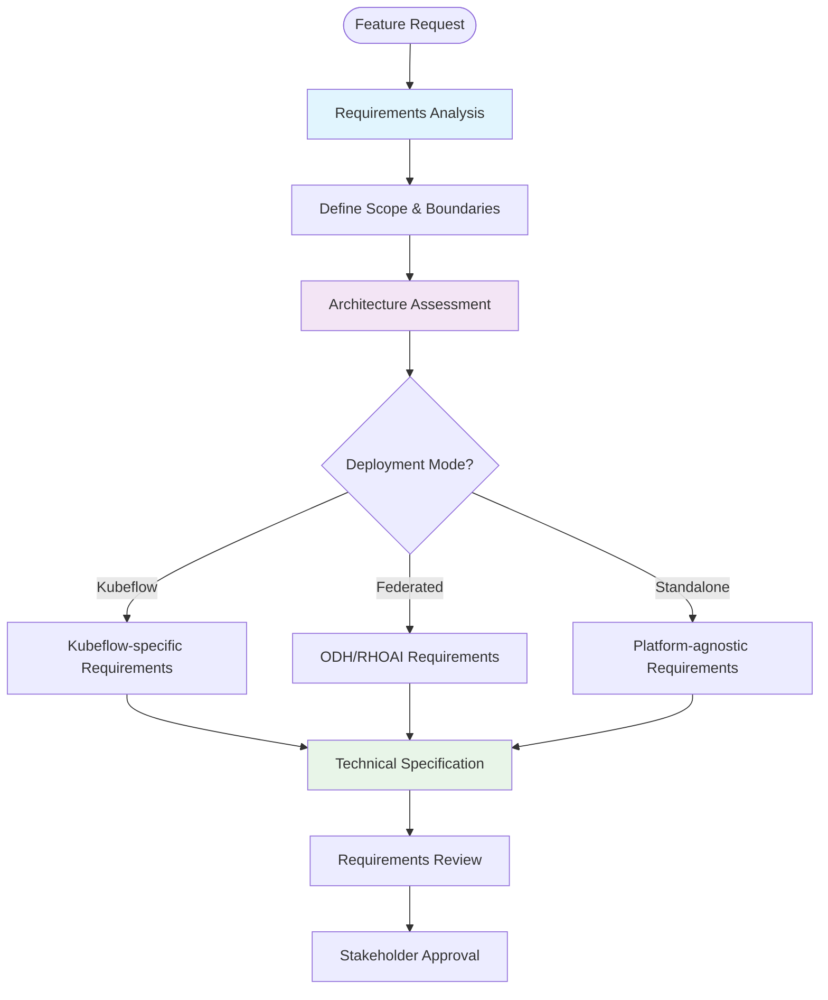
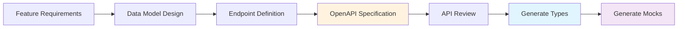
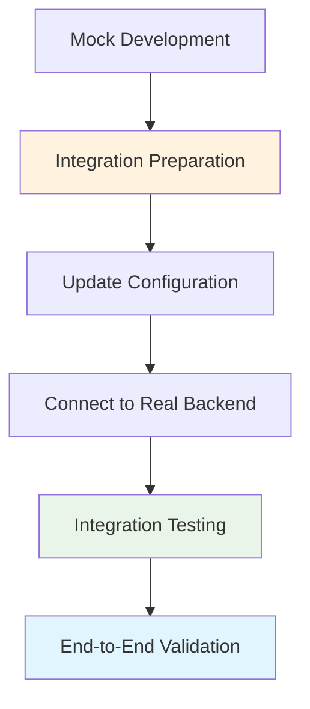

# Development Flow

This document outlines the comprehensive development workflows for modular architecture, including common patterns, upstream and downstream development approaches, and feature flagging strategies.

## Common Development Patterns

Our development workflow follows a structured approach that ensures consistency, quality, and alignment with architectural principles.

### 1. Start Defining Feature Requirements

Every feature development begins with clear requirements definition:



#### Requirements Template

```markdown
# Feature Requirements: [Feature Name]

## Overview
Brief description of the feature and its purpose.

## User Stories
- As a [user type], I want [functionality] so that [benefit]
- As a [user type], I want [functionality] so that [benefit]

## Functional Requirements
1. The system shall...
2. The system shall...

## Non-Functional Requirements
- Performance: Response time < 2 seconds
- Scalability: Support 1000+ concurrent users
- Security: RBAC compliance required

## Technical Constraints
- Must integrate with existing authentication system
- Must support both PatternFly and Material-UI themes
- Must be accessible (WCAG 2.1 AA compliance)

## Deployment Targets
- [ ] Kubeflow Central Dashboard
- [ ] ODH/RHOAI Dashboard
- [ ] Standalone deployment

## Dependencies
- External APIs: [list]
- Shared components: [list]
- Infrastructure: [list]
```

### 2. Get All Endpoints and Data - Define OpenAPI Spec

Before any development begins, define the complete API specification:

#### OpenAPI Specification Process



#### Example OpenAPI Design Process

```yaml
# Step 1: Define data models
components:
  schemas:
    Model:
      type: object
      required: [id, name, version, namespace]
      properties:
        id: { type: string }
        name: { type: string }
        version: { type: string }
        namespace: { type: string }
        description: { type: string }
        status: { type: string, enum: [active, inactive, archived] }
        artifacts: { type: array, items: { $ref: '#/components/schemas/Artifact' } }
        metadata: { type: object }

# Step 2: Define endpoints with clear operations
paths:
  /api/v1/models:
    get:
      summary: List models
      operationId: listModels
      parameters:
        - name: namespace
          in: query
          required: true
          schema: { type: string }
      responses:
        '200':
          content:
            application/json:
              schema: { $ref: '#/components/schemas/ModelsResponse' }
    
    post:
      summary: Create model
      operationId: createModel
      requestBody:
        required: true
        content:
          application/json:
            schema: { $ref: '#/components/schemas/CreateModelRequest' }
```

### 3. Create STUB Endpoints for BFF with Mock Data

Implement BFF endpoints with mock data to enable parallel frontend development:

```go
// Mock data service
type MockModelService struct {
    models []Model
}

func NewMockModelService() *MockModelService {
    return &MockModelService{
        models: []Model{
            {
                ID:          "model-1",
                Name:        "fraud-detection",
                Version:     "1.0.0",
                Namespace:   "data-science",
                Description: "ML model for detecting fraudulent transactions",
                Status:      "active",
                Artifacts: []Artifact{
                    {Type: "model", URI: "s3://bucket/model.pkl"},
                    {Type: "metrics", URI: "s3://bucket/metrics.json"},
                },
            },
            // More mock models...
        },
    }
}

// STUB endpoint implementation
func (h *ModelHandler) ListModels(w http.ResponseWriter, r *http.Request) {
    namespace := r.URL.Query().Get("namespace")
    if namespace == "" {
        http.Error(w, "namespace is required", http.StatusBadRequest)
        return
    }
    
    // Mock implementation with realistic behavior
    filteredModels := h.mockService.FilterByNamespace(namespace)
    
    response := ModelsResponse{
        Models: filteredModels,
        Pagination: PaginationInfo{
            Total: len(filteredModels),
            Page:  1,
            Size:  len(filteredModels),
        },
        Metadata: ResponseMetadata{
            Namespace: namespace,
            Timestamp: time.Now(),
        },
    }
    
    // Simulate realistic response times
    time.Sleep(100 * time.Millisecond)
    
    w.Header().Set("Content-Type", "application/json")
    json.NewEncoder(w).Encode(response)
}
```

### 4. Start Development - Frontend and BFF in Parallel

#### Frontend Development with Mock BFF

```typescript
// API client configuration for mock mode
const createApiClient = () => {
  const config = {
    basePath: process.env.REACT_APP_BFF_URL || 'http://localhost:8080',
    // Mock mode interceptors for development
    interceptors: process.env.NODE_ENV === 'development' ? {
      request: addMockHeaders,
      response: addMockDelays,
    } : undefined,
  };
  
  return new ModelsApiClient(config);
};

// Frontend component development
const ModelsPage: React.FC = () => {
  const { selectedNamespace } = useNamespaceSelector();
  const [filters, setFilters] = React.useState<ModelFilters>({});
  
  // Works with mock data during development
  const { data: models, loading, error } = useModels(selectedNamespace, filters);
  const createModel = useCreateModel();
  
  const handleCreateModel = async (modelData: CreateModelRequest) => {
    try {
      await createModel.mutateAsync({
        namespace: selectedNamespace,
        model: modelData,
      });
      // Success handling
    } catch (error) {
      // Error handling
    }
  };
  
  if (loading) return <LoadingSkeleton />;
  if (error) return <ErrorState error={error} />;
  
  return (
    <ApplicationsPage
      title="Models"
      description="Manage your machine learning models"
      actions={<CreateModelButton onClick={handleCreateModel} />}
    >
      <ModelsTable
        models={models?.models || []}
        onSort={(field) => setFilters({ ...filters, sortBy: field })}
        onFilter={(search) => setFilters({ ...filters, search })}
      />
    </ApplicationsPage>
  );
};
```

#### BFF Development with Business Logic

```go
// Production BFF implementation
type ProductionModelService struct {
    kubeClient     kubernetes.Interface
    modelRegistry  modelregistry.Client
    authHandler    auth.Handler
    logger         logrus.FieldLogger
}

func (s *ProductionModelService) ListModels(ctx context.Context, namespace string, filters ModelFilters) (*ModelsResponse, error) {
    // Authentication and authorization
    user, err := s.authHandler.GetUserFromContext(ctx)
    if err != nil {
        return nil, fmt.Errorf("authentication failed: %w", err)
    }
    
    if !s.authHandler.CanAccessNamespace(user, namespace) {
        return nil, fmt.Errorf("access denied to namespace %s", namespace)
    }
    
    // Business logic implementation
    models, err := s.modelRegistry.ListModels(ctx, namespace)
    if err != nil {
        s.logger.WithError(err).Error("Failed to list models from registry")
        return nil, fmt.Errorf("failed to retrieve models: %w", err)
    }
    
    // Apply filtering and sorting
    filteredModels := s.applyFilters(models, filters)
    sortedModels := s.applySorting(filteredModels, filters.SortBy)
    
    // Enrich with additional data
    enrichedModels := make([]Model, len(sortedModels))
    for i, model := range sortedModels {
        enrichedModels[i] = s.enrichModelData(ctx, model)
    }
    
    return &ModelsResponse{
        Models: enrichedModels,
        Pagination: s.calculatePagination(enrichedModels, filters),
        Metadata: ResponseMetadata{
            Namespace: namespace,
            Timestamp: time.Now(),
            UserID:    user.ID,
        },
    }, nil
}
```

### 5. End Up with Integration

Final integration phase combines frontend and BFF with real backend services:



## Upstream Development

Development pattern for features intended for open-source community contribution.

### Running Standalone Mode with UI Essentials Library

#### Environment Setup

```bash
# 1. Clone upstream repository
git clone https://github.com/kubeflow/model-registry
cd model-registry

# 2. Install kubeflow-ui-essentials
cd frontend
npm install @kubeflow/ui-essentials

# 3. Configure for upstream development
cat > .env.local << EOF
REACT_APP_MODE=standalone
REACT_APP_THEME=mui-theme
REACT_APP_BFF_URL=http://localhost:8080
REACT_APP_NAMESPACE_SELECTOR=enabled
EOF

# 4. Start development environment
npm run dev:upstream
```

#### Component Integration

```typescript
// Upstream component using shared library
import React from 'react';
import {
  ApplicationsPage,
  useNamespaceSelector,
  DashboardEmptyTableView,
  ToastNotification,
} from '@kubeflow/ui-essentials';
import { ThemeProvider } from '@mui/material/styles';

const ModelRegistryApp: React.FC = () => {
  return (
    <ThemeProvider theme={muiTheme}>
      <div className="model-registry-standalone">
        <ModelRegistryRoutes />
        <ToastNotification />
      </div>
    </ThemeProvider>
  );
};

const ModelsListPage: React.FC = () => {
  const { selectedNamespace } = useNamespaceSelector();
  const { data: models, loading, error } = useModels(selectedNamespace);
  
  return (
    <ApplicationsPage
      title="Model Registry"
      description="Manage your machine learning models"
      breadcrumb={[
        { label: 'Home', href: '/' },
        { label: 'Model Registry', isActive: true },
      ]}
    >
      {models?.length === 0 ? (
        <DashboardEmptyTableView
          onCreateButton={() => navigate('/models/create')}
        />
      ) : (
        <ModelsTable models={models} />
      )}
    </ApplicationsPage>
  );
};
```

### Testing Kubeflow Deployments

```bash
# 1. Deploy to Kubeflow cluster
kubectl apply -f manifests/kubeflow/

# 2. Port forward for testing
kubectl port-forward -n kubeflow svc/model-registry 8080:80

# 3. Run integration tests
npm run test:integration:kubeflow

# 4. Run end-to-end tests
npm run test:e2e:kubeflow
```

## Downstream Development

Development pattern for ODH/RHOAI specific features using federated architecture.

### Running ODH Dashboard in Federated Mode

#### Setup Process

```bash
# 1. Clone ODH Dashboard
git clone https://github.com/opendatahub-io/odh-dashboard
cd odh-dashboard

# 2. Configure for federated development
export NODE_ENV=development
export REACT_APP_MODE=federated
export REACT_APP_MOCK_MODE=true

# 3. Start dashboard in serverless mode
npm run start:federated

# 4. In separate terminal, start your module
cd packages/model-registry
npm run start:remote
```

#### Module Development Configuration

```javascript
// webpack.config.js for remote module
const ModuleFederationPlugin = require('@module-federation/webpack');

module.exports = {
  mode: 'development',
  devServer: {
    port: 4001,
    headers: {
      'Access-Control-Allow-Origin': '*',
    },
  },
  plugins: [
    new ModuleFederationPlugin({
      name: 'modelRegistryModule',
      filename: 'remoteEntry.js',
      exposes: {
        './ModelRegistryApp': './src/app/ModelRegistryApp',
        './ModelRegistryRoutes': './src/routes',
      },
      shared: {
        react: { singleton: true },
        'react-dom': { singleton: true },
        '@patternfly/react-core': { singleton: true },
      },
    }),
  ],
};
```

### BFF Development Modes

#### Mock Mode for Frontend Development

```go
// BFF with mock mode flag
func main() {
    mockMode := flag.Bool("mock", false, "Run in mock mode")
    federatedMode := flag.Bool("federated", false, "Run in federated mode")
    flag.Parse()
    
    var service ModelService
    
    if *mockMode {
        service = NewMockModelService()
    } else if *federatedMode {
        service = NewFederatedModelService()
    } else {
        service = NewKubeflowModelService()
    }
    
    handler := NewModelHandler(service)
    router := setupRoutes(handler)
    
    log.Println("Starting BFF server...")
    if err := http.ListenAndServe(":8080", router); err != nil {
        log.Fatal(err)
    }
}
```

#### Federated Mode with Cluster Interaction

```go
// Federated service with OpenShift integration
type FederatedModelService struct {
    ocClient       openshift.Interface
    k8sClient      kubernetes.Interface
    oauthClient    oauth.Client
    logger         logrus.FieldLogger
}

func (s *FederatedModelService) ListModels(ctx context.Context, namespace string) (*ModelsResponse, error) {
    // OpenShift-specific authentication
    user, err := s.oauthClient.GetUserFromToken(ctx)
    if err != nil {
        return nil, fmt.Errorf("OpenShift authentication failed: %w", err)
    }
    
    // Check OpenShift project access
    if !s.canAccessProject(user, namespace) {
        return nil, fmt.Errorf("access denied to project %s", namespace)
    }
    
    // Retrieve models from OpenShift resources
    models, err := s.getModelsFromCustomResources(ctx, namespace)
    if err != nil {
        return nil, fmt.Errorf("failed to get models from OpenShift: %w", err)
    }
    
    return s.transformToResponse(models), nil
}
```

## Feature Flagging

Feature flags enable gradual rollout and A/B testing of new functionality.

### Feature Flag Implementation

#### Frontend Feature Flags

```typescript
// Feature flag context
interface FeatureFlags {
  modelVersioning: boolean;
  advancedMetrics: boolean;
  experimentalUI: boolean;
  mlflowIntegration: boolean;
}

const FeatureFlagsContext = React.createContext<FeatureFlags | null>(null);

export const FeatureFlagsProvider: React.FC<{ children: React.ReactNode }> = ({ children }) => {
  const [flags, setFlags] = React.useState<FeatureFlags>({
    modelVersioning: process.env.REACT_APP_FEATURE_MODEL_VERSIONING === 'true',
    advancedMetrics: process.env.REACT_APP_FEATURE_ADVANCED_METRICS === 'true',
    experimentalUI: process.env.REACT_APP_FEATURE_EXPERIMENTAL_UI === 'true',
    mlflowIntegration: process.env.REACT_APP_FEATURE_MLFLOW === 'true',
  });
  
  // Fetch flags from BFF
  React.useEffect(() => {
    const fetchFlags = async () => {
      try {
        const response = await fetch('/api/v1/feature-flags');
        const serverFlags = await response.json();
        setFlags(prev => ({ ...prev, ...serverFlags }));
      } catch (error) {
        console.warn('Failed to fetch feature flags:', error);
      }
    };
    
    fetchFlags();
  }, []);
  
  return (
    <FeatureFlagsContext.Provider value={flags}>
      {children}
    </FeatureFlagsContext.Provider>
  );
};

export const useFeatureFlags = () => {
  const context = React.useContext(FeatureFlagsContext);
  if (!context) {
    throw new Error('useFeatureFlags must be used within FeatureFlagsProvider');
  }
  return context;
};
```

#### Conditional Feature Rendering

```typescript
// Component with feature flag
const ModelsTable: React.FC<{ models: Model[] }> = ({ models }) => {
  const { modelVersioning, advancedMetrics } = useFeatureFlags();
  
  const columns = React.useMemo(() => {
    const baseColumns = [
      { key: 'name', title: 'Name' },
      { key: 'description', title: 'Description' },
      { key: 'status', title: 'Status' },
    ];
    
    if (modelVersioning) {
      baseColumns.splice(2, 0, { key: 'version', title: 'Version' });
    }
    
    if (advancedMetrics) {
      baseColumns.push({ key: 'accuracy', title: 'Accuracy' });
    }
    
    return baseColumns;
  }, [modelVersioning, advancedMetrics]);
  
  return (
    <Table
      columns={columns}
      rows={models.map(model => ({
        ...model,
        ...(modelVersioning && { version: model.version }),
        ...(advancedMetrics && { accuracy: model.metrics?.accuracy }),
      }))}
    />
  );
};
```

#### Backend Feature Flags

```go
// Feature flag service
type FeatureFlagService struct {
    flags map[string]bool
    db    database.Interface
}

func (f *FeatureFlagService) GetFlags(ctx context.Context, userID string) (map[string]bool, error) {
    // Get user-specific flags from database
    userFlags, err := f.db.GetUserFeatureFlags(ctx, userID)
    if err != nil {
        return nil, err
    }
    
    // Merge with global flags
    result := make(map[string]bool)
    for k, v := range f.flags {
        result[k] = v
    }
    
    for k, v := range userFlags {
        result[k] = v
    }
    
    return result, nil
}

// BFF endpoint for feature flags
func (h *Handler) GetFeatureFlags(w http.ResponseWriter, r *http.Request) {
    user, err := h.authHandler.GetUserFromContext(r.Context())
    if err != nil {
        http.Error(w, "Unauthorized", http.StatusUnauthorized)
        return
    }
    
    flags, err := h.featureFlagService.GetFlags(r.Context(), user.ID)
    if err != nil {
        http.Error(w, "Failed to get feature flags", http.StatusInternalServerError)
        return
    }
    
    w.Header().Set("Content-Type", "application/json")
    json.NewEncoder(w).Encode(flags)
}
```

### Gradual Feature Rollout

```yaml
# Feature flag configuration
apiVersion: v1
kind: ConfigMap
metadata:
  name: feature-flags
data:
  model-versioning: |
    enabled: true
    rollout:
      percentage: 50
      groups: ["beta-users", "power-users"]
  
  advanced-metrics: |
    enabled: true
    rollout:
      percentage: 25
      groups: ["data-scientists"]
  
  experimental-ui: |
    enabled: false
    rollout:
      percentage: 10
      groups: ["ui-team"]
```

This development flow ensures consistent, high-quality feature development while maintaining flexibility for different deployment scenarios and team preferences.
