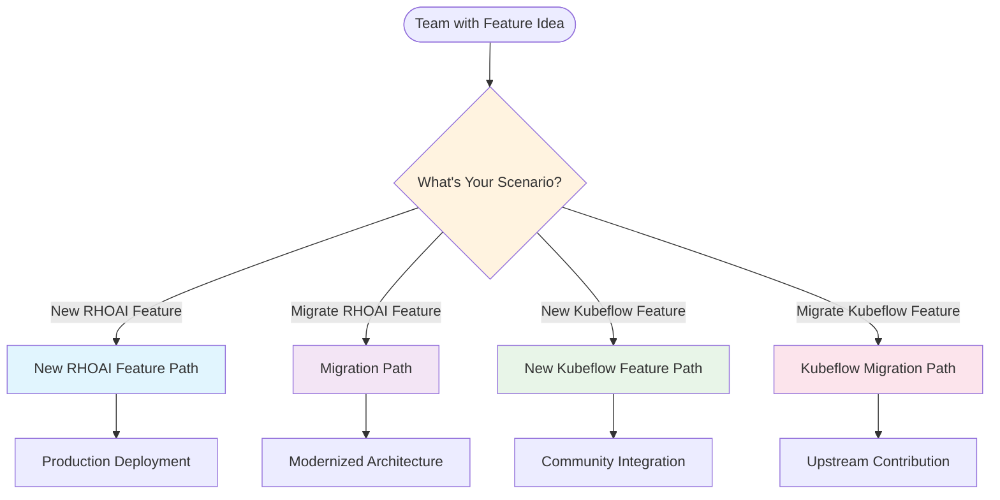
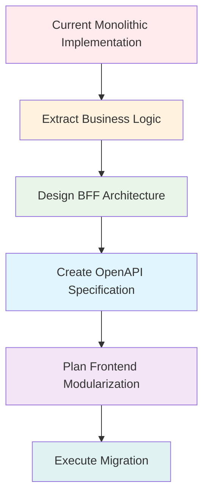
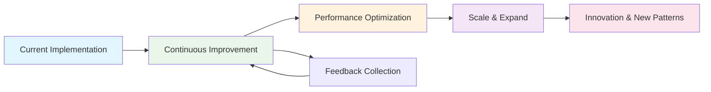

# Golden Path

The Golden Path provides opinionated, proven workflows for common scenarios in modular architecture development. These pathways reduce decision paralysis and ensure teams adopt established patterns that have been validated in production environments.

## Overview

Golden Paths are curated sets of tools, techniques, and workflows that provide teams with clear, step-by-step guidance for achieving common goals. They represent the "happy path" - the most efficient route from idea to production deployment.



## We are a team that wants to develop a new RHOAI feature

This path guides teams through creating entirely new features for Red Hat OpenShift AI using modular architecture principles.

### Phase 1: Onboarding in the Monorepo (ODH Dashboard)

#### 1.1 Repository Setup

```bash
# Clone the ODH Dashboard repository
git clone https://github.com/opendatahub-io/odh-dashboard
cd odh-dashboard

# Create your feature package
mkdir -p packages/my-feature
cd packages/my-feature

# Initialize package structure
npm init -y
```

#### 1.2 Package Structure Creation

```bash
# Create standard package structure
mkdir -p src/{app,components,pages,hooks,api,types,routes}
mkdir -p src/{utils,constants,styles}
mkdir -p __tests__/{unit,integration}
mkdir -p public

# Create essential files
touch src/index.ts
touch src/app/MyFeatureApp.tsx
touch src/routes/MyFeatureRoutes.tsx
touch webpack.config.js
touch tsconfig.json
touch README.md
```

#### 1.3 Package Configuration

```json
{
  "name": "@odh-dashboard/my-feature",
  "version": "1.0.0",
  "description": "My Feature for ODH Dashboard",
  "main": "src/index.ts",
  "scripts": {
    "start": "webpack serve --mode development",
    "start:remote": "webpack serve --mode development --env remote",
    "build": "webpack --mode production",
    "build:federated": "webpack --mode production --env federated",
    "test": "jest",
    "test:watch": "jest --watch",
    "type-check": "tsc --noEmit",
    "lint": "eslint src --ext .ts,.tsx"
  },
  "dependencies": {
    "react": "^18.0.0",
    "react-dom": "^18.0.0",
    "react-router-dom": "^6.8.0",
    "@patternfly/react-core": "^5.0.0",
    "@patternfly/react-table": "^5.0.0",
    "@tanstack/react-query": "^4.0.0",
    "axios": "^1.0.0"
  },
  "devDependencies": {
    "@module-federation/webpack": "^0.0.1",
    "webpack": "^5.0.0",
    "webpack-cli": "^5.0.0",
    "webpack-dev-server": "^4.0.0",
    "@types/react": "^18.0.0",
    "@types/react-dom": "^18.0.0",
    "typescript": "^5.0.0",
    "jest": "^29.0.0",
    "@testing-library/react": "^13.0.0"
  }
}
```

#### 1.4 Module Federation Configuration

```javascript
// webpack.config.js
const ModuleFederationPlugin = require('@module-federation/webpack');
const path = require('path');

const isRemote = process.env.WEBPACK_SERVE && process.argv.includes('remote');

module.exports = {
  mode: process.env.NODE_ENV || 'development',
  entry: './src/index.tsx',
  
  module: {
    rules: [
      {
        test: /\.tsx?$/,
        use: 'ts-loader',
        exclude: /node_modules/,
      },
      {
        test: /\.css$/,
        use: ['style-loader', 'css-loader'],
      },
    ],
  },
  
  resolve: {
    extensions: ['.tsx', '.ts', '.js'],
  },
  
  plugins: [
    new ModuleFederationPlugin({
      name: 'myFeature',
      filename: 'remoteEntry.js',
      
      exposes: {
        './MyFeatureApp': './src/app/MyFeatureApp',
        './MyFeatureRoutes': './src/routes/MyFeatureRoutes',
      },
      
      shared: {
        react: { singleton: true, requiredVersion: '^18.0.0' },
        'react-dom': { singleton: true, requiredVersion: '^18.0.0' },
        'react-router-dom': { singleton: true },
        '@patternfly/react-core': { singleton: true },
        '@patternfly/react-table': { singleton: true },
        '@tanstack/react-query': { singleton: true },
      },
    }),
  ],
  
  devServer: isRemote ? {
    port: 4005, // Assign unique port for your feature
    headers: {
      'Access-Control-Allow-Origin': '*',
    },
  } : undefined,
};
```

### Phase 2: Follow Development Flow

#### 2.1 Define Feature Requirements

```markdown
# Feature Requirements: My Feature

## Overview
[Brief description of what your feature does]

## User Stories
- As a data scientist, I want to [action] so that [benefit]
- As an administrator, I want to [action] so that [benefit]

## Functional Requirements
1. The system shall provide [specific functionality]
2. The system shall integrate with [existing systems]
3. The system shall support [user workflows]

## Non-Functional Requirements
- Performance: Response time < 2 seconds for data retrieval
- Scalability: Support 100+ concurrent users
- Security: RBAC compliance with OpenShift
- Accessibility: WCAG 2.1 AA compliance

## Integration Points
- Authentication: OpenShift OAuth
- Data Storage: [specify storage backend]
- External APIs: [list external dependencies]

## Success Criteria
- [Measurable outcomes]
- [User satisfaction metrics]
- [Performance benchmarks]
```

#### 2.2 Define OpenAPI Specification

```yaml
# openapi/my-feature-api.yaml
openapi: 3.0.3
info:
  title: My Feature BFF API
  version: 1.0.0
  description: Backend-for-Frontend API for My Feature

servers:
  - url: http://localhost:3000/api/v1
    description: Development server

paths:
  /my-feature/items:
    get:
      summary: List feature items
      operationId: listItems
      parameters:
        - name: namespace
          in: query
          required: true
          schema:
            type: string
        - name: filter
          in: query
          schema:
            type: string
      responses:
        '200':
          description: Successful response
          content:
            application/json:
              schema:
                $ref: '#/components/schemas/ItemsResponse'
    
    post:
      summary: Create new item
      operationId: createItem
      requestBody:
        required: true
        content:
          application/json:
            schema:
              $ref: '#/components/schemas/CreateItemRequest'
      responses:
        '201':
          description: Item created
          content:
            application/json:
              schema:
                $ref: '#/components/schemas/Item'

components:
  schemas:
    Item:
      type: object
      required: [id, name, namespace]
      properties:
        id:
          type: string
          example: "item-123"
        name:
          type: string
          example: "my-item"
        namespace:
          type: string
          example: "default"
        description:
          type: string
        status:
          type: string
          enum: [active, inactive]
        createdAt:
          type: string
          format: date-time
        metadata:
          type: object
          additionalProperties: true
    
    ItemsResponse:
      type: object
      properties:
        items:
          type: array
          items:
            $ref: '#/components/schemas/Item'
        pagination:
          $ref: '#/components/schemas/PaginationInfo'
```

#### 2.3 Create STUB Endpoints

```go
// backend/cmd/bff/main.go
package main

import (
    "encoding/json"
    "fmt"
    "log"
    "net/http"
    "time"
    
    "github.com/gorilla/mux"
)

type Item struct {
    ID          string                 `json:"id"`
    Name        string                 `json:"name"`
    Namespace   string                 `json:"namespace"`
    Description string                 `json:"description,omitempty"`
    Status      string                 `json:"status"`
    CreatedAt   time.Time              `json:"createdAt"`
    Metadata    map[string]interface{} `json:"metadata,omitempty"`
}

type ItemsResponse struct {
    Items      []Item         `json:"items"`
    Pagination PaginationInfo `json:"pagination"`
}

type PaginationInfo struct {
    Total int `json:"total"`
    Page  int `json:"page"`
    Size  int `json:"size"`
}

// Mock data
var mockItems = []Item{
    {
        ID:          "item-1",
        Name:        "example-item-1",
        Namespace:   "default",
        Description: "An example item for testing",
        Status:      "active",
        CreatedAt:   time.Now().Add(-24 * time.Hour),
        Metadata:    map[string]interface{}{"category": "test"},
    },
    {
        ID:          "item-2", 
        Name:        "example-item-2",
        Namespace:   "default",
        Description: "Another example item",
        Status:      "inactive",
        CreatedAt:   time.Now().Add(-48 * time.Hour),
        Metadata:    map[string]interface{}{"category": "demo"},
    },
}

func listItems(w http.ResponseWriter, r *http.Request) {
    namespace := r.URL.Query().Get("namespace")
    if namespace == "" {
        http.Error(w, "namespace is required", http.StatusBadRequest)
        return
    }
    
    // Filter by namespace
    var filteredItems []Item
    for _, item := range mockItems {
        if item.Namespace == namespace {
            filteredItems = append(filteredItems, item)
        }
    }
    
    response := ItemsResponse{
        Items: filteredItems,
        Pagination: PaginationInfo{
            Total: len(filteredItems),
            Page:  1,
            Size:  len(filteredItems),
        },
    }
    
    // Simulate realistic response time
    time.Sleep(100 * time.Millisecond)
    
    w.Header().Set("Content-Type", "application/json")
    json.NewEncoder(w).Encode(response)
}

func createItem(w http.ResponseWriter, r *http.Request) {
    var newItem Item
    if err := json.NewDecoder(r.Body).Decode(&newItem); err != nil {
        http.Error(w, "Invalid request body", http.StatusBadRequest)
        return
    }
    
    // Generate ID and set timestamps
    newItem.ID = fmt.Sprintf("item-%d", time.Now().Unix())
    newItem.CreatedAt = time.Now()
    newItem.Status = "active"
    
    // Add to mock data
    mockItems = append(mockItems, newItem)
    
    w.Header().Set("Content-Type", "application/json")
    w.WriteHeader(http.StatusCreated)
    json.NewEncoder(w).Encode(newItem)
}

func main() {
    r := mux.NewRouter()
    
    // API routes
    api := r.PathPrefix("/api/v1").Subrouter()
    api.HandleFunc("/my-feature/items", listItems).Methods("GET")
    api.HandleFunc("/my-feature/items", createItem).Methods("POST")
    
    // CORS headers
    r.Use(func(next http.Handler) http.Handler {
        return http.HandlerFunc(func(w http.ResponseWriter, r *http.Request) {
            w.Header().Set("Access-Control-Allow-Origin", "*")
            w.Header().Set("Access-Control-Allow-Methods", "GET, POST, PUT, DELETE, OPTIONS")
            w.Header().Set("Access-Control-Allow-Headers", "Content-Type, Authorization")
            
            if r.Method == "OPTIONS" {
                w.WriteHeader(http.StatusOK)
                return
            }
            
            next.ServeHTTP(w, r)
        })
    })
    
    log.Println("BFF server starting on :3000")
    log.Fatal(http.ListenAndServe(":3000", r))
}
```

### Phase 3: Frontend and BFF Development

#### 3.1 Frontend Development

```typescript
// src/app/MyFeatureApp.tsx
import React from 'react';
import { BrowserRouter as Router, Routes, Route } from 'react-router-dom';
import { QueryClient, QueryClientProvider } from '@tanstack/react-query';
import { Page, PageSection } from '@patternfly/react-core';

import { ItemsListPage } from '../pages/ItemsListPage';
import { CreateItemPage } from '../pages/CreateItemPage';
import { ItemDetailsPage } from '../pages/ItemDetailsPage';

const queryClient = new QueryClient({
  defaultOptions: {
    queries: {
      retry: 3,
      staleTime: 5 * 60 * 1000, // 5 minutes
    },
  },
});

export const MyFeatureApp: React.FC = () => {
  return (
    <QueryClientProvider client={queryClient}>
      <Page>
        <PageSection>
          <Router>
            <Routes>
              <Route path="/" element={<ItemsListPage />} />
              <Route path="/create" element={<CreateItemPage />} />
              <Route path="/:id" element={<ItemDetailsPage />} />
            </Routes>
          </Router>
        </PageSection>
      </Page>
    </QueryClientProvider>
  );
};
```

```typescript
// src/pages/ItemsListPage.tsx
import React from 'react';
import {
  PageSection,
  Title,
  Card,
  CardBody,
  Button,
  Toolbar,
  ToolbarContent,
  ToolbarItem,
} from '@patternfly/react-core';
import { Table, Thead, Tr, Th, Tbody, Td } from '@patternfly/react-table';
import { useNavigate } from 'react-router-dom';

import { useItems } from '../hooks/useItems';
import { useNamespaceSelector } from '../hooks/useNamespaceSelector';

export const ItemsListPage: React.FC = () => {
  const navigate = useNavigate();
  const { selectedNamespace } = useNamespaceSelector();
  const { data: itemsResponse, loading, error } = useItems(selectedNamespace);

  if (loading) {
    return <div>Loading items...</div>;
  }

  if (error) {
    return <div>Error loading items: {error.message}</div>;
  }

  const items = itemsResponse?.items || [];

  return (
    <PageSection>
      <Title headingLevel="h1" size="lg">
        My Feature Items
      </Title>
      
      <Card>
        <CardBody>
          <Toolbar>
            <ToolbarContent>
              <ToolbarItem>
                <Button variant="primary" onClick={() => navigate('/create')}>
                  Create Item
                </Button>
              </ToolbarItem>
            </ToolbarContent>
          </Toolbar>
          
          <Table aria-label="Items table">
            <Thead>
              <Tr>
                <Th>Name</Th>
                <Th>Status</Th>
                <Th>Description</Th>
                <Th>Created</Th>
                <Th>Actions</Th>
              </Tr>
            </Thead>
            <Tbody>
              {items.map((item) => (
                <Tr key={item.id}>
                  <Td>{item.name}</Td>
                  <Td>{item.status}</Td>
                  <Td>{item.description}</Td>
                  <Td>{new Date(item.createdAt).toLocaleDateString()}</Td>
                  <Td>
                    <Button
                      variant="link"
                      onClick={() => navigate(`/${item.id}`)}
                    >
                      View Details
                    </Button>
                  </Td>
                </Tr>
              ))}
            </Tbody>
          </Table>
        </CardBody>
      </Card>
    </PageSection>
  );
};
```

#### 3.2 API Integration

```typescript
// src/api/client.ts
import axios, { AxiosInstance } from 'axios';

export interface ApiClientConfig {
  baseUrl: string;
  token?: string;
}

export class MyFeatureApiClient {
  private client: AxiosInstance;

  constructor(config: ApiClientConfig) {
    this.client = axios.create({
      baseURL: config.baseUrl,
      headers: {
        'Content-Type': 'application/json',
        ...(config.token && { Authorization: `Bearer ${config.token}` }),
      },
    });
  }

  async listItems(namespace: string, filter?: string): Promise<ItemsResponse> {
    const params = new URLSearchParams({ namespace });
    if (filter) params.append('filter', filter);

    const response = await this.client.get(`/my-feature/items?${params}`);
    return response.data;
  }

  async createItem(item: CreateItemRequest): Promise<Item> {
    const response = await this.client.post('/my-feature/items', item);
    return response.data;
  }

  async getItem(id: string, namespace: string): Promise<Item> {
    const response = await this.client.get(`/my-feature/items/${id}?namespace=${namespace}`);
    return response.data;
  }
}

// src/hooks/useItems.ts
import { useQuery } from '@tanstack/react-query';
import { useApiClient } from './useApiClient';

export const useItems = (namespace: string) => {
  const apiClient = useApiClient();
  
  return useQuery({
    queryKey: ['items', namespace],
    queryFn: () => apiClient.listItems(namespace),
    enabled: !!namespace,
  });
};

export const useCreateItem = () => {
  const apiClient = useApiClient();
  const queryClient = useQueryClient();
  
  return useMutation({
    mutationFn: apiClient.createItem,
    onSuccess: () => {
      queryClient.invalidateQueries({ queryKey: ['items'] });
    },
  });
};
```

### Phase 4: Integration and Testing

#### 4.1 Local Development Testing

```bash
# Terminal 1: Start BFF in mock mode
cd backend
go run cmd/bff/main.go

# Terminal 2: Start frontend in development mode
cd packages/my-feature
npm start

# Terminal 3: Start ODH Dashboard host (optional for integration testing)
cd ../..
npm run start:federated
```

#### 4.2 Integration with ODH Dashboard

```typescript
// Integration configuration in ODH Dashboard
// frontend/src/routes/moduleFederationRoutes.ts

const MyFeatureApp = React.lazy(() => import('myFeature/MyFeatureApp'));

export const moduleFederationRoutes = [
  // ...existing routes
  {
    path: '/my-feature/*',
    element: (
      <React.Suspense fallback={<div>Loading My Feature...</div>}>
        <MyFeatureApp />
      </React.Suspense>
    ),
  },
];
```

### Phase 5: Production Deployment

#### 5.1 Container Configuration

```dockerfile
# Dockerfile.frontend
FROM registry.redhat.io/ubi9/nodejs-18:latest

WORKDIR /app

COPY package*.json ./
RUN npm ci --only=production

COPY src/ ./src/
COPY public/ ./public/
COPY webpack.config.js ./
COPY tsconfig.json ./

RUN npm run build:federated

FROM registry.redhat.io/ubi9/nginx-122:latest
COPY --from=0 /app/dist /opt/app-root/src
COPY nginx.conf /etc/nginx/nginx.conf

EXPOSE 8080
CMD ["nginx", "-g", "daemon off;"]
```

```dockerfile
# Dockerfile.bff
FROM registry.redhat.io/ubi9/go-1.20:latest

WORKDIR /app

COPY go.mod go.sum ./
RUN go mod download

COPY . .
RUN go build -o bff cmd/bff/main.go

FROM registry.redhat.io/ubi9/ubi-minimal:latest
COPY --from=0 /app/bff /usr/local/bin/bff

EXPOSE 3000
CMD ["bff"]
```

## We are a team that wants to migrate a feature already in RHOAI to Modular Architecture

This path guides teams through modernizing existing RHOAI features using modular architecture principles.

### Phase 1: Assessment and Planning

#### 1.1 Current State Analysis

```bash
# Create analysis document
cat > migration-analysis.md << EOF
# Migration Analysis: [Feature Name]

## Current Implementation
- Location: [current location in codebase]
- Components: [list of components]
- Dependencies: [list of dependencies]
- API Endpoints: [list of current endpoints]
- Data Flow: [describe current data flow]

## Business Logic Extraction
- Frontend Logic to Extract:
  - [ ] Data fetching logic
  - [ ] State management
  - [ ] Business rules
  - [ ] Validation logic

- Backend Integration Points:
  - [ ] Kubernetes API calls
  - [ ] External service calls
  - [ ] Authentication handling
  - [ ] Data transformation

## Migration Complexity Assessment
- High: [items requiring significant rework]
- Medium: [items requiring moderate changes]
- Low: [items requiring minimal changes]

## Migration Strategy
- Phase 1: [extract business logic]
- Phase 2: [implement BFF]
- Phase 3: [modularize frontend]
- Phase 4: [integrate and deploy]
EOF
```

#### 1.2 Architecture Planning



### Phase 2: Business Logic Extraction

#### 2.1 Identify Backend Logic in Frontend

```typescript
// Example: Current implementation with mixed concerns
// src/pages/CurrentFeaturePage.tsx (BEFORE)

const CurrentFeaturePage: React.FC = () => {
  const [data, setData] = useState([]);
  const [loading, setLoading] = useState(false);
  
  // Business logic mixed in frontend - TO EXTRACT
  const fetchData = async () => {
    setLoading(true);
    try {
      // Direct Kubernetes API calls - MOVE TO BFF
      const response = await k8sApi.listCustomResources({
        group: 'myfeature.io',
        version: 'v1',
        plural: 'myresources',
        namespace: selectedNamespace,
      });
      
      // Business logic - MOVE TO BFF
      const processedData = response.items.map(item => ({
        id: item.metadata.name,
        name: item.spec.displayName || item.metadata.name,
        status: calculateStatus(item), // Business logic
        health: determineHealth(item), // Business logic
        lastUpdated: item.metadata.managedFields?.[0]?.time,
        // Complex data transformation - MOVE TO BFF
        metrics: aggregateMetrics(item.status?.metrics || []),
      }));
      
      setData(processedData);
    } catch (error) {
      // Error handling - IMPROVE IN BFF
      console.error('Failed to fetch data:', error);
    } finally {
      setLoading(false);
    }
  };
  
  // More business logic - MOVE TO BFF
  const calculateStatus = (item) => {
    if (item.status?.phase === 'Ready') return 'Active';
    if (item.status?.phase === 'Failed') return 'Error';
    return 'Pending';
  };
  
  // ... rest of component
};
```

#### 2.2 Plan BFF Architecture

```go
// backend/internal/service/myfeature.go - Planned BFF structure

package service

import (
    "context"
    "fmt"
    
    "k8s.io/client-go/kubernetes"
    "k8s.io/apimachinery/pkg/apis/meta/v1/unstructured"
)

type MyFeatureService struct {
    k8sClient    kubernetes.Interface
    dynamicClient dynamic.Interface
    authHandler  auth.Handler
}

type MyResource struct {
    ID          string                 `json:"id"`
    Name        string                 `json:"name"`
    Namespace   string                 `json:"namespace"`
    Status      string                 `json:"status"`
    Health      string                 `json:"health"`
    LastUpdated string                 `json:"lastUpdated"`
    Metrics     map[string]interface{} `json:"metrics"`
    Metadata    map[string]interface{} `json:"metadata"`
}

// Extracted business logic from frontend
func (s *MyFeatureService) ListResources(ctx context.Context, namespace string) ([]MyResource, error) {
    // Authentication - centralized
    user, err := s.authHandler.GetUserFromContext(ctx)
    if err != nil {
        return nil, fmt.Errorf("authentication failed: %w", err)
    }
    
    // Authorization - centralized
    if !s.authHandler.CanAccessNamespace(user, namespace) {
        return nil, fmt.Errorf("access denied to namespace %s", namespace)
    }
    
    // Kubernetes API interaction - centralized
    resources, err := s.dynamicClient.Resource(myResourceGVR).Namespace(namespace).List(ctx, metav1.ListOptions{})
    if err != nil {
        return nil, fmt.Errorf("failed to list resources: %w", err)
    }
    
    // Business logic - moved from frontend
    var result []MyResource
    for _, item := range resources.Items {
        resource := s.transformResource(&item)
        result = append(result, resource)
    }
    
    return result, nil
}

// Business logic extracted from frontend
func (s *MyFeatureService) transformResource(item *unstructured.Unstructured) MyResource {
    // Extract metadata
    name := item.GetName()
    namespace := item.GetNamespace()
    
    // Calculate status - business logic from frontend
    status := s.calculateStatus(item)
    
    // Determine health - business logic from frontend
    health := s.determineHealth(item)
    
    // Aggregate metrics - business logic from frontend
    metrics := s.aggregateMetrics(item)
    
    return MyResource{
        ID:          name,
        Name:        s.getDisplayName(item),
        Namespace:   namespace,
        Status:      status,
        Health:      health,
        LastUpdated: s.getLastUpdated(item),
        Metrics:     metrics,
        Metadata:    s.extractMetadata(item),
    }
}

func (s *MyFeatureService) calculateStatus(item *unstructured.Unstructured) string {
    phase, found, _ := unstructured.NestedString(item.Object, "status", "phase")
    if !found {
        return "Unknown"
    }
    
    switch phase {
    case "Ready":
        return "Active"
    case "Failed":
        return "Error"
    default:
        return "Pending"
    }
}

func (s *MyFeatureService) determineHealth(item *unstructured.Unstructured) string {
    conditions, found, _ := unstructured.NestedSlice(item.Object, "status", "conditions")
    if !found {
        return "Unknown"
    }
    
    // Health determination logic
    for _, condition := range conditions {
        if condMap, ok := condition.(map[string]interface{}); ok {
            if condType, exists := condMap["type"]; exists && condType == "Healthy" {
                if status, exists := condMap["status"]; exists && status == "True" {
                    return "Healthy"
                }
            }
        }
    }
    
    return "Unhealthy"
}
```

### Phase 3: Create BFF with STUB Endpoints

#### 3.1 OpenAPI Specification for Migration

```yaml
# openapi/migrated-feature-api.yaml
openapi: 3.0.3
info:
  title: Migrated Feature BFF API
  version: 1.0.0
  description: BFF API for migrated feature with extracted business logic

paths:
  /myfeature/resources:
    get:
      summary: List feature resources
      operationId: listResources
      parameters:
        - name: namespace
          in: query
          required: true
          schema:
            type: string
        - name: filter
          in: query
          schema:
            type: string
        - name: sortBy
          in: query
          schema:
            type: string
            enum: [name, status, lastUpdated]
      responses:
        '200':
          description: List of resources
          content:
            application/json:
              schema:
                $ref: '#/components/schemas/ResourcesResponse'

  /myfeature/resources/{resourceId}:
    get:
      summary: Get resource details
      operationId: getResource
      parameters:
        - name: resourceId
          in: path
          required: true
          schema:
            type: string
        - name: namespace
          in: query
          required: true
          schema:
            type: string
      responses:
        '200':
          description: Resource details
          content:
            application/json:
              schema:
                $ref: '#/components/schemas/ResourceDetails'

components:
  schemas:
    MyResource:
      type: object
      required: [id, name, namespace, status]
      properties:
        id:
          type: string
        name:
          type: string
        namespace:
          type: string
        status:
          type: string
          enum: [Active, Error, Pending, Unknown]
        health:
          type: string
          enum: [Healthy, Unhealthy, Unknown]
        lastUpdated:
          type: string
          format: date-time
        metrics:
          type: object
          additionalProperties: true
        metadata:
          type: object
          additionalProperties: true
```

#### 3.2 STUB Implementation with Mock Data

```go
// backend/cmd/stub/main.go - STUB server for migration
package main

import (
    "encoding/json"
    "log"
    "net/http"
    "time"
    
    "github.com/gorilla/mux"
)

// Replicate the target data structure
type MyResource struct {
    ID          string                 `json:"id"`
    Name        string                 `json:"name"`
    Namespace   string                 `json:"namespace"`
    Status      string                 `json:"status"`
    Health      string                 `json:"health"`
    LastUpdated time.Time              `json:"lastUpdated"`
    Metrics     map[string]interface{} `json:"metrics"`
    Metadata    map[string]interface{} `json:"metadata"`
}

// Mock data that mirrors current production data structure
var mockResources = []MyResource{
    {
        ID:          "resource-1",
        Name:        "Production Model A",
        Namespace:   "production",
        Status:      "Active",
        Health:      "Healthy",
        LastUpdated: time.Now().Add(-2 * time.Hour),
        Metrics: map[string]interface{}{
            "accuracy":     0.95,
            "throughput":   150,
            "responseTime": "200ms",
        },
        Metadata: map[string]interface{}{
            "owner":   "data-science-team",
            "version": "1.2.0",
            "type":    "classification",
        },
    },
    {
        ID:          "resource-2",
        Name:        "Development Model B",
        Namespace:   "development", 
        Status:      "Pending",
        Health:      "Unknown",
        LastUpdated: time.Now().Add(-1 * time.Hour),
        Metrics: map[string]interface{}{
            "accuracy":     0.88,
            "throughput":   75,
            "responseTime": "350ms",
        },
        Metadata: map[string]interface{}{
            "owner":   "ml-research-team",
            "version": "0.8.0",
            "type":    "regression",
        },
    },
}

func listResources(w http.ResponseWriter, r *http.Request) {
    namespace := r.URL.Query().Get("namespace")
    if namespace == "" {
        http.Error(w, "namespace is required", http.StatusBadRequest)
        return
    }
    
    var filtered []MyResource
    for _, resource := range mockResources {
        if resource.Namespace == namespace {
            filtered = append(filtered, resource)
        }
    }
    
    response := map[string]interface{}{
        "resources": filtered,
        "pagination": map[string]interface{}{
            "total": len(filtered),
            "page":  1,
            "size":  len(filtered),
        },
        "metadata": map[string]interface{}{
            "namespace": namespace,
            "timestamp": time.Now(),
        },
    }
    
    w.Header().Set("Content-Type", "application/json")
    json.NewEncoder(w).Encode(response)
}

func main() {
    r := mux.NewRouter()
    
    api := r.PathPrefix("/api/v1").Subrouter()
    api.HandleFunc("/myfeature/resources", listResources).Methods("GET")
    
    // CORS
    r.Use(func(next http.Handler) http.Handler {
        return http.HandlerFunc(func(w http.ResponseWriter, r *http.Request) {
            w.Header().Set("Access-Control-Allow-Origin", "*")
            w.Header().Set("Access-Control-Allow-Methods", "GET, POST, PUT, DELETE, OPTIONS")
            w.Header().Set("Access-Control-Allow-Headers", "Content-Type, Authorization")
            
            if r.Method == "OPTIONS" {
                w.WriteHeader(http.StatusOK)
                return
            }
            
            next.ServeHTTP(w, r)
        })
    })
    
    log.Println("STUB BFF server starting on :3000")
    log.Fatal(http.ListenAndServe(":3000", r))
}
```

### Phase 4: Frontend Migration

#### 4.1 Create New Modular Frontend

```typescript
// packages/migrated-feature/src/pages/MigratedFeaturePage.tsx (AFTER)

import React from 'react';
import { useQuery } from '@tanstack/react-query';
import {
  PageSection,
  Title,
  Card,
  CardBody,
  EmptyState,
  EmptyStateIcon,
  EmptyStateBody,
  Spinner,
} from '@patternfly/react-core';
import { ExclamationCircleIcon } from '@patternfly/react-icons';

import { useMyFeatureApi } from '../hooks/useMyFeatureApi';
import { useNamespaceSelector } from '../hooks/useNamespaceSelector';
import { ResourcesTable } from '../components/ResourcesTable';

export const MigratedFeaturePage: React.FC = () => {
  const { selectedNamespace } = useNamespaceSelector();
  const myFeatureApi = useMyFeatureApi();
  
  // Clean data fetching - business logic moved to BFF
  const { 
    data: resourcesResponse, 
    loading, 
    error 
  } = useQuery({
    queryKey: ['myfeature-resources', selectedNamespace],
    queryFn: () => myFeatureApi.listResources(selectedNamespace),
    enabled: !!selectedNamespace,
  });

  if (loading) {
    return (
      <PageSection>
        <EmptyState>
          <EmptyStateIcon variant="container" component={Spinner} />
          <EmptyStateBody>Loading resources...</EmptyStateBody>
        </EmptyState>
      </PageSection>
    );
  }

  if (error) {
    return (
      <PageSection>
        <EmptyState>
          <EmptyStateIcon icon={ExclamationCircleIcon} />
          <Title headingLevel="h4" size="lg">
            Error loading resources
          </Title>
          <EmptyStateBody>{error.message}</EmptyStateBody>
        </EmptyState>
      </PageSection>
    );
  }

  const resources = resourcesResponse?.resources || [];

  return (
    <PageSection>
      <Title headingLevel="h1" size="lg">
        Migrated Feature
      </Title>
      
      <Card>
        <CardBody>
          <ResourcesTable 
            resources={resources}
            namespace={selectedNamespace}
          />
        </CardBody>
      </Card>
    </PageSection>
  );
};
```

#### 4.2 Gradual Migration Strategy

```typescript
// Migration strategy: Feature flags for gradual rollout
// src/hooks/useMigrationFlag.ts

export const useMigrationFlag = () => {
  const [isNewArchitecture, setIsNewArchitecture] = React.useState(() => {
    // Check feature flag from various sources
    const envFlag = process.env.REACT_APP_USE_NEW_ARCHITECTURE;
    const urlFlag = new URLSearchParams(window.location.search).get('new-arch');
    const storageFlag = localStorage.getItem('use-new-architecture');
    
    return envFlag === 'true' || urlFlag === 'true' || storageFlag === 'true';
  });
  
  const toggleArchitecture = () => {
    const newValue = !isNewArchitecture;
    setIsNewArchitecture(newValue);
    localStorage.setItem('use-new-architecture', String(newValue));
  };
  
  return { isNewArchitecture, toggleArchitecture };
};

// src/pages/FeaturePage.tsx - Conditional rendering during migration
export const FeaturePage: React.FC = () => {
  const { isNewArchitecture } = useMigrationFlag();
  
  if (isNewArchitecture) {
    // New modular implementation
    return <MigratedFeaturePage />;
  } else {
    // Legacy implementation
    return <CurrentFeaturePage />;
  }
};
```

### Phase 5: Production Migration

#### 5.1 Blue-Green Deployment Strategy

```yaml
# deployment/blue-green-migration.yaml
apiVersion: argoproj.io/v1alpha1
kind: Rollout
metadata:
  name: migrated-feature-rollout
spec:
  replicas: 3
  strategy:
    blueGreen:
      activeService: migrated-feature-active
      previewService: migrated-feature-preview
      autoPromotionEnabled: false
      scaleDownDelaySeconds: 30
      prePromotionAnalysis:
        templates:
        - templateName: migrated-feature-success-rate
        args:
        - name: service-name
          value: migrated-feature-preview
      postPromotionAnalysis:
        templates:
        - templateName: migrated-feature-success-rate
        args:
        - name: service-name
          value: migrated-feature-active
  selector:
    matchLabels:
      app: migrated-feature
  template:
    metadata:
      labels:
        app: migrated-feature
    spec:
      containers:
      - name: frontend
        image: migrated-feature-frontend:latest
        env:
        - name: REACT_APP_BFF_URL
          value: "http://migrated-feature-bff:3000"
        - name: REACT_APP_MODE
          value: "federated"
      - name: bff
        image: migrated-feature-bff:latest
        env:
        - name: MODE
          value: "production"
        - name: KUBERNETES_NAMESPACE
          valueFrom:
            fieldRef:
              fieldPath: metadata.namespace
```

## We are a team that wants to develop a new feature into Kubeflow (Work in Progress)

*This section is currently being developed and will include comprehensive guidance for teams working with Kubeflow platform integration.*

### Coming Soon

- Kubeflow-specific development workflows
- Integration with Kubeflow Central Dashboard
- ML workflow integration patterns
- Community contribution guidelines
- Kubeflow deployment strategies

For updates on Kubeflow mode development, please check our [roadmap](./roadmap.md) or contact the platform team.

## We are a team that wants to migrate a feature into Kubeflow (Work in Progress)

*This section is currently being developed and will include migration strategies for moving existing features to Kubeflow platform.*

### Coming Soon

- Migration assessment for Kubeflow compatibility
- Kubeflow architecture adaptation patterns
- Community engagement strategies
- Upstream contribution workflows
- Migration testing strategies

---

## Success Metrics and Validation

### Key Performance Indicators

- **Development Velocity**: Time from feature request to production deployment
- **Team Autonomy**: Percentage of work completed without cross-team dependencies
- **Code Quality**: Test coverage, code review time, defect rates
- **User Experience**: Performance metrics, user satisfaction scores
- **Community Engagement**: Upstream contributions, external adoption

### Validation Checklist

#### Technical Validation
- [ ] BFF endpoints provide optimized data for frontend
- [ ] Frontend components reuse shared libraries effectively
- [ ] Module federation integration works seamlessly
- [ ] Performance meets established benchmarks
- [ ] Security and accessibility requirements are met

#### Process Validation
- [ ] Development workflow reduces team dependencies
- [ ] Deployment process is automated and reliable
- [ ] Monitoring and observability provide actionable insights
- [ ] Documentation is comprehensive and maintained
- [ ] Team onboarding time is reduced

#### Business Validation
- [ ] Feature delivers expected user value
- [ ] Development costs are within budget
- [ ] Time to market is improved
- [ ] Technical debt is reduced
- [ ] Maintenance overhead is manageable

---

## Continuous Improvement

### Feedback Loops

1. **Weekly Retrospectives**: Team reflection on development experience
2. **Monthly Architecture Reviews**: Technical debt and improvement opportunities
3. **Quarterly Business Reviews**: Value delivery and strategic alignment
4. **Annual Platform Assessment**: Overall architecture effectiveness

### Evolution Path



The Golden Path is a living guide that evolves based on team experiences and changing requirements. Regular updates ensure that recommended practices reflect the most effective approaches for modular architecture development.
