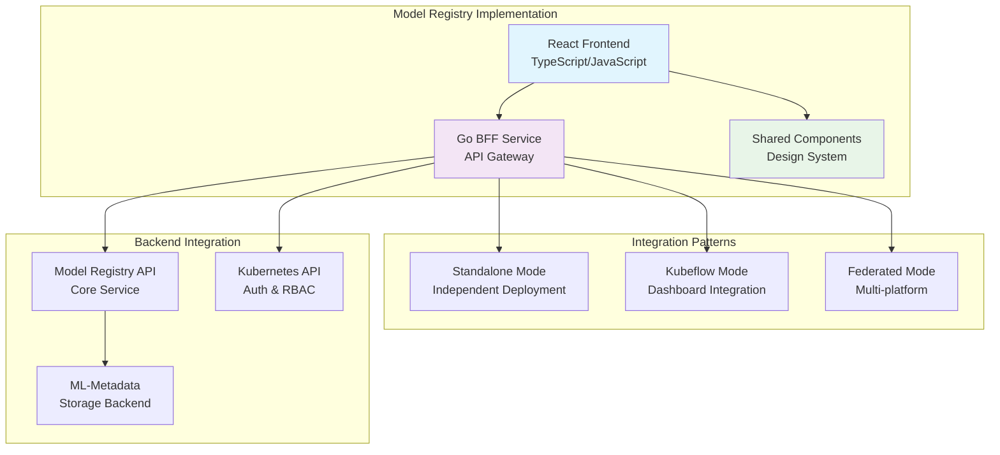
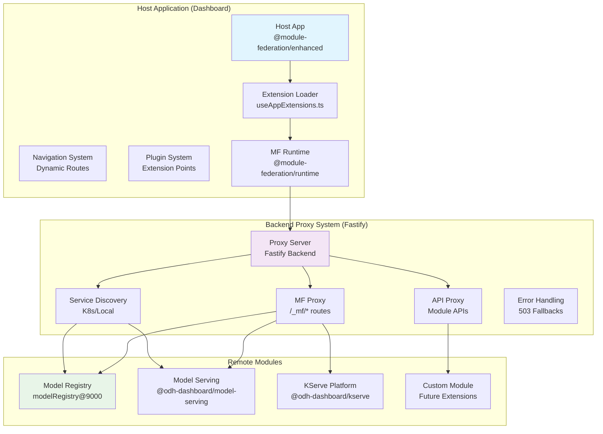

# Integration Examples

This document provides real-world implementation examples showcasing how modular architecture patterns are applied in practice. It includes comprehensive case studies and advanced integration patterns that demonstrate the full capabilities of our modular approach.

## Table of Contents

1. [Model Registry Case Study](#model-registry-case-study)
2. [Module Federation Integration](#module-federation-integration)

---

## Model Registry Case Study

The **Model Registry UI** serves as a comprehensive case study for implementing modular architecture patterns in practice. This document examines how the Model Registry UI implements the core patterns, technologies, and best practices outlined in our modular architecture initiative.

### Overview

The Model Registry UI demonstrates a complete modular micro-frontend implementation with:

- **Standalone Deployment**: Independent application with full functionality
- **Kubeflow Integration**: Seamless integration with the Kubeflow ecosystem
- **Multi-Theme Support**: PatternFly and Material-UI compatibility
- **Comprehensive BFF**: Full Backend-for-Frontend implementation
- **Authentication Integration**: Kubernetes RBAC and token-based auth

### Architecture Implementation

#### Core Pattern Application

The Model Registry UI implements all three core modular architecture patterns:



#### Multi-Deployment Architecture

The Model Registry demonstrates sophisticated deployment flexibility:

##### Deployment Mode Configuration

```typescript
// Environment-based deployment mode selection
interface DeploymentConfig {
  mode: 'standalone' | 'kubeflow' | 'federated';
  theme: 'patternfly-theme' | 'mui-theme';
  authMethod: 'internal' | 'user_token';
  apiEndpoints: string[];
  staticAssets: string;
}

// Example configurations for different modes
const standaloneConfig: DeploymentConfig = {
  mode: 'standalone',
  theme: 'patternfly-theme',
  authMethod: 'user_token',
  apiEndpoints: ['/api/v1/*', '/namespace'],
  staticAssets: '/app/dist'
};

const kubeflowConfig: DeploymentConfig = {
  mode: 'kubeflow',
  theme: 'patternfly-theme',
  authMethod: 'internal',
  apiEndpoints: ['/api/v1/*'], // Limited endpoints
  staticAssets: '/app/dist'
};
```

### Frontend Implementation Patterns

#### Component Architecture

The Model Registry frontend demonstrates modern React patterns aligned with shared library principles:

```typescript
// Model Registry App Structure
import React from 'react';
import { BrowserRouter as Router } from 'react-router-dom';
import { QueryClient, QueryClientProvider } from 'react-query';
import { 
  ModularArchContextProvider,
  ThemeProvider,
  BrowserStorageContextProvider,
  NotificationContextProvider,
  NavBar
} from 'mod-arch-shared';

const ModelRegistryApp: React.FC = () => {
  const queryClient = new QueryClient({
    defaultOptions: {
      queries: {
        retry: 3,
        staleTime: 5 * 60 * 1000, // 5 minutes
      },
    },
  });

  return (
    <QueryClientProvider client={queryClient}>
      <ModularArchContextProvider config={modularArchConfig}>
        <ThemeProvider theme={Theme.Patternfly}>
          <BrowserStorageContextProvider>
            <NotificationContextProvider>
              <Router>
                <div className="model-registry-app">
                  <NavBar />
                  <main>
                    <ModelRegistryRoutes />
                  </main>
                </div>
              </Router>
            </NotificationContextProvider>
          </BrowserStorageContextProvider>
        </ThemeProvider>
      </ModularArchContextProvider>
    </QueryClientProvider>
  );
};
```

#### Shared Library Integration

The Model Registry showcases effective shared library usage:

```typescript
// Using shared components for consistent UI
import { 
  ApplicationsPage,
  DashboardDescriptionListGroup,
  DashboardEmptyTableView,
  useNamespaceSelector,
  useNotifications
} from 'mod-arch-shared';

const ModelListPage: React.FC = () => {
  const { selectedNamespace } = useNamespaceSelector();
  const { addSuccess, addError } = useNotifications();
  const { data: models, loading, error } = useModels(selectedNamespace);

  const handleModelDelete = async (modelId: string) => {
    try {
      await deleteModel(modelId);
      addSuccess('Model deleted successfully');
    } catch (error) {
      addError('Failed to delete model', error.message);
    }
  };

  if (loading) {
    return <div>Loading models...</div>;
  }

  if (error) {
    return (
      <EmptyStateErrorMessage
        title="Failed to load models"
        description={error.message}
        action={{
          label: 'Retry',
          onClick: () => window.location.reload(),
        }}
      />
    );
  }

  if (!models || models.length === 0) {
    return (
      <DashboardEmptyTableView
        title="No models found"
        description="Register your first model to get started"
        primaryAction={{
          label: 'Register Model',
          onClick: () => navigate('/models/register'),
        }}
      />
    );
  }

  return (
    <ApplicationsPage
      title="Models"
      description="Manage your machine learning models"
      breadcrumbs={[
        { label: 'Model Registry', path: '/' },
        { label: 'Models', path: '/models' },
      ]}
    >
      <ModelTable models={models} onDelete={handleModelDelete} />
    </ApplicationsPage>
  );
};
```

### Backend-for-Frontend Implementation

#### Go BFF Architecture

The Model Registry BFF demonstrates clean API gateway patterns:

```go
// main.go - BFF service entry point
package main

import (
    "context"
    "log"
    "net/http"
    "os"
    "time"

    "github.com/gin-contrib/cors"
    "github.com/gin-gonic/gin"
    "github.com/kubeflow/model-registry/internal/api"
    "github.com/kubeflow/model-registry/internal/auth"
    "github.com/kubeflow/model-registry/internal/config"
)

func main() {
    cfg := config.LoadConfig()
    
    // Initialize router with middleware
    router := gin.New()
    router.Use(gin.Logger())
    router.Use(gin.Recovery())
    
    // CORS configuration for multi-deployment support
    router.Use(cors.New(cors.Config{
        AllowOrigins:     cfg.AllowedOrigins,
        AllowMethods:     []string{"GET", "POST", "PUT", "DELETE", "OPTIONS"},
        AllowHeaders:     []string{"Origin", "Content-Type", "Authorization", "X-User-ID"},
        AllowCredentials: true,
        MaxAge:          12 * time.Hour,
    }))
    
    // Authentication middleware
    if cfg.AuthMode == "user_token" {
        router.Use(auth.ValidateUserToken())
    }
    
    // API routes
    api.RegisterRoutes(router, cfg)
    
    // Static file serving for standalone mode
    if cfg.DeploymentMode == "standalone" {
        router.Static("/static", "./dist/static")
        router.StaticFile("/", "./dist/index.html")
    }
    
    log.Printf("Starting Model Registry BFF on port %s", cfg.Port)
    log.Fatal(http.ListenAndServe(":"+cfg.Port, router))
}
```

#### API Route Implementation

```go
// internal/api/routes.go
package api

import (
    "net/http"
    "strconv"

    "github.com/gin-gonic/gin"
    "github.com/kubeflow/model-registry/internal/services"
)

func RegisterRoutes(router *gin.Engine, cfg *config.Config) {
    api := router.Group("/api/v1")
    
    // Model management endpoints
    models := api.Group("/models")
    {
        models.GET("", getModels)
        models.POST("", createModel)
        models.GET("/:id", getModel)
        models.PUT("/:id", updateModel)
        models.DELETE("/:id", deleteModel)
    }
    
    // Model version endpoints
    versions := api.Group("/model_versions")
    {
        versions.GET("", getModelVersions)
        versions.POST("", createModelVersion)
        versions.GET("/:id", getModelVersion)
        versions.PUT("/:id", updateModelVersion)
    }
    
    // Model artifact endpoints
    artifacts := api.Group("/model_artifacts")
    {
        artifacts.GET("", getModelArtifacts)
        artifacts.POST("", createModelArtifact)
        artifacts.GET("/:id", getModelArtifact)
    }
    
    // Health check endpoint
    api.GET("/health", healthCheck)
}

func getModels(c *gin.Context) {
    namespace := c.GetHeader("X-Namespace")
    if namespace == "" {
        c.JSON(http.StatusBadRequest, gin.H{"error": "Namespace required"})
        return
    }
    
    pageSize, _ := strconv.Atoi(c.DefaultQuery("page_size", "20"))
    nextPageToken := c.Query("next_page_token")
    
    models, token, err := services.GetModels(namespace, pageSize, nextPageToken)
    if err != nil {
        c.JSON(http.StatusInternalServerError, gin.H{"error": err.Error()})
        return
    }
    
    c.JSON(http.StatusOK, gin.H{
        "models": models,
        "next_page_token": token,
    })
}
```

### API Integration Patterns

#### Custom Hooks for Model Registry

The Model Registry implements domain-specific hooks that build on shared library patterns:

```typescript
// hooks/useModels.ts
import { useQuery, useMutation, useQueryClient } from 'react-query';
import { useModularArchContext, useNamespaceSelector, restGET } from 'mod-arch-shared';

export const useModels = (namespace?: string) => {
  const { config } = useModularArchContext();
  const { selectedNamespace } = useNamespaceSelector();
  const effectiveNamespace = namespace || selectedNamespace?.name;

  return useQuery(
    ['models', effectiveNamespace],
    async () => {
      const response = await restGET<ModelsResponse>(
        '',
        '/api/v1/models',
        config,
        {
          headers: {
            'X-Namespace': effectiveNamespace,
          },
        }
      );
      return response.models;
    },
    {
      enabled: !!effectiveNamespace,
      staleTime: 30000, // 30 seconds
      cacheTime: 300000, // 5 minutes
    }
  );
};

export const useCreateModel = () => {
  const queryClient = useQueryClient();
  const { config } = useModularArchContext();
  const { selectedNamespace } = useNamespaceSelector();

  return useMutation(
    async (modelData: CreateModelRequest) => {
      return restPOST<Model>(
        '',
        '/api/v1/models',
        config,
        modelData,
        {
          headers: {
            'X-Namespace': selectedNamespace?.name,
          },
        }
      );
    },
    {
      onSuccess: () => {
        // Invalidate and refetch models
        queryClient.invalidateQueries(['models', selectedNamespace?.name]);
      },
    }
  );
};
```

#### Error Handling Patterns

```typescript
// utils/errorHandling.ts
import { isModArchResponse, handleRestFailures } from 'mod-arch-shared';

export const handleModelRegistryError = (error: unknown): ModelRegistryError => {
  // Handle structured API errors
  if (isModArchResponse(error)) {
    return {
      message: error.message || 'An error occurred',
      code: error.code || 'UNKNOWN_ERROR',
      details: error.details,
    };
  }
  
  // Handle network errors
  if (error instanceof TypeError && error.message.includes('fetch')) {
    return {
      message: 'Unable to connect to Model Registry service',
      code: 'NETWORK_ERROR',
      details: 'Please check your connection and try again',
    };
  }
  
  // Handle other errors
  const standardError = handleRestFailures(error);
  return {
    message: standardError.message,
    code: 'UNKNOWN_ERROR',
    details: standardError.details,
  };
};

// Error boundary for Model Registry
export const ModelRegistryErrorBoundary: React.FC<{ children: ReactNode }> = ({ children }) => {
  return (
    <ErrorBoundary
      fallback={({ error, retry }) => (
        <div className="model-registry-error">
          <h2>Model Registry Error</h2>
          <p>{handleModelRegistryError(error).message}</p>
          <button onClick={retry}>Try Again</button>
        </div>
      )}
    >
      {children}
    </ErrorBoundary>
  );
};
```

### Performance Optimizations

#### Bundle Splitting Strategy

The Model Registry implements strategic code splitting:

```typescript
// Lazy loading for heavy components
import { lazy, Suspense } from 'react';

// Split by feature domain
const ModelDetails = lazy(() => import('./components/ModelDetails'));
const ModelVersions = lazy(() => import('./components/ModelVersions'));
const ModelArtifacts = lazy(() => import('./components/ModelArtifacts'));
const ModelMetrics = lazy(() => import('./components/ModelMetrics'));

// Split by size/complexity
const ModelVisualization = lazy(() => 
  import('./components/ModelVisualization').catch(() => ({
    default: () => <div>Visualization unavailable</div>
  }))
);

const ModelRegistryRoutes: React.FC = () => {
  return (
    <Routes>
      <Route path="/models" element={
        <Suspense fallback={<div>Loading models...</div>}>
          <ModelList />
        </Suspense>
      } />
      <Route path="/models/:id" element={
        <Suspense fallback={<div>Loading model details...</div>}>
          <ModelDetails />
        </Suspense>
      } />
      <Route path="/models/:id/versions" element={
        <Suspense fallback={<div>Loading versions...</div>}>
          <ModelVersions />
        </Suspense>
      } />
      <Route path="/models/:id/artifacts" element={
        <Suspense fallback={<div>Loading artifacts...</div>}>
          <ModelArtifacts />
        </Suspense>
      } />
    </Routes>
  );
};
```

#### Caching Strategy

```typescript
// Optimized caching for Model Registry
const queryClient = new QueryClient({
  defaultOptions: {
    queries: {
      // Aggressive caching for relatively static data
      staleTime: 5 * 60 * 1000, // 5 minutes
      cacheTime: 10 * 60 * 1000, // 10 minutes
      
      // Retry configuration
      retry: (failureCount, error) => {
        // Don't retry on 4xx errors
        if (error?.status >= 400 && error?.status < 500) {
          return false;
        }
        return failureCount < 3;
      },
      
      // Background refetch
      refetchOnWindowFocus: false,
      refetchOnReconnect: true,
    },
  },
});

// Cache invalidation patterns
export const useModelRegistryCache = () => {
  const queryClient = useQueryClient();

  const invalidateModels = useCallback((namespace?: string) => {
    queryClient.invalidateQueries(['models', namespace]);
  }, [queryClient]);

  const invalidateModel = useCallback((modelId: string) => {
    queryClient.invalidateQueries(['model', modelId]);
    queryClient.invalidateQueries(['model-versions', modelId]);
    queryClient.invalidateQueries(['model-artifacts', modelId]);
  }, [queryClient]);

  return { invalidateModels, invalidateModel };
};
```

### Deployment Configurations

#### Kubernetes Manifests

```yaml
# deployments/standalone/deployment.yaml
apiVersion: apps/v1
kind: Deployment
metadata:
  name: model-registry-standalone
  namespace: kubeflow
spec:
  replicas: 2
  selector:
    matchLabels:
      app: model-registry
      mode: standalone
  template:
    metadata:
      labels:
        app: model-registry
        mode: standalone
    spec:
      containers:
      - name: model-registry-bff
        image: model-registry-bff:latest
        ports:
        - containerPort: 8080
        env:
        - name: DEPLOYMENT_MODE
          value: "standalone"
        - name: AUTH_MODE
          value: "user_token"
        - name: MODEL_REGISTRY_URL
          value: "http://model-registry-service:8080"
        resources:
          requests:
            memory: "256Mi"
            cpu: "100m"
          limits:
            memory: "512Mi"
            cpu: "500m"
        livenessProbe:
          httpGet:
            path: /api/v1/health
            port: 8080
          initialDelaySeconds: 30
          periodSeconds: 10
        readinessProbe:
          httpGet:
            path: /api/v1/health
            port: 8080
          initialDelaySeconds: 5
          periodSeconds: 5
---
apiVersion: v1
kind: Service
metadata:
  name: model-registry-service
  namespace: kubeflow
spec:
  selector:
    app: model-registry
  ports:
  - port: 8080
    targetPort: 8080
    name: http
  type: ClusterIP
```

#### Kubeflow Integration

```yaml
# deployments/kubeflow/configmap.yaml
apiVersion: v1
kind: ConfigMap
metadata:
  name: model-registry-config
  namespace: kubeflow
data:
  app.js: |
    // Kubeflow dashboard integration script
    (function() {
      // Register with Kubeflow dashboard
      if (window.kubeflowDashboard) {
        window.kubeflowDashboard.registerExtension({
          name: 'Model Registry',
          path: '/model-registry',
          icon: 'model',
          displayName: 'Model Registry',
          description: 'Manage ML models and versions'
        });
      }
      
      // Load Model Registry app
      const script = document.createElement('script');
      script.src = '/model-registry/static/js/main.js';
      document.head.appendChild(script);
    })();
```

---

## Module Federation Integration

This section covers the comprehensive implementation of Webpack Module Federation in our modular architecture, enabling dynamic loading and integration of micro-frontends into the main dashboard application.

### Module Federation Overview

Module Federation provides the technical foundation for our modular architecture by enabling:

- **Dynamic Module Loading**: Micro-frontends are loaded at runtime rather than build time
- **Independent Deployment**: Each module can be deployed and updated independently
- **Shared Dependencies**: Common libraries are shared between host and remote modules
- **Plugin Architecture**: Extensible system for adding new capabilities
- **Runtime Integration**: Modules are discovered and integrated dynamically

### Architecture Components

#### High-Level System Architecture

```text
┌─────────────────┐    ┌─────────────────┐    ┌─────────────────┐
│   Host App      │    │   Backend       │    │   Remote Apps   │
│   (Dashboard)   │◄──►│   (Proxy)       │◄──►│   (Modules)     │
└─────────────────┘    └─────────────────┘    └─────────────────┘
```

#### Detailed Component Architecture



### Host Application Configuration

#### Webpack Configuration

```javascript
// webpack.config.js for host application
const ModuleFederationPlugin = require('@module-federation/webpack');
const { dependencies } = require('./package.json');

module.exports = {
  entry: './src/index.tsx',
  mode: 'development',
  
  devServer: {
    port: 3000,
    historyApiFallback: true,
    headers: {
      'Access-Control-Allow-Origin': '*',
      'Access-Control-Allow-Methods': 'GET, POST, PUT, DELETE, PATCH, OPTIONS',
      'Access-Control-Allow-Headers': 'X-Requested-With, content-type, Authorization',
    },
  },
  
  resolve: {
    extensions: ['.tsx', '.ts', '.js'],
  },
  
  module: {
    rules: [
      {
        test: /\.tsx?$/,
        loader: 'ts-loader',
        exclude: /node_modules/,
      },
      {
        test: /\.css$/,
        use: ['style-loader', 'css-loader'],
      },
    ],
  },
  
  plugins: [
    new ModuleFederationPlugin({
      name: 'odh_dashboard',
      filename: 'remoteEntry.js',
      
      // Define what this host can consume
      remotes: {
        modelRegistry: 'modelRegistry@http://localhost:9000/remoteEntry.js',
        modelServing: 'modelServing@http://localhost:9001/remoteEntry.js',
      },
      
      // Share dependencies
      shared: {
        react: {
          singleton: true,
          eager: true,
          requiredVersion: dependencies.react,
        },
        'react-dom': {
          singleton: true,
          eager: true,
          requiredVersion: dependencies['react-dom'],
        },
        'mod-arch-shared': {
          singleton: true,
          eager: true,
          requiredVersion: dependencies['mod-arch-shared'],
        },
        '@patternfly/react-core': {
          singleton: true,
          requiredVersion: dependencies['@patternfly/react-core'],
        },
      },
    }),
  ],
};
```

#### Dynamic Extension Loading

```typescript
// hooks/useAppExtensions.ts
import { useState, useEffect } from 'react';
import { loadRemote } from '@module-federation/runtime';

interface ExtensionConfig {
  name: string;
  remote: string;
  module: string;
  scope: string;
  url: string;
  enabled: boolean;
}

interface LoadedExtension {
  name: string;
  component: React.ComponentType;
  config: ExtensionConfig;
  error?: Error;
}

export const useAppExtensions = () => {
  const [extensions, setExtensions] = useState<LoadedExtension[]>([]);
  const [loading, setLoading] = useState(true);
  const [error, setError] = useState<Error | null>(null);

  useEffect(() => {
    const loadExtensions = async () => {
      try {
        // Fetch extension configuration from backend
        const response = await fetch('/api/extensions');
        const configs: ExtensionConfig[] = await response.json();
        
        const loadedExtensions = await Promise.allSettled(
          configs
            .filter(config => config.enabled)
            .map(async (config) => {
              try {
                // Dynamic import of remote module
                const module = await loadRemote<{ default: React.ComponentType }>({
                  remote: config.remote,
                  module: config.module,
                });
                
                return {
                  name: config.name,
                  component: module.default,
                  config,
                };
              } catch (error) {
                console.error(`Failed to load extension ${config.name}:`, error);
                return {
                  name: config.name,
                  component: () => (
                    <div>Extension {config.name} failed to load</div>
                  ),
                  config,
                  error: error as Error,
                };
              }
            })
        );

        const extensions = loadedExtensions
          .filter(result => result.status === 'fulfilled')
          .map(result => (result as PromiseFulfilledResult<LoadedExtension>).value);

        setExtensions(extensions);
      } catch (err) {
        setError(err as Error);
      } finally {
        setLoading(false);
      }
    };

    loadExtensions();
  }, []);

  return { extensions, loading, error };
};
```

#### Extension Router Integration

```typescript
// components/ExtensionRouter.tsx
import React, { Suspense } from 'react';
import { Routes, Route } from 'react-router-dom';
import { ErrorBoundary } from 'mod-arch-shared';
import { useAppExtensions } from '../hooks/useAppExtensions';

const ExtensionLoadingFallback: React.FC<{ name: string }> = ({ name }) => (
  <div className="extension-loading">
    <div>Loading {name}...</div>
  </div>
);

const ExtensionErrorFallback: React.FC<{ name: string; error: Error }> = ({ name, error }) => (
  <div className="extension-error">
    <h2>Extension Error</h2>
    <p>Failed to load {name}: {error.message}</p>
    <button onClick={() => window.location.reload()}>
      Reload Page
    </button>
  </div>
);

export const ExtensionRouter: React.FC = () => {
  const { extensions, loading, error } = useAppExtensions();

  if (loading) {
    return <div>Loading extensions...</div>;
  }

  if (error) {
    return <div>Failed to load extensions: {error.message}</div>;
  }

  return (
    <Routes>
      {extensions.map(({ name, component: Component, config }) => (
        <Route
          key={name}
          path={config.route || `/${name.toLowerCase()}/*`}
          element={
            <ErrorBoundary
              fallback={() => <ExtensionErrorFallback name={name} error={config.error!} />}
            >
              <Suspense fallback={<ExtensionLoadingFallback name={name} />}>
                <Component />
              </Suspense>
            </ErrorBoundary>
          }
        />
      ))}
    </Routes>
  );
};
```

### Remote Module Configuration

#### Model Registry Remote Configuration

```javascript
// webpack.config.js for Model Registry remote
const ModuleFederationPlugin = require('@module-federation/webpack');
const { dependencies } = require('./package.json');

module.exports = {
  entry: './src/index.tsx',
  mode: 'development',
  
  devServer: {
    port: 9000,
    historyApiFallback: true,
  },
  
  resolve: {
    extensions: ['.tsx', '.ts', '.js'],
  },
  
  plugins: [
    new ModuleFederationPlugin({
      name: 'modelRegistry',
      filename: 'remoteEntry.js',
      
      // Expose components for consumption
      exposes: {
        './ModelRegistry': './src/components/ModelRegistryApp',
        './ModelList': './src/components/ModelList',
        './ModelDetails': './src/components/ModelDetails',
        './ModelCreator': './src/components/ModelCreator',
      },
      
      // Share dependencies with host
      shared: {
        react: {
          singleton: true,
          requiredVersion: dependencies.react,
        },
        'react-dom': {
          singleton: true,
          requiredVersion: dependencies['react-dom'],
        },
        'mod-arch-shared': {
          singleton: true,
          requiredVersion: dependencies['mod-arch-shared'],
        },
      },
    }),
  ],
};
```

#### Remote Module Bootstrap

```typescript
// src/bootstrap.tsx for remote module
import React from 'react';
import { createRoot } from 'react-dom/client';
import { ModelRegistryApp } from './components/ModelRegistryApp';

// Export for module federation
export { ModelRegistryApp as default } from './components/ModelRegistryApp';

// Standalone mode bootstrap
if (process.env.NODE_ENV === 'development') {
  const container = document.getElementById('root');
  if (container) {
    const root = createRoot(container);
    root.render(<ModelRegistryApp />);
  }
}
```

### Backend Proxy Implementation

#### Fastify Proxy Server

```javascript
// backend/proxy.js
const fastify = require('fastify')({ logger: true });
const { createProxyMiddleware } = require('http-proxy-middleware');

// Configuration for remote modules
const moduleConfigs = [
  {
    name: 'modelRegistry',
    path: '/model-registry',
    target: process.env.MODEL_REGISTRY_URL || 'http://localhost:9000',
    enabled: true,
  },
  {
    name: 'modelServing',
    path: '/model-serving',
    target: process.env.MODEL_SERVING_URL || 'http://localhost:9001',
    enabled: true,
  },
];

// Register proxy routes for each module
moduleConfigs.forEach(config => {
  if (config.enabled) {
    // Proxy static assets
    fastify.register(require('@fastify/http-proxy'), {
      upstream: config.target,
      prefix: config.path,
      rewritePrefix: '/',
      http2: false,
    });
    
    // Proxy API routes
    fastify.register(require('@fastify/http-proxy'), {
      upstream: config.target,
      prefix: `/api${config.path}`,
      rewritePrefix: '/api',
      http2: false,
    });
  }
});

// Module federation specific routes
fastify.register(async function (fastify) {
  // Serve remote entry files
  fastify.get('/_mf/:module/remoteEntry.js', async (request, reply) => {
    const { module } = request.params;
    const config = moduleConfigs.find(c => c.name === module);
    
    if (!config || !config.enabled) {
      return reply.code(404).send({ error: 'Module not found' });
    }
    
    try {
      const response = await fetch(`${config.target}/remoteEntry.js`);
      const content = await response.text();
      
      reply
        .header('Content-Type', 'application/javascript')
        .send(content);
    } catch (error) {
      reply.code(503).send({ error: 'Module unavailable' });
    }
  });
  
  // Health check for modules
  fastify.get('/api/extensions', async (request, reply) => {
    const healthChecks = await Promise.allSettled(
      moduleConfigs.map(async config => {
        try {
          const response = await fetch(`${config.target}/health`, {
            timeout: 5000,
          });
          return {
            ...config,
            healthy: response.ok,
            url: `${config.target}/remoteEntry.js`,
          };
        } catch {
          return {
            ...config,
            healthy: false,
            enabled: false,
          };
        }
      })
    );
    
    const extensions = healthChecks
      .filter(result => result.status === 'fulfilled')
      .map(result => result.value);
    
    reply.send(extensions);
  });
});

// Start server
const start = async () => {
  try {
    await fastify.listen({ port: 8080, host: '0.0.0.0' });
    console.log('Proxy server running on port 8080');
  } catch (err) {
    fastify.log.error(err);
    process.exit(1);
  }
};

start();
```

### Advanced Federation Patterns

#### Error Recovery and Fallbacks

```typescript
// utils/federationUtils.ts
export const loadRemoteWithFallback = async <T>(
  remoteName: string,
  moduleName: string,
  fallbackComponent?: React.ComponentType
): Promise<React.ComponentType> => {
  try {
    const container = await loadRemote<{ default: React.ComponentType }>({
      remote: remoteName,
      module: moduleName,
    });
    
    return container.default;
  } catch (error) {
    console.error(`Failed to load ${remoteName}/${moduleName}:`, error);
    
    if (fallbackComponent) {
      return fallbackComponent;
    }
    
    // Return generic fallback
    return () => (
      <div className="module-fallback">
        <h3>Module Unavailable</h3>
        <p>The {remoteName} module is currently unavailable.</p>
        <button onClick={() => window.location.reload()}>
          Try Again
        </button>
      </div>
    );
  }
};

// Hook for safe remote loading
export const useRemoteModule = (remoteName: string, moduleName: string) => {
  const [component, setComponent] = useState<React.ComponentType | null>(null);
  const [loading, setLoading] = useState(true);
  const [error, setError] = useState<Error | null>(null);

  useEffect(() => {
    loadRemoteWithFallback(remoteName, moduleName)
      .then(setComponent)
      .catch(setError)
      .finally(() => setLoading(false));
  }, [remoteName, moduleName]);

  return { component, loading, error };
};
```

#### Module Communication

```typescript
// utils/moduleMessaging.ts
interface ModuleMessage {
  type: string;
  payload: any;
  source: string;
  target?: string;
}

class ModuleFederationMessageBus {
  private handlers = new Map<string, (message: ModuleMessage) => void>();
  private moduleId: string;

  constructor(moduleId: string) {
    this.moduleId = moduleId;
    window.addEventListener('message', this.handleMessage.bind(this));
  }

  private handleMessage = (event: MessageEvent) => {
    if (event.data?.type === 'MODULE_FEDERATION_MESSAGE') {
      const message: ModuleMessage = event.data.payload;
      
      // Check if message is for this module
      if (!message.target || message.target === this.moduleId) {
        const handler = this.handlers.get(message.type);
        if (handler) {
          handler(message);
        }
      }
    }
  };

  subscribe(messageType: string, handler: (message: ModuleMessage) => void) {
    this.handlers.set(messageType, handler);
    
    return () => {
      this.handlers.delete(messageType);
    };
  }

  broadcast(type: string, payload: any, target?: string) {
    const message: ModuleMessage = {
      type,
      payload,
      source: this.moduleId,
      target,
    };

    window.postMessage({
      type: 'MODULE_FEDERATION_MESSAGE',
      payload: message,
    }, '*');
  }
}

// Usage in modules
export const useModuleMessaging = (moduleId: string) => {
  const [messageBus] = useState(() => new ModuleFederationMessageBus(moduleId));

  const subscribe = useCallback((type: string, handler: (message: ModuleMessage) => void) => {
    return messageBus.subscribe(type, handler);
  }, [messageBus]);

  const broadcast = useCallback((type: string, payload: any, target?: string) => {
    messageBus.broadcast(type, payload, target);
  }, [messageBus]);

  return { subscribe, broadcast };
};
```

### Deployment and Operations

#### Kubernetes Deployment

```yaml
# deployments/federation/dashboard-host.yaml
apiVersion: apps/v1
kind: Deployment
metadata:
  name: dashboard-host
  namespace: kubeflow
spec:
  replicas: 2
  selector:
    matchLabels:
      app: dashboard-host
  template:
    metadata:
      labels:
        app: dashboard-host
    spec:
      containers:
      - name: dashboard
        image: dashboard-host:latest
        ports:
        - containerPort: 3000
          name: frontend
        env:
        - name: PROXY_BACKEND_URL
          value: "http://dashboard-proxy:8080"
        resources:
          requests:
            memory: "512Mi"
            cpu: "200m"
          limits:
            memory: "1Gi"
            cpu: "500m"
      - name: proxy
        image: dashboard-proxy:latest
        ports:
        - containerPort: 8080
          name: proxy
        env:
        - name: MODEL_REGISTRY_URL
          value: "http://model-registry-service:9000"
        - name: MODEL_SERVING_URL
          value: "http://model-serving-service:9001"
        resources:
          requests:
            memory: "256Mi"
            cpu: "100m"
          limits:
            memory: "512Mi"
            cpu: "300m"
```

#### Module Health Monitoring

```typescript
// monitoring/moduleHealth.ts
interface ModuleHealthStatus {
  name: string;
  healthy: boolean;
  lastCheck: Date;
  responseTime: number;
  error?: string;
}

class ModuleHealthMonitor {
  private modules: Map<string, ModuleHealthStatus> = new Map();
  private checkInterval: number = 30000; // 30 seconds
  private intervalId?: NodeJS.Timeout;

  constructor(modules: Array<{ name: string; url: string }>) {
    modules.forEach(module => {
      this.modules.set(module.name, {
        name: module.name,
        healthy: false,
        lastCheck: new Date(),
        responseTime: 0,
      });
    });

    this.startMonitoring();
  }

  private startMonitoring() {
    this.intervalId = setInterval(() => {
      this.checkAllModules();
    }, this.checkInterval);
  }

  private async checkAllModules() {
    const checks = Array.from(this.modules.entries()).map(([name, status]) =>
      this.checkModule(name, status)
    );

    await Promise.allSettled(checks);
  }

  private async checkModule(name: string, status: ModuleHealthStatus) {
    const startTime = Date.now();
    
    try {
      const response = await fetch(`/api/modules/${name}/health`, {
        timeout: 5000,
      });
      
      const responseTime = Date.now() - startTime;
      
      this.modules.set(name, {
        ...status,
        healthy: response.ok,
        lastCheck: new Date(),
        responseTime,
        error: response.ok ? undefined : `HTTP ${response.status}`,
      });
    } catch (error) {
      this.modules.set(name, {
        ...status,
        healthy: false,
        lastCheck: new Date(),
        responseTime: Date.now() - startTime,
        error: error.message,
      });
    }
  }

  getModuleStatus(name: string): ModuleHealthStatus | undefined {
    return this.modules.get(name);
  }

  getAllStatuses(): ModuleHealthStatus[] {
    return Array.from(this.modules.values());
  }

  destroy() {
    if (this.intervalId) {
      clearInterval(this.intervalId);
    }
  }
}

export const moduleHealthMonitor = new ModuleHealthMonitor([
  { name: 'modelRegistry', url: '/api/model-registry/health' },
  { name: 'modelServing', url: '/api/model-serving/health' },
]);
```

---

## Conclusion

These integration examples demonstrate the practical application of modular architecture patterns in real-world scenarios. The Model Registry case study shows how to implement a complete modular application from frontend to backend, while the Module Federation integration examples provide the technical foundation for dynamic micro-frontend composition.

Key takeaways from these examples:

1. **Comprehensive Integration**: Successful modular implementations require coordination across frontend, backend, deployment, and operational concerns
2. **Graceful Degradation**: Robust error handling and fallback mechanisms are essential for production deployments
3. **Performance Considerations**: Strategic code splitting, caching, and optimization are crucial for good user experience
4. **Operational Excellence**: Monitoring, health checks, and automated deployment processes ensure reliability

These patterns and examples provide a proven foundation for implementing modular architecture in production environments while maintaining high standards for performance, reliability, and developer experience.

---

**Related Documentation:**

- [Developer Implementation Guide](./08-developer-implementation-guide.md) - Complete implementation guidance
- [Technical Reference](./technical-reference.md) - Detailed technical documentation
- [Architecture Overview](./03-architecture-overview.md) - High-level architectural concepts
- [Getting Started](./10-getting-started.md) - Quick start guide
