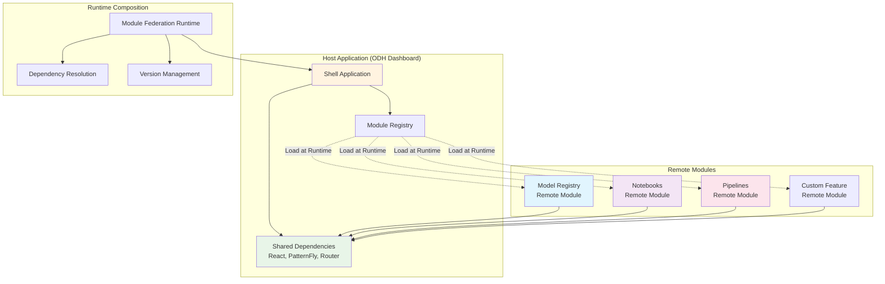

# Module Federation

Module Federation enables multiple separate builds to form a single application at runtime. This technology is central to our federated deployment mode, allowing for true independent deployments while maintaining shared dependencies and consistent user experience.

## Overview

Module Federation is a Webpack 5 feature that allows JavaScript applications to dynamically import code from other applications at runtime. In our architecture, it enables the ODH/RHOAI Dashboard to load feature modules as independent micro-frontends while sharing common dependencies.



## Configuration

### Host Application Configuration

The host application (ODH Dashboard) is configured to consume remote modules:

```javascript
// frontend/webpack.config.js - Host Configuration
const ModuleFederationPlugin = require('@module-federation/webpack');
const path = require('path');

module.exports = {
  mode: process.env.NODE_ENV || 'development',
  entry: './src/index.tsx',
  
  plugins: [
    new ModuleFederationPlugin({
      name: 'odhDashboard',
      
      // Remote modules to consume
      remotes: {
        modelRegistry: getRemoteUrl('modelRegistry', 'http://localhost:4001/remoteEntry.js'),
        notebooks: getRemoteUrl('notebooks', 'http://localhost:4002/remoteEntry.js'),
        pipelines: getRemoteUrl('pipelines', 'http://localhost:4003/remoteEntry.js'),
        customFeatures: getRemoteUrl('customFeatures', 'http://localhost:4004/remoteEntry.js'),
      },
      
      // Dependencies to share between host and remotes
      shared: {
        // React ecosystem
        react: {
          singleton: true,
          requiredVersion: '^18.0.0',
          eager: true,
        },
        'react-dom': {
          singleton: true,
          requiredVersion: '^18.0.0',
          eager: true,
        },
        'react-router-dom': {
          singleton: true,
          requiredVersion: '^6.8.0',
        },
        
        // PatternFly ecosystem
        '@patternfly/react-core': {
          singleton: true,
          requiredVersion: '^5.0.0',
        },
        '@patternfly/react-table': {
          singleton: true,
          requiredVersion: '^5.0.0',
        },
        '@patternfly/react-charts': {
          singleton: true,
        },
        
        // State management
        '@tanstack/react-query': {
          singleton: true,
          requiredVersion: '^4.0.0',
        },
        
        // Utilities
        axios: {
          singleton: true,
          requiredVersion: '^1.0.0',
        },
        lodash: {
          singleton: true,
        },
      },
    }),
  ],
  
  // Development server configuration
  devServer: {
    port: 3000,
    historyApiFallback: true,
    headers: {
      'Access-Control-Allow-Origin': '*',
      'Access-Control-Allow-Methods': 'GET, POST, PUT, DELETE, PATCH, OPTIONS',
      'Access-Control-Allow-Headers': 'X-Requested-With, content-type, Authorization',
    },
  },
};

// Dynamic remote URL resolution
function getRemoteUrl(name, fallbackUrl) {
  // In production, resolve from environment or service discovery
  if (process.env.NODE_ENV === 'production') {
    return process.env[`REACT_APP_REMOTE_${name.toUpperCase()}_URL`] || fallbackUrl;
  }
  return fallbackUrl;
}
```

### Remote Module Configuration

Each remote module (feature) is configured to expose components and share dependencies:

```javascript
// packages/model-registry/webpack.config.js - Remote Configuration
const ModuleFederationPlugin = require('@module-federation/webpack');

module.exports = {
  mode: process.env.NODE_ENV || 'development',
  entry: './src/index.tsx',
  
  plugins: [
    new ModuleFederationPlugin({
      name: 'modelRegistry',
      filename: 'remoteEntry.js',
      
      // Components/modules to expose to the host
      exposes: {
        // Main application component
        './ModelRegistryApp': './src/app/ModelRegistryApp.tsx',
        
        // Routing component
        './ModelRegistryRoutes': './src/routes/ModelRegistryRoutes.tsx',
        
        // Individual components for granular consumption
        './ModelsListPage': './src/pages/ModelsListPage.tsx',
        './ModelDetailsPage': './src/pages/ModelDetailsPage.tsx',
        './CreateModelPage': './src/pages/CreateModelPage.tsx',
        
        // Utility exports
        './api': './src/api/index.ts',
        './types': './src/types/index.ts',
        './hooks': './src/hooks/index.ts',
      },
      
      // Shared dependencies - must match host configuration
      shared: {
        react: {
          singleton: true,
          requiredVersion: '^18.0.0',
        },
        'react-dom': {
          singleton: true,
          requiredVersion: '^18.0.0',
        },
        'react-router-dom': {
          singleton: true,
          requiredVersion: '^6.8.0',
        },
        '@patternfly/react-core': {
          singleton: true,
          requiredVersion: '^5.0.0',
        },
        '@patternfly/react-table': {
          singleton: true,
          requiredVersion: '^5.0.0',
        },
        '@tanstack/react-query': {
          singleton: true,
          requiredVersion: '^4.0.0',
        },
        axios: {
          singleton: true,
          requiredVersion: '^1.0.0',
        },
      },
    }),
  ],
  
  devServer: {
    port: 4001,
    headers: {
      'Access-Control-Allow-Origin': '*',
    },
  },
};
```

## Shared Libraries

Shared libraries ensure consistency across modules while avoiding duplicate dependencies.

### Dependency Sharing Strategy

```mermaid
graph TB
    subgraph "Shared Dependencies"
        subgraph "Core React"
            React[React 18+]
            ReactDOM[React DOM]
            ReactRouter[React Router]
        end
        
        subgraph "UI Components"
            PatternFly[PatternFly Components]
            PatternFlyTable[PatternFly Table]
            PatternFlyCharts[PatternFly Charts]
        end
        
        subgraph "State Management"
            ReactQuery[React Query]
            ContextAPI[React Context]
        end
        
        subgraph "Utilities"
            Axios[HTTP Client]
            Lodash[Utility Functions]
            DateFns[Date Utilities]
        end
    end
    
    subgraph "Host Application"
        HostApp[ODH Dashboard]
        HostApp --> React
        HostApp --> PatternFly
        HostApp --> ReactQuery
        HostApp --> Axios
    end
    
    subgraph "Remote Modules"
        ModelRegistry[Model Registry]
        Notebooks[Notebooks]
        Pipelines[Pipelines]
        
        ModelRegistry --> React
        ModelRegistry --> PatternFly
        ModelRegistry --> ReactQuery
        
        Notebooks --> React
        Notebooks --> PatternFly
        Notebooks --> ReactQuery
        
        Pipelines --> React
        Pipelines --> PatternFly
        Pipelines --> ReactQuery
    end
    
    style React fill:#61dafb
    style PatternFly fill:#0066cc
    style ReactQuery fill:#ff6b6b
    style Axios fill:#5a67d8
```



### Custom Shared Library

```typescript
// shared/lib/src/index.ts - Custom shared components and utilities
export * from './components';
export * from './hooks';
export * from './utils';
export * from './types';
export * from './context';

// Components
export { ApplicationsPage } from './components/ApplicationsPage';
export { DashboardEmptyTableView } from './components/DashboardEmptyTableView';
export { ToastNotification } from './components/ToastNotification';
export { NamespaceSelector } from './components/NamespaceSelector';

// Hooks
export { useNamespaceSelector } from './hooks/useNamespaceSelector';
export { useNotifications } from './hooks/useNotifications';
export { useApiClient } from './hooks/useApiClient';

// Context Providers
export { ModularArchContextProvider } from './context/ModularArchContext';
export { ThemeProvider } from './context/ThemeContext';
export { NotificationProvider } from './context/NotificationContext';

// Utilities
export { formatDate, formatBytes } from './utils/formatters';
export { validateEmail, validateK8sName } from './utils/validators';
export { createApiClient } from './utils/apiClient';
```

### Shared Library Configuration

```javascript
// shared/lib/webpack.config.js
const ModuleFederationPlugin = require('@module-federation/webpack');

module.exports = {
  plugins: [
    new ModuleFederationPlugin({
      name: 'sharedLib',
      filename: 'remoteEntry.js',
      
      // Expose shared utilities
      exposes: {
        './components': './src/components/index.ts',
        './hooks': './src/hooks/index.ts',
        './utils': './src/utils/index.ts',
        './context': './src/context/index.ts',
        './types': './src/types/index.ts',
      },
      
      shared: {
        react: { singleton: true },
        'react-dom': { singleton: true },
        '@patternfly/react-core': { singleton: true },
      },
    }),
  ],
};
```

## Exposing APIs

Remote modules can expose both components and API utilities for consumption by other modules.

### API Exposure Patterns

```typescript
// Model Registry API exposure
// packages/model-registry/src/api/index.ts

export interface ModelsApiInterface {
  listModels(namespace: string, filters?: ModelFilters): Promise<ModelsResponse>;
  getModel(namespace: string, modelId: string): Promise<ModelDetails>;
  createModel(namespace: string, model: CreateModelRequest): Promise<Model>;
  updateModel(namespace: string, modelId: string, model: UpdateModelRequest): Promise<Model>;
  deleteModel(namespace: string, modelId: string): Promise<void>;
}

export class ModelsApiClient implements ModelsApiInterface {
  constructor(private config: ApiClientConfig) {}

  async listModels(namespace: string, filters?: ModelFilters): Promise<ModelsResponse> {
    const params = new URLSearchParams({ namespace });
    if (filters?.search) params.append('search', filters.search);
    if (filters?.sortBy) params.append('sort', filters.sortBy);
    
    const response = await fetch(`${this.config.baseUrl}/api/v1/models?${params}`, {
      headers: this.getHeaders(),
    });
    
    if (!response.ok) {
      throw new ApiError(response.status, await response.text());
    }
    
    return response.json();
  }

  // Additional methods...
  
  private getHeaders(): HeadersInit {
    return {
      'Content-Type': 'application/json',
      'Authorization': `Bearer ${this.config.token}`,
    };
  }
}

// Factory for creating API clients
export const createModelsApiClient = (config: ApiClientConfig): ModelsApiClient => {
  return new ModelsApiClient(config);
};

// Hook for consuming the API
export const useModelsApi = (): ModelsApiClient => {
  const { apiConfig } = useModularArchContext();
  return React.useMemo(() => createModelsApiClient(apiConfig), [apiConfig]);
};
```

### Cross-Module API Consumption

```typescript
// Another module consuming Model Registry APIs
// packages/experiments/src/hooks/useModelIntegration.ts

import { useModelsApi, Model } from 'modelRegistry/api';

export const useModelIntegration = (namespace: string) => {
  const modelsApi = useModelsApi();
  
  const { data: availableModels, loading } = useQuery({
    queryKey: ['models', namespace],
    queryFn: () => modelsApi.listModels(namespace, { 
      status: 'active' // Only active models for experiments
    }),
    enabled: !!namespace,
  });
  
  const linkModelToExperiment = async (modelId: string, experimentId: string) => {
    try {
      // Cross-module interaction
      const model = await modelsApi.getModel(namespace, modelId);
      
      // Update experiment with model reference
      await updateExperiment(experimentId, {
        linkedModels: [...experiment.linkedModels, modelId],
        metadata: {
          ...experiment.metadata,
          lastLinkedModel: {
            id: model.id,
            name: model.name,
            version: model.version,
            timestamp: new Date().toISOString(),
          },
        },
      });
      
      return { success: true, model };
    } catch (error) {
      throw new Error(`Failed to link model to experiment: ${error.message}`);
    }
  };
  
  return {
    availableModels,
    loading,
    linkModelToExperiment,
  };
};
```

## Sharing TypeScript Types

Type sharing ensures type safety across module boundaries and consistent interfaces.

### Type Definitions Export

```typescript
// packages/model-registry/src/types/index.ts

// Core model types
export interface Model {
  id: string;
  name: string;
  version: string;
  namespace: string;
  description?: string;
  displayName?: string;
  status: ModelStatus;
  createdAt: string;
  updatedAt: string;
  artifacts?: ModelArtifact[];
  metadata?: Record<string, any>;
  labels?: Record<string, string>;
}

export type ModelStatus = 'active' | 'inactive' | 'archived' | 'error';

export interface ModelArtifact {
  id: string;
  type: ArtifactType;
  uri: string;
  size?: number;
  checksum?: string;
  metadata?: Record<string, any>;
}

export type ArtifactType = 'model' | 'metrics' | 'schema' | 'documentation' | 'dataset';

// API request/response types
export interface ModelsResponse {
  models: Model[];
  pagination: PaginationInfo;
  metadata?: ResponseMetadata;
}

export interface CreateModelRequest {
  name: string;
  version: string;
  description?: string;
  artifacts?: Omit<ModelArtifact, 'id'>[];
  metadata?: Record<string, any>;
  labels?: Record<string, string>;
}

export interface UpdateModelRequest {
  description?: string;
  status?: ModelStatus;
  metadata?: Record<string, any>;
  labels?: Record<string, string>;
}

export interface ModelFilters {
  search?: string;
  status?: ModelStatus[];
  sortBy?: 'name' | 'created_at' | 'updated_at';
  sortOrder?: 'asc' | 'desc';
}

// Common types used across modules
export interface PaginationInfo {
  total: number;
  page: number;
  size: number;
  hasNext: boolean;
  hasPrevious: boolean;
}

export interface ResponseMetadata {
  namespace: string;
  timestamp: string;
  requestId?: string;
  version?: string;
}

// Error types
export class ApiError extends Error {
  constructor(
    public status: number,
    public message: string,
    public data?: any
  ) {
    super(message);
    this.name = 'ApiError';
  }
}

export interface ValidationError {
  field: string;
  message: string;
  code: string;
}

// Event types for inter-module communication
export interface ModelEvent {
  type: 'MODEL_CREATED' | 'MODEL_UPDATED' | 'MODEL_DELETED';
  payload: {
    model: Model;
    namespace: string;
    timestamp: string;
    userId?: string;
  };
}
```

### Type Consumption

```typescript
// packages/experiments/src/types/experiment.ts
// Consuming Model Registry types in another module

import { Model, ModelArtifact, ModelStatus } from 'modelRegistry/types';

export interface Experiment {
  id: string;
  name: string;
  description?: string;
  namespace: string;
  status: ExperimentStatus;
  
  // Integration with Model Registry types
  linkedModels?: ExperimentModelLink[];
  baseModel?: Pick<Model, 'id' | 'name' | 'version' | 'status'>;
  
  createdAt: string;
  updatedAt: string;
  metadata?: Record<string, any>;
}

export interface ExperimentModelLink {
  modelId: string;
  modelName: string;
  modelVersion: string;
  modelStatus: ModelStatus; // Reusing Model Registry type
  linkType: 'baseline' | 'comparison' | 'derived';
  linkMetadata?: {
    accuracy?: number;
    performance?: Record<string, number>;
    artifacts?: ModelArtifact[]; // Reusing Model Registry type
  };
}

export type ExperimentStatus = 'running' | 'completed' | 'failed' | 'cancelled';
```

### Global Type Declarations

```typescript
// types/global.d.ts - Global type declarations for Module Federation

declare module 'modelRegistry/ModelRegistryApp' {
  const ModelRegistryApp: React.ComponentType;
  export default ModelRegistryApp;
}

declare module 'modelRegistry/api' {
  export * from '../packages/model-registry/src/api';
}

declare module 'modelRegistry/types' {
  export * from '../packages/model-registry/src/types';
}

declare module 'notebooks/NotebooksApp' {
  const NotebooksApp: React.ComponentType;
  export default NotebooksApp;
}

declare module 'pipelines/PipelinesApp' {
  const PipelinesApp: React.ComponentType;
  export default PipelinesApp;
}

// Extend Window for development debugging
declare global {
  interface Window {
    __webpack_init_sharing__: (scope: string) => Promise<void>;
    __webpack_share_scopes__: Record<string, any>;
  }
}
```

### Runtime Type Validation

```typescript
// Type guards for runtime validation
export const isModel = (obj: any): obj is Model => {
  return (
    obj &&
    typeof obj.id === 'string' &&
    typeof obj.name === 'string' &&
    typeof obj.version === 'string' &&
    typeof obj.namespace === 'string' &&
    ['active', 'inactive', 'archived', 'error'].includes(obj.status)
  );
};

export const isModelsResponse = (obj: any): obj is ModelsResponse => {
  return (
    obj &&
    Array.isArray(obj.models) &&
    obj.models.every(isModel) &&
    obj.pagination &&
    typeof obj.pagination.total === 'number'
  );
};

// Usage in API client
export class TypeSafeModelsApiClient extends ModelsApiClient {
  async listModels(namespace: string, filters?: ModelFilters): Promise<ModelsResponse> {
    const response = await super.listModels(namespace, filters);
    
    if (!isModelsResponse(response)) {
      throw new ApiError(500, 'Invalid response format from server');
    }
    
    return response;
  }
}
```

This comprehensive Module Federation setup enables true micro-frontend architecture while maintaining type safety, shared dependencies, and seamless integration across all modules.
