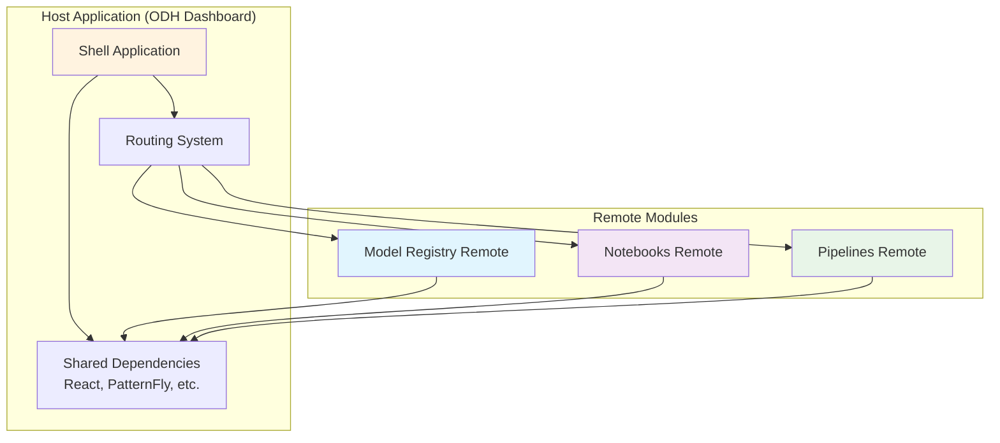
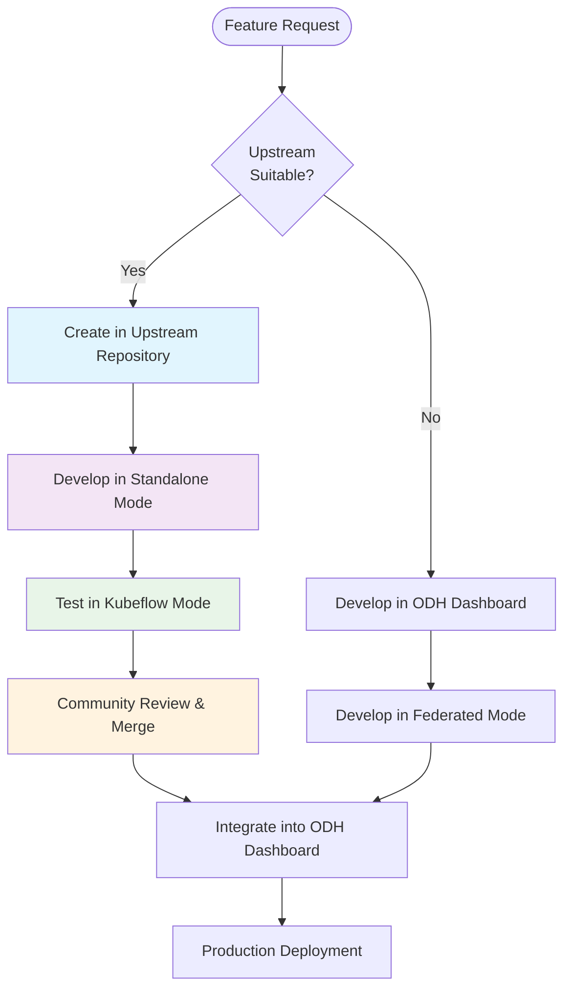
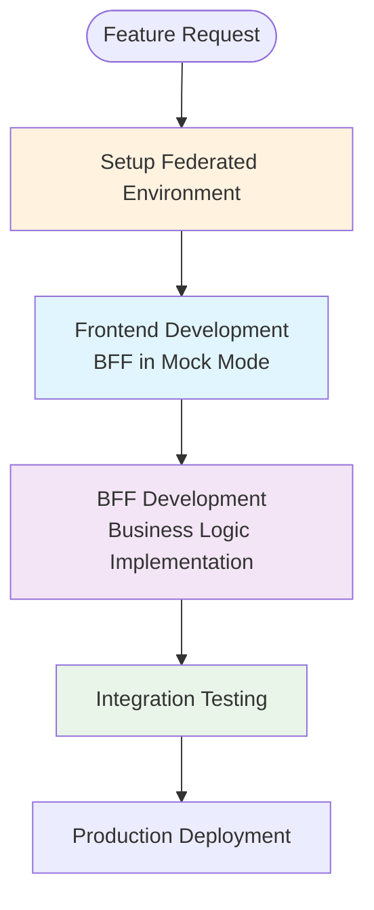

# Onboarding

Welcome to the modular architecture onboarding guide. This is the primary entry point for new team members to understand and start working with our modular architecture approach. This section provides comprehensive guidance for different deployment modes and development workflows.

## Quick Start for New Team Members

### Understanding the Architecture

Before diving into development, familiarize yourself with:

1. **[Overview](./overview.md)** - Understanding the shift from monolithic to modular architecture
2. **[Deployment Modes](./deployment-modes.md)** - Understanding Kubeflow, Federated, and Standalone modes
3. **[Architecture](./architecture.md)** - Deep dive into frontend, BFF, and OpenAPI patterns

### Choose Your Path

Based on your team's requirements, follow the appropriate onboarding path:

- **[Federated Mode Onboarding](#federated-mode-onboarding)** - For ODH/RHOAI development teams
- **[Kubeflow Mode Onboarding](#kubeflow-mode-onboarding)** - For Kubeflow platform development (Work in Progress)

---

## Federated Mode Onboarding

This comprehensive onboarding guide is designed for teams developing features for ODH/RHOAI deployments using OpenShift clusters with Module Federation architecture.

### Prerequisites

Before starting, ensure you have:

- Access to OpenShift cluster (for production testing)
- Node.js 18+ and npm installed
- Docker and container development experience
- Basic understanding of React and TypeScript
- Familiarity with Git workflows

### 1. Monorepo Structure

Our federated mode follows a **monorepo structure** where all features integrate with the main dashboard repository to reuse components and utilities while using the module federation approach.

```
odh-dashboard/
├── frontend/                    # Main dashboard shell
│   ├── src/
│   │   ├── app/                # Core shell application
│   │   ├── components/         # Shared components
│   │   └── utilities/          # Shared utilities
│   └── webpack.config.js       # Module federation host config
├── packages/                    # Feature modules
│   ├── model-registry/         # Model registry module
│   │   ├── src/
│   │   ├── webpack.config.js   # Remote module config
│   │   └── package.json
│   ├── notebooks/              # Notebooks module
│   └── pipelines/              # Pipelines module
└── shared/                     # Shared libraries and utilities
    ├── components/
    ├── hooks/
    └── types/
```

**Key Principles:**

- **Shared Foundation**: All features build upon shared components and utilities from the main dashboard
- **Independent Modules**: Each feature is developed as an independent package within the monorepo
- **Module Federation**: Runtime composition allows dynamic loading and shared dependencies
- **Consistent Architecture**: All modules follow the same architectural patterns and standards

### 2. Module Federation

Module Federation enables multiple separate builds to form a single application at runtime. This allows for true independent deployments while maintaining shared dependencies.

#### Understanding Module Federation Concepts



#### Module Federation Configuration

**Host Configuration (Main Dashboard):**
```javascript
// frontend/webpack.config.js
const ModuleFederationPlugin = require('@module-federation/webpack');

module.exports = {
  plugins: [
    new ModuleFederationPlugin({
      name: 'odhDashboard',
      remotes: {
        modelRegistry: 'modelRegistry@http://localhost:4001/remoteEntry.js',
        notebooks: 'notebooks@http://localhost:4002/remoteEntry.js',
        pipelines: 'pipelines@http://localhost:4003/remoteEntry.js',
      },
      shared: {
        react: { singleton: true, requiredVersion: '^18.0.0' },
        'react-dom': { singleton: true, requiredVersion: '^18.0.0' },
        '@patternfly/react-core': { singleton: true },
        '@patternfly/react-table': { singleton: true },
        'react-router-dom': { singleton: true },
      },
    }),
  ],
};
```

**Remote Configuration (Feature Module):**
```javascript
// packages/model-registry/webpack.config.js
const ModuleFederationPlugin = require('@module-federation/webpack');

module.exports = {
  plugins: [
    new ModuleFederationPlugin({
      name: 'modelRegistry',
      filename: 'remoteEntry.js',
      exposes: {
        './ModelRegistryApp': './src/app/ModelRegistryApp',
        './ModelRegistryRoutes': './src/routes/ModelRegistryRoutes',
      },
      shared: {
        react: { singleton: true, requiredVersion: '^18.0.0' },
        'react-dom': { singleton: true, requiredVersion: '^18.0.0' },
        '@patternfly/react-core': { singleton: true },
        '@patternfly/react-table': { singleton: true },
        'react-router-dom': { singleton: true },
      },
    }),
  ],
};
```

### 3. Development Flow

The development flow varies between upstream and downstream development approaches, each optimized for different contribution patterns.

#### Upstream Development

For features that will be contributed back to open-source communities:



**Upstream Development Steps:**

1. **Repository Setup**: Create feature in upstream repository (e.g., kubeflow/model-registry)
2. **Standalone Development**: Use standalone mode with kubeflow-ui-essentials library
3. **Community Testing**: Test with Kubeflow deployments before feature release
4. **Integration**: Once mature, integrate into ODH Dashboard via module federation

#### Downstream Development

For ODH/RHOAI specific features:



**Downstream Development Steps:**

1. **Environment Setup**: Run ODH Dashboard in "Federated mode" creating a serverless version
2. **Frontend Development**: Develop with BFF in mock mode for rapid iteration
3. **BFF Development**: Implement business logic with "federated" mode cluster interaction
4. **Integration**: Test complete integration within the federated environment

### 4. Deployment Flow

The deployment flow ensures smooth integration of new features into the main dashboard while maintaining system stability.

#### Image Onboarding to Konflux

```mermaid
flowchart LR
    Development[Feature Development] --> ImageBuild[Build Container Image]
    ImageBuild --> KonfluxOnboard[Onboard to Konflux]
    KonfluxOnboard --> Registry[Container Registry]
    Registry --> Manifest[Update Dashboard Manifest]
    Manifest --> Production[Production Deployment]
    
    style Development fill:#e1f5fe
    style ImageBuild fill:#f3e5f5
    style KonfluxOnboard fill:#e8f5e8
    style Registry fill:#fff3e0
    style Manifest fill:#fce4ec
```



**Deployment Steps:**

1. **Container Image**: Build and tag container images for your feature module
2. **Konflux Onboarding**: Submit image to Konflux build system for security scanning and validation
3. **Registry Publication**: Images are published to approved container registries
4. **Manifest Integration**: Update ODH Dashboard deployment manifests to include new module
5. **Production Rollout**: Deploy through standard ODH/RHOAI release process

#### Manifest Integration

```yaml
# Example deployment manifest update
apiVersion: apps/v1
kind: Deployment
metadata:
  name: odh-dashboard
spec:
  template:
    spec:
      containers:
      - name: dashboard
        image: odh-dashboard:latest
        env:
        - name: MODULE_FEDERATION_REMOTES
          value: |
            {
              "modelRegistry": "http://model-registry-service:8080/remoteEntry.js",
              "notebooks": "http://notebooks-service:8080/remoteEntry.js"
            }
---
# New service for your module
apiVersion: apps/v1
kind: Deployment
metadata:
  name: model-registry-service
spec:
  template:
    spec:
      containers:
      - name: model-registry
        image: model-registry:latest
        ports:
        - containerPort: 8080
```

### 5. Extensibility

Our modular architecture implements a powerful extensibility system that allows for modular functionality through plugins and extensions. For comprehensive details, see **[Extensibility](./extensibility.md)**.

#### Key Extension Concepts

- **Extension Points**: Specifications that define where and how the application can be extended
- **Extensions**: Concrete instances that implement extension point specifications
- **Code References**: Enable lazy loading of extension code for optimal performance
- **Type Safety**: Strong TypeScript typing for all extension interfaces

#### Example Extension Implementation

```typescript
// Define extension type
export type DashboardWidgetExtension = Extension<
  'app.dashboard/widget',
  {
    title: string;
    description: string;
    category: string;
    component: ComponentCodeRef;
  }
>;

// Create type guard
export const isDashboardWidget = (e: Extension): e is DashboardWidgetExtension => 
  e.type === 'app.dashboard/widget';

// Use in component
const DashboardPage: React.FC = () => {
  const widgetExtensions = useExtensions(isDashboardWidget);
  
  return (
    <div className="dashboard">
      {widgetExtensions.map((extension) => (
        <LazyCodeRefComponent
          key={extension.uid}
          component={extension.properties.component}
          fallback={<WidgetSkeleton />}
        />
      ))}
    </div>
  );
};
```

### 6. BFF Logic (Work in Progress)

The Backend-for-Frontend (BFF) pattern is central to our architecture, providing each frontend with its own tailored backend service.

#### BFF Responsibilities

- **API Aggregation**: Combine multiple backend services into frontend-optimized APIs
- **Authentication**: Handle authentication flows and token management
- **Data Transformation**: Convert backend data into frontend-friendly formats
- **Business Logic**: Implement domain-specific business rules
- **Caching**: Optimize performance through intelligent caching strategies

#### Development Patterns

```go
// Example BFF service structure
type ModelRegistryBFF struct {
    client     kubernetes.Interface
    mlmdClient mlmd.Client
    authHandler auth.Handler
}

func (b *ModelRegistryBFF) GetModels(ctx context.Context, namespace string) (*ModelsResponse, error) {
    // Authentication
    user, err := b.authHandler.GetUser(ctx)
    if err != nil {
        return nil, err
    }
    
    // Authorization
    if !b.authHandler.CanAccessNamespace(user, namespace) {
        return nil, errors.New("unauthorized")
    }
    
    // Business Logic
    models, err := b.mlmdClient.GetModels(ctx, namespace)
    if err != nil {
        return nil, err
    }
    
    // Data Transformation
    return b.transformModelsResponse(models), nil
}
```

### Getting Started Checklist

#### Initial Setup

- [ ] Clone ODH Dashboard repository
- [ ] Install Node.js 18+ and npm
- [ ] Set up development environment
- [ ] Configure OpenShift CLI (if needed)

#### Architecture Understanding

- [ ] Read [Overview](./overview.md) documentation
- [ ] Understand [Deployment Modes](./deployment-modes.md)
- [ ] Review [Architecture](./architecture.md) patterns
- [ ] Study [Module Federation](./module-federation.md) concepts

#### Development Environment

- [ ] Set up local development environment
- [ ] Configure Module Federation for your feature
- [ ] Implement basic BFF endpoints with mock data
- [ ] Create frontend components using shared libraries

#### Testing & Integration

- [ ] Test in federated mode locally
- [ ] Validate integration with shared components
- [ ] Implement extensibility patterns if needed
- [ ] Prepare deployment manifests

#### Production Readiness

- [ ] Complete Konflux onboarding process
- [ ] Update dashboard deployment manifests
- [ ] Coordinate production deployment
- [ ] Monitor and validate deployment

---

## Kubeflow Mode Onboarding (Work in Progress)

*This section is currently being developed and will include comprehensive guidance for teams working with Kubeflow platform integration.*

### Coming Soon

- Kubeflow-specific development workflows
- Integration with Kubeflow Central Dashboard
- ML workflow integration patterns
- Community contribution guidelines
- Kubeflow deployment strategies

For updates on Kubeflow mode onboarding, please check our [roadmap](./roadmap.md) or contact the platform team.

---

## Next Steps

After completing the onboarding process:

1. **Join the Community**: Participate in architecture discussions and contribute to improvements
2. **Follow Best Practices**: Refer to [Development Flow](./development-flow.md) for ongoing development
3. **Stay Updated**: Monitor [Architecture](./architecture.md) updates and new patterns
4. **Contribute Back**: Share learnings and improvements with the broader team

## Support and Resources

- **Documentation**: Complete technical references in [Architecture](./architecture.md)
- **Examples**: Real-world implementations in [Golden Path](./golden-path.md)
- **Community**: Join our Slack channels and team meetings
- **Training**: Regular workshops and training sessions
