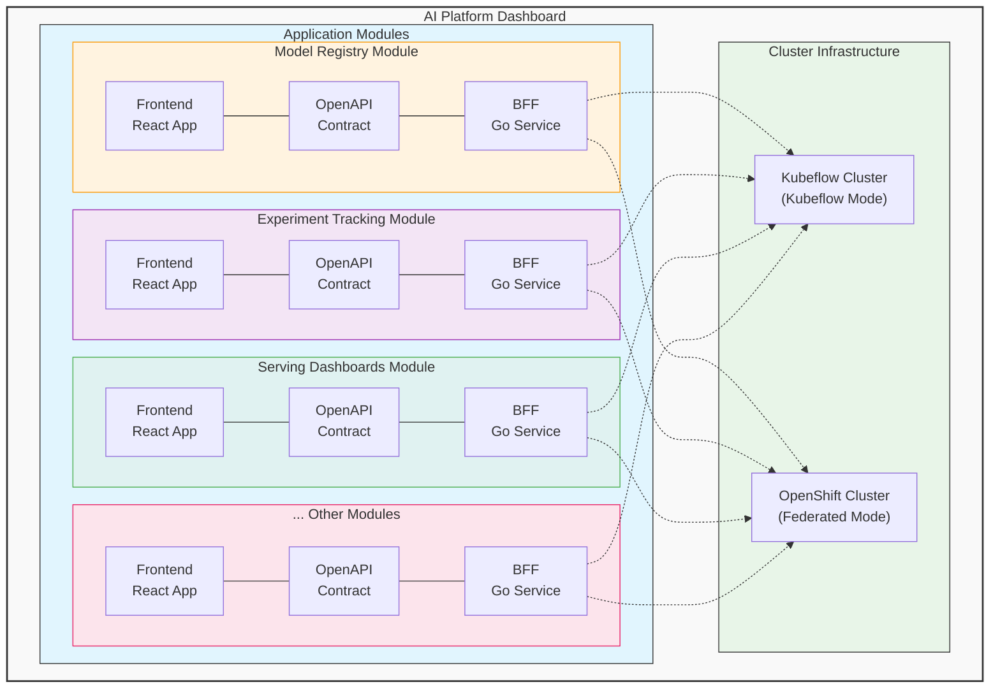

# Overview

## Introducing the Modular Architecture

The **Modular Architecture Initiative** represents a fundamental shift in how we build and maintain our AI platform's user interface. Moving from a monolithic frontend application to a modular, micro-frontend based approach, this initiative addresses key challenges in scalability, maintainability, and developer productivity while enabling upstream-first development practices.

## Current Monolithic Approach

### Challenges with the Monolithic Architecture

Our current monolithic approach presents several limitations that hinder development velocity and team autonomy:

- **Build Performance**: Build times exceed 10 minutes, significantly impacting developer productivity
- **Team Dependencies**: Changes in one area can block other teams' work through merge conflicts and integration issues
- **Testing Complexity**: Testing requires running the entire application stack, making feedback cycles longer
- **Deployment Coordination**: All features must be deployed together, creating coordination overhead
- **Technology Lock-in**: All teams must use the same technology stack and architectural patterns
- **Code Coupling**: Business logic is tightly coupled between different functional areas

### Impact on Development Teams

The monolithic approach creates several organizational challenges:

- **Reduced Autonomy**: Teams cannot move independently due to shared codebase dependencies
- **Slower Innovation**: Technology choices and architectural decisions require consensus across all teams
- **Bottlenecks**: Senior developers become bottlenecks for architectural decisions
- **Knowledge Silos**: Deep knowledge of the entire codebase is required for effective development

## Goals of the Modular Architecture

### Strategic Goals

- **Enable Independent Teams**: Apply the [Inverse Conway Maneuver](https://www.thoughtworks.com/en-us/insights/blog/customer-experience/inverse-conway-maneuver-product-development-teams) to create autonomous teams aligned with business domains
- **Accelerate Development**: Provide architectural patterns and common libraries to speed up feature development
- **Enhanced Component Reusability**: Enable the same components to be used across RHOAI, upstream projects, Jupyter extensions, and Gen AI v3 UI
- **Upstream Consumption**: Streamline ability to consume upstream projects as modules

### Platform Team Goals

- **Support Modular Architecture**: Provide infrastructure and tooling to enable modular development
- **Establish Onboarding Rules**: Clear guidelines for integrating new projects into the RHOAI Dashboard
- **Common Platform Features**: Standardized data passing between modules, notifications, and inter-module communication
- **Standard Architecture Recommendations**: Scaffolding and [Golden Paths](https://engineering.atspotify.com/2020/08/how-we-use-golden-paths-to-solve-fragmentation-in-our-software-ecosystem) for development
- **Team Efficiency**: Fast PR turnaround, optimized development environments, and autonomous team operations
- **Production Deployment**: Streamlined deployment into RHOAI with observability and telemetry
- **Developer Autonomy**: Enable teams to merge their own PRs through OWNERS files and automated guardrails

## Architecture Overview

### The Big Picture

Each module consists of:

- **Frontend**: React application with domain-specific user interface
- **BFF**: Go-based backend service providing business logic and cluster integration
- **OpenAPI Contract**: Strong specification defining the communication interface
- **Independent Deployment**: Own repository and deployment pipeline

### Architectural Patterns

Our modular architecture is built on three foundational patterns:

#### 1. Micro-Frontend Architecture

**Micro-frontends** are the building blocks of our new architecture. Each micro-frontend represents a distinct business domain or feature set.

- **Self-Contained**: Each micro-frontend is a complete web application with its own components, state management, and data-fetching logic
- **Domain-Focused**: Aligned with specific business capabilities (e.g., Model Registry, Experiment Tracking)
- **Technology Flexibility**: While we recommend standard technologies, teams can choose different approaches when justified
- **Independent Lifecycle**: Development, testing, and deployment happen independently

#### 2. Backend-for-Frontend (BFF) Pattern

Each micro-frontend is supported by its own **Backend-for-Frontend (BFF)** - a dedicated server-side component tailored to the specific needs of its corresponding frontend.

**Primary Functions:**
- **API Aggregation**: Combines data from multiple backend services into optimized frontend-specific APIs
- **Authentication Handling**: Manages authentication flows and token validation
- **Data Transformation**: Converts backend data formats into frontend-optimized structures
- **Business Logic**: Contains domain-specific logic that doesn't belong in the frontend
- **Caching and Performance**: Implements caching strategies to improve frontend performance

#### 3. OpenAPI Contract Pattern

Each micro-frontend communicates with its BFF through a **strong OpenAPI specification** that defines the contract between frontend and backend components.

- **OpenAPI Specification**: Complete API documentation defining endpoints, request/response schemas, and error handling
- **Type Generation**: Automatic generation of TypeScript types from OpenAPI specs for frontend consumption
- **Validation**: Request and response validation ensuring contract compliance
- **Versioning**: API versioning strategy to manage evolution while maintaining compatibility

## Expected Outcomes

### Short-term Benefits (3-6 months)

- Improved developer productivity through independent development workflows
- Reduced build times and simplified development setup
- Better testing isolation and faster feedback loops
- Initial upstream community engagement

### Medium-term Benefits (6-12 months)

- Successful migration of pilot features to modular architecture
- Established shared component ecosystem
- Streamlined deployment processes
- Enhanced feature reusability across projects

### Long-term Benefits (12+ months)

- Fully autonomous development teams with minimal coordination overhead
- Strong upstream community engagement and contribution patterns
- Mature component library ecosystem
- Optimized deployment and operations processes

## Success Metrics

### Developer Experience

- **Build Time**: Reduced from 10+ minutes to under 2 minutes for individual modules
- **Setup Time**: New developer onboarding reduced from days to hours
- **Release Frequency**: Increased from monthly to weekly/bi-weekly releases
- **Test Feedback**: Reduced from hours to minutes for test completion

### Team Autonomy

- **Cross-Team Dependencies**: Reduced by 80% through independent deployment
- **Merge Conflicts**: Eliminated through repository separation
- **Feature Development**: Parallel development without blocking dependencies

### Community Engagement

- **Upstream Contributions**: Measurable increase in external contributions
- **Community Adoption**: External projects using our shared components
- **Maintenance Sharing**: Reduced maintenance burden through community support
