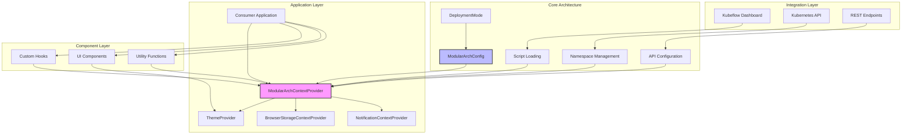
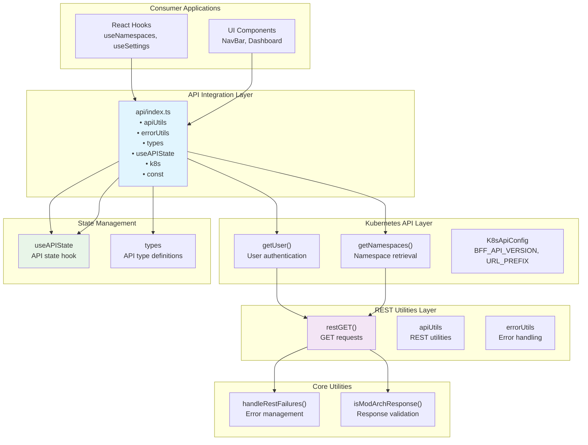
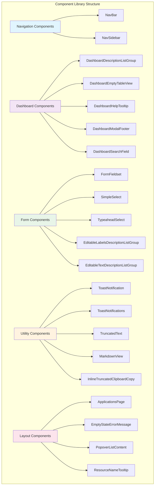

# Technical Reference

This comprehensive technical reference covers all technical aspects of the modular architecture implementation, including the shared library, API integration, component library, and advanced development patterns.

## Table of Contents

1. [Shared Library Guide](#shared-library-guide)
2. [API Integration](#api-integration)
3. [Component Library](#component-library)
4. [Advanced Patterns](#advanced-patterns)

---

## Shared Library Guide

The **mod-arch-shared** library (`opendatahub-io/kubeflow-ui-essentials`) is the cornerstone of our modular architecture initiative. This TypeScript-based shared component library provides the foundation for building consistent, reusable micro-frontend applications across the AI platform ecosystem.

### Overview

The `mod-arch-shared` library serves as a foundational layer that enables:

- **Unified Context Management**: Centralized state management through React Context API
- **Multi-Deployment Support**: Configurable deployment modes for different architectural patterns
- **Kubernetes Integration**: Built-in support for namespace management and K8s API interactions
- **Cross-Platform Theming**: Support for both PatternFly and Material-UI design systems
- **Reusable Components**: Common UI components optimized for micro-frontend architectures

### Architecture Overview

The library follows a modular micro-frontend architecture designed to support three distinct deployment modes while maintaining a consistent API surface.

#### Core Architectural Components



### Installation and Setup

#### Prerequisites

Install the library and required peer dependencies:

```bash
npm install mod-arch-shared @mui/material @mui/icons-material @mui/types sass sass-loader
```

#### Build System Configuration

The library contains SCSS files that must be processed by your build system. For webpack:

```javascript
{
  test: /\.s[ac]ss$/i,
  use: [
    'style-loader',    // Creates style nodes from JS strings
    'css-loader',      // Translates CSS into CommonJS
    'sass-loader',     // Compiles Sass to CSS
  ],
}
```

#### Provider Setup

Configure the required context providers at your application root:

```typescript
import React from 'react';
import { createRoot } from 'react-dom/client';
import { BrowserRouter as Router } from 'react-router-dom';
import { 
  ModularArchContextProvider, 
  ThemeProvider,
  BrowserStorageContextProvider,
  NotificationContextProvider,
  DeploymentMode,
  Theme,
  ModularArchConfig
} from 'mod-arch-shared';

const modularArchConfig: ModularArchConfig = {
  deploymentMode: DeploymentMode.Standalone,
  URL_PREFIX: '/api',
  BFF_API_VERSION: 'v1',
  // mandatoryNamespace: 'my-namespace', // Optional: force single namespace
};

const container = document.getElementById('root');
const root = createRoot(container!);

root.render(
  <React.StrictMode>
    <Router>
      <ModularArchContextProvider config={modularArchConfig}>
        <ThemeProvider theme={Theme.Patternfly}>
          <BrowserStorageContextProvider>
            <NotificationContextProvider>
              <App />
            </NotificationContextProvider>
          </BrowserStorageContextProvider>
        </ThemeProvider>
      </ModularArchContextProvider>
    </Router>
  </React.StrictMode>,
);
```

### Configuration System

#### Deployment Modes

The library supports three deployment modes, each with different integration patterns:

| Mode | Use Case | Description |
|------|----------|-------------|
| `DeploymentMode.Standalone` | Independent applications | Standard API integration without external dependencies |
| `DeploymentMode.Federated` | Module federation | Standard API integration with federation support |
| `DeploymentMode.Kubeflow` | Kubeflow integration | External script loading and dashboard integration |

#### Configuration Interface

```typescript
interface ModularArchConfig {
  deploymentMode: DeploymentMode;
  URL_PREFIX: string;           // Base URL for API endpoints
  BFF_API_VERSION: string;      // API version for backend communication
  mandatoryNamespace?: string;  // Optional: forces single namespace operation
}
```

### Context and State Management

The library implements a centralized state management system through the `ModularArchContext`:

#### Core Context State

```typescript
interface ModularArchContextType {
  config: ModularArchConfig;
  namespacesLoaded: boolean;
  namespacesLoadError: Error | undefined;
  namespaces: Namespace[];
  preferredNamespace: Namespace | undefined;
  updatePreferredNamespace: (namespace: Namespace) => void;
  initializationError: Error | undefined;
  scriptLoaded: boolean;
}
```

#### Using Context Hooks

```typescript
import { useModularArchContext, useNamespaceSelector } from 'mod-arch-shared';

const MyComponent: React.FC = () => {
  const { namespaces, preferredNamespace } = useModularArchContext();
  const { selectedNamespace, setSelectedNamespace } = useNamespaceSelector();
  
  return (
    <div>
      <p>Available namespaces: {namespaces.length}</p>
      <p>Selected: {selectedNamespace?.name}</p>
    </div>
  );
};
```

### Utilities and Helpers

#### Kubeflow Integration

For applications deployed in Kubeflow mode:

```typescript
import { kubeflowScriptLoader, kubeflowNamespaceLoader } from 'mod-arch-shared';

// Script loading for Kubeflow integration
kubeflowScriptLoader(
  DeploymentMode.Kubeflow,
  () => console.log('Script loaded successfully'),
  (error) => console.error('Script loading failed:', error)
);

// Namespace integration with Kubeflow dashboard
const initSuccess = kubeflowNamespaceLoader(
  DeploymentMode.Kubeflow,
  true, // scriptLoaded
  'mandatory-namespace', // optional
  (namespace) => console.log('Namespace selected:', namespace),
  (error) => console.error('Namespace integration failed:', error)
);
```

#### General Utilities

```typescript
import { asEnumMember, isEnumMember, genRandomChars } from 'mod-arch-shared';

// Safe enum handling
const mode = asEnumMember(DeploymentMode, userInput);
if (mode) {
  console.log('Valid deployment mode:', mode);
}

// Type-safe enum checking
if (isEnumMember(DeploymentMode, someValue)) {
  console.log('Valid enum member');
}

// Random string generation
const randomId = genRandomChars(8);
```

---

## API Integration

This section provides comprehensive information about integrating with APIs in modular architecture applications. It covers the shared library's API utilities, REST integration patterns, Kubernetes API integration, and best practices for building robust API interactions.

### API Architecture Overview

The mod-arch-shared library provides a layered API integration system that separates concerns between generic REST utilities and domain-specific Kubernetes integration.



### REST API Utilities

#### Core REST Function

The `restGET` function provides the foundation for all REST API interactions:

```typescript
import { restGET } from 'mod-arch-shared';

const restGET = async <T>(
  hostPath: string,
  requestPath: string,
  config: ModularArchConfig,
  options?: {
    parseJSON?: boolean;
    fileDownload?: boolean;
    notFoundIsError?: boolean;
  }
): Promise<T> => {
  // Implementation handles error management, response validation, and type safety
};
```

#### Usage Examples

```typescript
// Basic API call
const data = await restGET<ModelData[]>(
  '', 
  '/api/models', 
  config
);

// File download
const fileBlob = await restGET<Blob>(
  '',
  '/api/models/export',
  config,
  { fileDownload: true, parseJSON: false }
);

// Handle 404 as success
const optionalData = await restGET<ModelData | null>(
  '',
  '/api/models/optional',
  config,
  { notFoundIsError: false }
);
```

### Error Handling System

#### Error Utilities

```typescript
import { handleRestFailures, isModArchResponse } from 'mod-arch-shared';

// Handle different types of API failures
const handleApiError = (error: unknown) => {
  if (isModArchResponse(error)) {
    // Handle structured API errors
    console.error('API Error:', error.message);
    return error;
  }
  
  // Handle generic failures
  return handleRestFailures(error);
};
```

#### Response Validation

```typescript
import { ModArchResponse } from 'mod-arch-shared';

// Type-safe response checking
const validateResponse = (response: unknown): response is ModArchResponse => {
  return isModArchResponse(response);
};

// Usage in async operations
try {
  const result = await apiCall();
  // Process successful result
} catch (error) {
  if (validateResponse(error)) {
    // Handle structured error response
    showErrorMessage(error.message);
  } else {
    // Handle unknown error
    showErrorMessage('An unexpected error occurred');
  }
}
```

### Kubernetes API Integration

#### User Authentication

```typescript
import { getUser } from 'mod-arch-shared';

const UserProfile: React.FC = () => {
  const [user, setUser] = useState<User | null>(null);
  const { config } = useModularArchContext();
  
  useEffect(() => {
    const fetchUser = async () => {
      try {
        const userData = await getUser('', config);
        setUser(userData);
      } catch (error) {
        console.error('Failed to fetch user:', error);
      }
    };
    
    fetchUser();
  }, [config]);
  
  return user ? <div>Welcome, {user.name}</div> : <div>Loading...</div>;
};
```

#### Namespace Management

```typescript
import { getNamespaces } from 'mod-arch-shared';

const NamespaceSelector: React.FC = () => {
  const [namespaces, setNamespaces] = useState<Namespace[]>([]);
  const { config } = useModularArchContext();
  
  useEffect(() => {
    const fetchNamespaces = async () => {
      try {
        const namespaceList = await getNamespaces('', config);
        setNamespaces(namespaceList);
      } catch (error) {
        console.error('Failed to fetch namespaces:', error);
      }
    };
    
    fetchNamespaces();
  }, [config]);
  
  return (
    <select>
      {namespaces.map(ns => (
        <option key={ns.name} value={ns.name}>
          {ns.displayName || ns.name}
        </option>
      ))}
    </select>
  );
};
```

### API State Management

#### useAPIState Hook

The `useAPIState` hook provides a standardized way to manage API call state:

```typescript
import { useAPIState, APIState } from 'mod-arch-shared';

const DataComponent: React.FC = () => {
  const [apiState, setAPIState] = useAPIState<ModelData[]>();
  
  const loadData = async () => {
    setAPIState({ loading: true });
    
    try {
      const data = await restGET<ModelData[]>('', '/api/models', config);
      setAPIState({ data, loading: false });
    } catch (error) {
      setAPIState({ 
        error: handleRestFailures(error), 
        loading: false 
      });
    }
  };
  
  useEffect(() => {
    loadData();
  }, []);
  
  if (apiState.loading) {
    return <LoadingSpinner />;
  }
  
  if (apiState.error) {
    return <ErrorMessage error={apiState.error} />;
  }
  
  return (
    <div>
      {apiState.data?.map(item => (
        <div key={item.id}>{item.name}</div>
      ))}
    </div>
  );
};
```

#### Custom API Hooks

```typescript
import { useCallback } from 'react';
import { useAPIState, restGET } from 'mod-arch-shared';

const useModels = () => {
  const [apiState, setAPIState] = useAPIState<ModelData[]>();
  const { config } = useModularArchContext();
  
  const fetchModels = useCallback(async () => {
    setAPIState({ loading: true });
    
    try {
      const models = await restGET<ModelData[]>('', '/api/models', config);
      setAPIState({ data: models, loading: false });
    } catch (error) {
      setAPIState({ 
        error: handleRestFailures(error), 
        loading: false 
      });
    }
  }, [config]);
  
  const refreshModels = useCallback(() => {
    fetchModels();
  }, [fetchModels]);
  
  return {
    models: apiState.data,
    loading: apiState.loading,
    error: apiState.error,
    refresh: refreshModels,
  };
};

// Usage
const ModelsPage: React.FC = () => {
  const { models, loading, error, refresh } = useModels();
  
  if (loading) return <div>Loading models...</div>;
  if (error) return <div>Error: {error.message}</div>;
  
  return (
    <div>
      <button onClick={refresh}>Refresh</button>
      {models?.map(model => (
        <div key={model.id}>{model.name}</div>
      ))}
    </div>
  );
};
```

### Advanced API Patterns

#### Request Interception

```typescript
import { restGET } from 'mod-arch-shared';

// Custom wrapper for authenticated requests
const authenticatedRequest = async <T>(
  path: string,
  config: ModularArchConfig,
  options?: any
): Promise<T> => {
  // Add authentication headers or tokens
  const enhancedConfig = {
    ...config,
    headers: {
      'Authorization': `Bearer ${getAuthToken()}`,
      'X-User-ID': getUserId(),
    }
  };
  
  return restGET<T>('', path, enhancedConfig, options);
};
```

#### Response Caching

```typescript
import { useState, useEffect } from 'react';

const useCache = <T>(key: string, fetcher: () => Promise<T>, ttl: number = 300000) => {
  const [data, setData] = useState<T | null>(null);
  const [loading, setLoading] = useState(false);
  
  useEffect(() => {
    const cached = localStorage.getItem(key);
    const cacheTime = localStorage.getItem(`${key}_time`);
    
    if (cached && cacheTime) {
      const age = Date.now() - parseInt(cacheTime);
      if (age < ttl) {
        setData(JSON.parse(cached));
        return;
      }
    }
    
    setLoading(true);
    fetcher()
      .then(result => {
        setData(result);
        localStorage.setItem(key, JSON.stringify(result));
        localStorage.setItem(`${key}_time`, Date.now().toString());
      })
      .finally(() => setLoading(false));
  }, [key, fetcher, ttl]);
  
  return { data, loading };
};
```

### Type Definitions

#### Core API Types

```typescript
// Response wrapper type
interface ModArchResponse {
  success: boolean;
  error?: string;
  message?: string;
  data?: any;
}

// API State interface
interface APIState<T = any> {
  data?: T;
  loading: boolean;
  error?: Error;
}

// Configuration types
interface K8sApiConfig {
  URL_PREFIX: string;
  BFF_API_VERSION: string;
}

// Kubernetes resource types
interface Namespace {
  name: string;
  displayName?: string;
  description?: string;
}

interface User {
  name: string;
  email?: string;
  groups?: string[];
}
```

---

## Component Library

This comprehensive guide covers all UI components available in the mod-arch-shared library. The component library provides reusable, theme-aware components optimized for micro-frontend architectures, with built-in support for PatternFly and Material-UI design systems.

### Component Categories

The component library is organized into several categories:



### Navigation Components

#### NavBar Component

The primary application masthead with integrated namespace selection and user management.

```typescript
import { NavBar } from 'mod-arch-shared';

const App: React.FC = () => {
  return (
    <div>
      <NavBar />
      <main>{/* Your application content */}</main>
    </div>
  );
};
```

**Features:**

- Automatic namespace selector integration
- User menu with profile and logout options
- Theme-aware styling (PatternFly/Material-UI)
- Mobile-responsive design
- Integration with modular architecture context

#### NavSidebar Component

Secondary navigation sidebar for application-specific navigation.

```typescript
import { NavSidebar } from 'mod-arch-shared';

const navigationItems = [
  { label: 'Dashboard', path: '/dashboard', icon: 'dashboard' },
  { label: 'Models', path: '/models', icon: 'model' },
  { label: 'Settings', path: '/settings', icon: 'settings' },
];

const AppWithSidebar: React.FC = () => {
  return (
    <div className="app-layout">
      <NavBar />
      <div className="app-body">
        <NavSidebar items={navigationItems} />
        <main>{/* Content */}</main>
      </div>
    </div>
  );
};
```

### Dashboard Components

#### DashboardDescriptionListGroup

Displays structured data in a consistent description list format.

```typescript
import { DashboardDescriptionListGroup } from 'mod-arch-shared';

const ModelDetails: React.FC<{ model: Model }> = ({ model }) => {
  return (
    <DashboardDescriptionListGroup
      groupLabel="Model Information"
      items={[
        { term: 'Name', description: model.name },
        { term: 'Version', description: model.version },
        { term: 'Created', description: model.createdAt },
        { term: 'Status', description: model.status },
      ]}
    />
  );
};
```

#### DashboardEmptyTableView

Standardized empty state for data tables.

```typescript
import { DashboardEmptyTableView } from 'mod-arch-shared';

const ModelsTable: React.FC = () => {
  const { models, loading } = useModels();
  
  if (loading) return <div>Loading...</div>;
  
  if (!models || models.length === 0) {
    return (
      <DashboardEmptyTableView
        title="No models found"
        description="Create your first model to get started"
        primaryAction={{
          label: 'Create Model',
          onClick: () => navigate('/models/create'),
        }}
        secondaryAction={{
          label: 'Import Model',
          onClick: () => navigate('/models/import'),
        }}
      />
    );
  }
  
  return <ModelsTableView models={models} />;
};
```

#### DashboardHelpTooltip

Contextual help tooltips for UI elements.

```typescript
import { DashboardHelpTooltip } from 'mod-arch-shared';

const ComplexFormField: React.FC = () => {
  return (
    <div className="form-field">
      <label>
        Advanced Configuration
        <DashboardHelpTooltip
          content="This setting controls how the model handles batch processing. Higher values improve throughput but require more memory."
          position="right"
        />
      </label>
      <input type="number" />
    </div>
  );
};
```

### Form Components

#### FormFieldset

Groups related form fields with consistent styling.

```typescript
import { FormFieldset } from 'mod-arch-shared';

const ModelForm: React.FC = () => {
  return (
    <form>
      <FormFieldset
        legend="Basic Information"
        description="Provide basic details about your model"
      >
        <input placeholder="Model name" />
        <textarea placeholder="Description" />
      </FormFieldset>
      
      <FormFieldset
        legend="Configuration"
        description="Configure model runtime settings"
      >
        <input type="number" placeholder="Memory limit" />
        <input type="number" placeholder="CPU limit" />
      </FormFieldset>
    </form>
  );
};
```

#### SimpleSelect

Basic dropdown selection component.

```typescript
import { SimpleSelect } from 'mod-arch-shared';

const ModelTypeSelector: React.FC = () => {
  const [selectedType, setSelectedType] = useState('');
  
  const modelTypes = [
    { value: 'tensorflow', label: 'TensorFlow' },
    { value: 'pytorch', label: 'PyTorch' },
    { value: 'scikit-learn', label: 'Scikit-Learn' },
  ];
  
  return (
    <SimpleSelect
      label="Model Type"
      value={selectedType}
      onChange={setSelectedType}
      options={modelTypes}
      placeholder="Select a model type"
    />
  );
};
```

#### TypeaheadSelect

Searchable dropdown with autocomplete functionality.

```typescript
import { TypeaheadSelect } from 'mod-arch-shared';

const NamespaceSelector: React.FC = () => {
  const { namespaces } = useModularArchContext();
  const [selectedNamespace, setSelectedNamespace] = useState('');
  
  const namespaceOptions = namespaces.map(ns => ({
    value: ns.name,
    label: ns.displayName || ns.name,
  }));
  
  return (
    <TypeaheadSelect
      label="Target Namespace"
      value={selectedNamespace}
      onChange={setSelectedNamespace}
      options={namespaceOptions}
      placeholder="Search and select namespace..."
      filterBy="label"
    />
  );
};
```

### Utility Components

#### ToastNotifications

Centralized notification management system.

```typescript
import { ToastNotifications, useNotifications } from 'mod-arch-shared';

const App: React.FC = () => {
  return (
    <div>
      {/* Application content */}
      <ToastNotifications />
    </div>
  );
};

// Using notifications in components
const ModelCreator: React.FC = () => {
  const { addSuccess, addError } = useNotifications();
  
  const createModel = async () => {
    try {
      await createModelAPI();
      addSuccess('Model created successfully');
    } catch (error) {
      addError('Failed to create model', error.message);
    }
  };
  
  return <button onClick={createModel}>Create Model</button>;
};
```

#### TruncatedText

Handles text overflow with ellipsis and optional tooltips.

```typescript
import { TruncatedText } from 'mod-arch-shared';

const ModelCard: React.FC<{ model: Model }> = ({ model }) => {
  return (
    <div className="model-card">
      <h3>
        <TruncatedText 
          content={model.name} 
          maxLength={20}
          tooltip={true}
        />
      </h3>
      <p>
        <TruncatedText 
          content={model.description} 
          maxLength={100}
          tooltip={true}
        />
      </p>
    </div>
  );
};
```

#### MarkdownView

Renders markdown content with security and styling.

```typescript
import { MarkdownView } from 'mod-arch-shared';

const DocumentationPage: React.FC = () => {
  const [content, setContent] = useState('');
  
  useEffect(() => {
    fetch('/api/documentation/readme.md')
      .then(response => response.text())
      .then(setContent);
  }, []);
  
  return (
    <div className="documentation">
      <MarkdownView
        content={content}
        className="documentation-content"
      />
    </div>
  );
};
```

### Layout Components

#### ApplicationsPage

Standard page layout wrapper for consistent application structure.

```typescript
import { ApplicationsPage } from 'mod-arch-shared';

const ModelsPage: React.FC = () => {
  return (
    <ApplicationsPage
      title="Models"
      description="Manage your machine learning models"
      breadcrumbs={[
        { label: 'Home', path: '/' },
        { label: 'Models', path: '/models' },
      ]}
      headerActions={
        <button onClick={() => navigate('/models/create')}>
          Create Model
        </button>
      }
    >
      <ModelsTable />
    </ApplicationsPage>
  );
};
```

#### EmptyStateErrorMessage

Standardized error state display.

```typescript
import { EmptyStateErrorMessage } from 'mod-arch-shared';

const ModelsPage: React.FC = () => {
  const { models, loading, error } = useModels();
  
  if (loading) return <div>Loading...</div>;
  
  if (error) {
    return (
      <EmptyStateErrorMessage
        title="Failed to load models"
        description={error.message}
        action={{
          label: 'Try Again',
          onClick: () => window.location.reload(),
        }}
      />
    );
  }
  
  return <ModelsTable models={models} />;
};
```

### Component Composition Patterns

#### Provider Integration

All components automatically integrate with the modular architecture context:

```typescript
import { 
  ModularArchContextProvider,
  ThemeProvider,
  NavBar,
  ToastNotifications 
} from 'mod-arch-shared';

const App: React.FC = () => {
  return (
    <ModularArchContextProvider config={config}>
      <ThemeProvider theme={Theme.Patternfly}>
        <NavBar />
        <Routes>
          {/* Application routes */}
        </Routes>
        <ToastNotifications />
      </ThemeProvider>
    </ModularArchContextProvider>
  );
};
```

#### Theme Customization

Components respect theme configuration and can be customized:

```typescript
import { ThemeProvider, Theme, NavBar } from 'mod-arch-shared';

const CustomThemedApp: React.FC = () => {
  return (
    <ThemeProvider 
      theme={Theme.Patternfly}
      customizations={{
        primaryColor: '#0066cc',
        fontFamily: 'Inter, sans-serif',
      }}
    >
      <NavBar />
      {/* Other components inherit theme */}
    </ThemeProvider>
  );
};
```

---

## Advanced Patterns

This guide covers sophisticated development patterns and best practices for building robust modular applications. It includes advanced architectural patterns, state management strategies, performance optimization techniques, and integration patterns that enable scalable micro-frontend development.

### Advanced Architectural Patterns

#### Micro-Frontend Communication Patterns

##### Event-Driven Communication

Implement loosely coupled communication between micro-frontends using custom events:

```typescript
// Event system for micro-frontend communication
class MicroFrontendEventBus {
  private eventTarget = new EventTarget();
  
  // Emit events
  emit<T = any>(eventType: string, data: T) {
    const event = new CustomEvent(eventType, { detail: data });
    this.eventTarget.dispatchEvent(event);
  }
  
  // Subscribe to events
  on<T = any>(eventType: string, handler: (data: T) => void) {
    const listener = (event: Event) => {
      const customEvent = event as CustomEvent<T>;
      handler(customEvent.detail);
    };
    
    this.eventTarget.addEventListener(eventType, listener);
    
    // Return unsubscribe function
    return () => this.eventTarget.removeEventListener(eventType, listener);
  }
  
  // One-time event subscription
  once<T = any>(eventType: string, handler: (data: T) => void) {
    const unsubscribe = this.on(eventType, (data: T) => {
      handler(data);
      unsubscribe();
    });
    return unsubscribe;
  }
}

// Global event bus instance
export const eventBus = new MicroFrontendEventBus();

// Usage in components
const ModelCreator: React.FC = () => {
  const createModel = async () => {
    const model = await createModelAPI();
    // Notify other micro-frontends about the new model
    eventBus.emit('model:created', model);
  };
  
  return <button onClick={createModel}>Create Model</button>;
};

const ModelList: React.FC = () => {
  const [models, setModels] = useState<Model[]>([]);
  
  useEffect(() => {
    // Listen for model creation events
    const unsubscribe = eventBus.on('model:created', (newModel: Model) => {
      setModels(prev => [...prev, newModel]);
    });
    
    return unsubscribe;
  }, []);
  
  return <div>{/* Render models */}</div>;
};
```

##### Shared State Management

Implement cross-module state sharing using advanced context patterns:

```typescript
// Shared state management for cross-module communication
interface SharedState {
  selectedModel: Model | null;
  selectedNamespace: string;
  user: User | null;
}

interface SharedStateContextType {
  state: SharedState;
  dispatch: React.Dispatch<SharedStateAction>;
}

type SharedStateAction = 
  | { type: 'SET_SELECTED_MODEL'; payload: Model | null }
  | { type: 'SET_SELECTED_NAMESPACE'; payload: string }
  | { type: 'SET_USER'; payload: User | null };

const sharedStateReducer = (state: SharedState, action: SharedStateAction): SharedState => {
  switch (action.type) {
    case 'SET_SELECTED_MODEL':
      return { ...state, selectedModel: action.payload };
    case 'SET_SELECTED_NAMESPACE':
      return { ...state, selectedNamespace: action.payload };
    case 'SET_USER':
      return { ...state, user: action.payload };
    default:
      return state;
  }
};

export const SharedStateProvider: React.FC<{ children: React.ReactNode }> = ({ children }) => {
  const [state, dispatch] = useReducer(sharedStateReducer, {
    selectedModel: null,
    selectedNamespace: '',
    user: null,
  });
  
  return (
    <SharedStateContext.Provider value={{ state, dispatch }}>
      {children}
    </SharedStateContext.Provider>
  );
};

// Custom hooks for shared state
export const useSharedState = () => {
  const context = useContext(SharedStateContext);
  if (!context) {
    throw new Error('useSharedState must be used within SharedStateProvider');
  }
  return context;
};

export const useSelectedModel = () => {
  const { state, dispatch } = useSharedState();
  
  const setSelectedModel = useCallback((model: Model | null) => {
    dispatch({ type: 'SET_SELECTED_MODEL', payload: model });
  }, [dispatch]);
  
  return [state.selectedModel, setSelectedModel] as const;
};
```

### Performance Optimization Patterns

#### Bundle Optimization

Advanced webpack configuration for optimal bundle splitting:

```javascript
// webpack.config.js for micro-frontend optimization
const ModuleFederationPlugin = require('@module-federation/webpack');

module.exports = {
  entry: './src/index.ts',
  mode: 'production',
  optimization: {
    splitChunks: {
      chunks: 'all',
      cacheGroups: {
        // Separate vendor chunks
        vendor: {
          test: /[\\/]node_modules[\\/]/,
          name: 'vendors',
          chunks: 'all',
          priority: 10,
        },
        // Shared library chunk
        modarchShared: {
          test: /[\\/]node_modules[\\/]mod-arch-shared[\\/]/,
          name: 'mod-arch-shared',
          chunks: 'all',
          priority: 20,
        },
        // Common utilities
        common: {
          name: 'common',
          minChunks: 2,
          chunks: 'all',
          priority: 5,
        },
      },
    },
  },
  plugins: [
    new ModuleFederationPlugin({
      name: 'modelRegistry',
      filename: 'remoteEntry.js',
      exposes: {
        './ModelRegistry': './src/components/ModelRegistry',
        './ModelCreator': './src/components/ModelCreator',
      },
      shared: {
        react: { singleton: true, eager: true },
        'react-dom': { singleton: true, eager: true },
        'mod-arch-shared': { singleton: true, eager: true },
      },
    }),
  ],
};
```

#### Lazy Loading and Code Splitting

Implement strategic lazy loading for optimal performance:

```typescript
// Lazy loading with error boundaries
import { lazy, Suspense } from 'react';
import { ErrorBoundary } from 'mod-arch-shared';

// Lazy load heavy components
const ModelVisualization = lazy(() => 
  import('./components/ModelVisualization').catch(error => {
    console.error('Failed to load ModelVisualization:', error);
    return { default: () => <div>Failed to load visualization</div> };
  })
);

const ModelDetails = lazy(() => import('./components/ModelDetails'));

const ModelPage: React.FC = () => {
  const [activeTab, setActiveTab] = useState('overview');
  
  return (
    <div>
      <nav>
        <button onClick={() => setActiveTab('overview')}>Overview</button>
        <button onClick={() => setActiveTab('visualization')}>Visualization</button>
      </nav>
      
      <ErrorBoundary fallback={<div>Something went wrong</div>}>
        <Suspense fallback={<div>Loading...</div>}>
          {activeTab === 'overview' && <ModelDetails />}
          {activeTab === 'visualization' && <ModelVisualization />}
        </Suspense>
      </ErrorBoundary>
    </div>
  );
};
```

#### Resource Management

Advanced caching and resource management patterns:

```typescript
// Advanced caching with TTL and invalidation
class ResourceCache {
  private cache = new Map<string, { data: any; timestamp: number; ttl: number }>();
  private subscribers = new Map<string, Set<() => void>>();
  
  set<T>(key: string, data: T, ttl: number = 300000) {
    this.cache.set(key, { data, timestamp: Date.now(), ttl });
    this.notifySubscribers(key);
  }
  
  get<T>(key: string): T | null {
    const entry = this.cache.get(key);
    if (!entry) return null;
    
    if (Date.now() - entry.timestamp > entry.ttl) {
      this.cache.delete(key);
      return null;
    }
    
    return entry.data;
  }
  
  invalidate(pattern: string) {
    const regex = new RegExp(pattern);
    for (const key of this.cache.keys()) {
      if (regex.test(key)) {
        this.cache.delete(key);
        this.notifySubscribers(key);
      }
    }
  }
  
  subscribe(key: string, callback: () => void) {
    if (!this.subscribers.has(key)) {
      this.subscribers.set(key, new Set());
    }
    this.subscribers.get(key)!.add(callback);
    
    return () => {
      this.subscribers.get(key)?.delete(callback);
    };
  }
  
  private notifySubscribers(key: string) {
    this.subscribers.get(key)?.forEach(callback => callback());
  }
}

export const resourceCache = new ResourceCache();

// Hook for cached resources
export const useCachedResource = <T>(
  key: string,
  fetcher: () => Promise<T>,
  ttl?: number
) => {
  const [data, setData] = useState<T | null>(resourceCache.get(key));
  const [loading, setLoading] = useState(false);
  const [error, setError] = useState<Error | null>(null);
  
  const fetchData = useCallback(async () => {
    const cached = resourceCache.get<T>(key);
    if (cached) {
      setData(cached);
      return;
    }
    
    setLoading(true);
    try {
      const result = await fetcher();
      resourceCache.set(key, result, ttl);
      setData(result);
      setError(null);
    } catch (err) {
      setError(err as Error);
    } finally {
      setLoading(false);
    }
  }, [key, fetcher, ttl]);
  
  useEffect(() => {
    fetchData();
    
    // Subscribe to cache changes
    const unsubscribe = resourceCache.subscribe(key, () => {
      const updated = resourceCache.get<T>(key);
      setData(updated);
    });
    
    return unsubscribe;
  }, [key, fetchData]);
  
  return { data, loading, error, refetch: fetchData };
};
```

### Error Handling and Resilience

#### Advanced Error Boundaries

Implement sophisticated error handling with recovery mechanisms:

```typescript
interface ErrorBoundaryState {
  hasError: boolean;
  error: Error | null;
  errorInfo: ErrorInfo | null;
  retryCount: number;
}

class AdvancedErrorBoundary extends Component<
  { children: ReactNode; fallback?: ComponentType<any>; maxRetries?: number },
  ErrorBoundaryState
> {
  private maxRetries: number;
  
  constructor(props: any) {
    super(props);
    this.state = {
      hasError: false,
      error: null,
      errorInfo: null,
      retryCount: 0,
    };
    this.maxRetries = props.maxRetries || 3;
  }
  
  static getDerivedStateFromError(error: Error): Partial<ErrorBoundaryState> {
    return { hasError: true, error };
  }
  
  componentDidCatch(error: Error, errorInfo: ErrorInfo) {
    this.setState({ errorInfo });
    
    // Report error to monitoring service
    this.reportError(error, errorInfo);
  }
  
  private reportError = (error: Error, errorInfo: ErrorInfo) => {
    // Send to error tracking service
    console.error('Error caught by boundary:', error, errorInfo);
  };
  
  private handleRetry = () => {
    if (this.state.retryCount < this.maxRetries) {
      this.setState({
        hasError: false,
        error: null,
        errorInfo: null,
        retryCount: this.state.retryCount + 1,
      });
    }
  };
  
  render() {
    if (this.state.hasError) {
      const canRetry = this.state.retryCount < this.maxRetries;
      
      return (
        <div className="error-boundary">
          <h2>Something went wrong</h2>
          <p>{this.state.error?.message}</p>
          {canRetry && (
            <button onClick={this.handleRetry}>
              Try Again ({this.state.retryCount}/{this.maxRetries})
            </button>
          )}
          {!canRetry && (
            <p>Max retries exceeded. Please refresh the page.</p>
          )}
        </div>
      );
    }
    
    return this.props.children;
  }
}
```

#### Graceful Degradation

Implement fallback mechanisms for failed module loads:

```typescript
// Graceful module federation loading
const loadRemoteModule = async (
  remoteName: string,
  moduleName: string,
  fallback?: ComponentType
): Promise<ComponentType> => {
  try {
    // Attempt to load the remote module
    const container = await import(/* webpackIgnore: true */ remoteName);
    await container.init(__webpack_share_scopes__.default);
    const module = await container.get(moduleName);
    return module().default;
  } catch (error) {
    console.warn(`Failed to load remote module ${remoteName}/${moduleName}:`, error);
    
    // Return fallback component
    return fallback || (() => (
      <div className="module-fallback">
        <p>Module temporarily unavailable</p>
        <button onClick={() => window.location.reload()}>
          Refresh Page
        </button>
      </div>
    ));
  }
};

// Usage with suspense
const RemoteComponent = lazy(() => 
  loadRemoteModule('modelRegistry', './ModelViewer', ModelViewerFallback)
);
```

### Testing Patterns

#### Advanced Testing Utilities

Create comprehensive testing utilities for modular applications:

```typescript
// Testing utilities for modular architecture
export const createTestProviders = (overrides: Partial<TestProviderConfig> = {}) => {
  const defaultConfig = {
    modularArchConfig: {
      deploymentMode: DeploymentMode.Standalone,
      URL_PREFIX: '/test-api',
      BFF_API_VERSION: 'v1',
    },
    theme: Theme.Patternfly,
    initialNotifications: [],
    mockUser: { name: 'Test User', email: 'test@example.com' },
    ...overrides,
  };
  
  return ({ children }: { children: ReactNode }) => (
    <MemoryRouter>
      <ModularArchContextProvider config={defaultConfig.modularArchConfig}>
        <ThemeProvider theme={defaultConfig.theme}>
          <BrowserStorageContextProvider>
            <NotificationContextProvider>
              {children}
            </NotificationContextProvider>
          </BrowserStorageContextProvider>
        </ThemeProvider>
      </ModularArchContextProvider>
    </MemoryRouter>
  );
};

// Mock API responses
export const createMockAPI = () => {
  const handlers = [
    rest.get('/test-api/namespaces', (req, res, ctx) => {
      return res(ctx.json([
        { name: 'default', displayName: 'Default' },
        { name: 'test', displayName: 'Test Environment' },
      ]));
    }),
    
    rest.get('/test-api/user', (req, res, ctx) => {
      return res(ctx.json({
        name: 'Test User',
        email: 'test@example.com',
      }));
    }),
  ];
  
  return setupServer(...handlers);
};

// Integration test example
describe('ModularComponent Integration', () => {
  const server = createMockAPI();
  
  beforeAll(() => server.listen());
  afterEach(() => server.resetHandlers());
  afterAll(() => server.close());
  
  it('should integrate with modular architecture providers', async () => {
    const TestProviders = createTestProviders();
    
    render(
      <TestProviders>
        <ModularComponent />
      </TestProviders>
    );
    
    // Test provider integration
    expect(screen.getByText('Test User')).toBeInTheDocument();
    
    // Test API integration
    await waitFor(() => {
      expect(screen.getByText('Default')).toBeInTheDocument();
    });
  });
});
```

### Security Patterns

#### Secure Communication

Implement secure patterns for cross-module communication:

```typescript
// Secure message passing between modules
class SecureMessageBus {
  private allowedOrigins: Set<string>;
  private messageHandlers = new Map<string, (data: any) => void>();
  
  constructor(allowedOrigins: string[]) {
    this.allowedOrigins = new Set(allowedOrigins);
    window.addEventListener('message', this.handleMessage.bind(this));
  }
  
  private handleMessage = (event: MessageEvent) => {
    // Validate origin
    if (!this.allowedOrigins.has(event.origin)) {
      console.warn('Message from unauthorized origin:', event.origin);
      return;
    }
    
    // Validate message structure
    if (!event.data || typeof event.data.type !== 'string') {
      console.warn('Invalid message format:', event.data);
      return;
    }
    
    const handler = this.messageHandlers.get(event.data.type);
    if (handler) {
      handler(event.data.payload);
    }
  };
  
  subscribe(messageType: string, handler: (data: any) => void) {
    this.messageHandlers.set(messageType, handler);
    
    return () => {
      this.messageHandlers.delete(messageType);
    };
  }
  
  send(target: Window, messageType: string, payload: any) {
    const message = { type: messageType, payload };
    target.postMessage(message, '*'); // Should specify target origin in production
  }
}
```

### Monitoring and Observability

#### Performance Monitoring

Implement comprehensive performance monitoring:

```typescript
// Performance monitoring for micro-frontends
class PerformanceMonitor {
  private metrics = new Map<string, number[]>();
  
  startTiming(label: string): () => void {
    const startTime = performance.now();
    
    return () => {
      const duration = performance.now() - startTime;
      this.recordMetric(label, duration);
    };
  }
  
  recordMetric(label: string, value: number) {
    if (!this.metrics.has(label)) {
      this.metrics.set(label, []);
    }
    this.metrics.get(label)!.push(value);
    
    // Send to monitoring service
    this.sendMetric(label, value);
  }
  
  private sendMetric(label: string, value: number) {
    // Send to monitoring service (e.g., DataDog, New Relic)
    console.log(`Metric: ${label} = ${value}ms`);
  }
  
  getAverageTime(label: string): number {
    const times = this.metrics.get(label) || [];
    return times.reduce((sum, time) => sum + time, 0) / times.length;
  }
}

export const performanceMonitor = new PerformanceMonitor();

// React hook for performance monitoring
export const usePerformanceTimer = (label: string, dependencies: any[] = []) => {
  useEffect(() => {
    const stopTimer = performanceMonitor.startTiming(label);
    return stopTimer;
  }, dependencies);
};

// Component performance monitoring
export const withPerformanceMonitoring = <P extends object>(
  Component: ComponentType<P>,
  componentName: string
) => {
  return (props: P) => {
    usePerformanceTimer(`${componentName}.render`);
    return <Component {...props} />;
  };
};
```

---

## Conclusion

This technical reference provides comprehensive documentation for all technical aspects of modular architecture implementation. The shared library, API integration patterns, component library, and advanced patterns work together to create a robust foundation for building scalable micro-frontend applications.

The patterns and utilities documented here represent battle-tested approaches that have been validated across multiple real-world implementations. They provide the foundation for building maintainable, performant, and secure modular applications while maintaining consistency and developer productivity.

---

**Related Documentation:**

- [Developer Implementation Guide](./08-developer-implementation-guide.md) - Comprehensive implementation guidance
- [Integration Examples](./integration-examples.md) - Real-world implementation examples
- [Architecture Overview](./03-architecture-overview.md) - High-level architectural concepts
- [Getting Started](./10-getting-started.md) - Quick start guide
